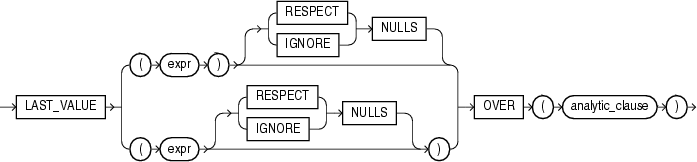

# FIRST_VALUE 函数
该函数提供了从一个数据行窗口最后一行中获取值的能力

## 语法


##描述
LAST_VALUE是一个分析函数，它返回一个数据行窗口中最后一行的相关值。

`{RESPECT | IGNORE} NULLS` 用于确定当expr为null时是否被计算在内，默认为RESPECT NULLS。如果定义了IGNORE NULLS，则函数返回第一个非null值（当所有值都为null时则返回NULL）

LAST_VALUE函数是分析函数，不允许嵌套其它的分析函数，但可嵌套Oracle内置的非分析函数。

如果忽略了analytic_clause中的windowing_clause，则默认窗口为`RANGE BETWEEN UNBOUNDED AND CURRENT ROW`. 使用默认窗口有时会获取不可预料的值，因为查询过程中CURRENT ROW始终在改变。如果期望获取可预料的值，则需定义窗口为`RANGE BETWEEN UNBOUNDED PRECEDING AND UNBOUNDED FOLLOWING`. 又或者定义为`RANGE BETWEEN CURRENT ROW AND UNBOUNDED FOLLOWING`.

##示例
以下示例返回所有销售人员中销售额最高的那天的日期
```sql
SELECT last_name, salary, hire_date,
       LAST_VALUE(hire_date)
         OVER (ORDER BY salary ROWS BETWEEN UNBOUNDED PRECEDING AND UNBOUNDED
               FOLLOWING) AS lv
  FROM (SELECT * FROM employees
          WHERE department_id = 90
          ORDER BY hire_date);
```
结果：

LAST_NAME | SALARY | HIRE_DATE | LV
--------- | ------ | --------- | ---------
De Haan   |  17000 | 13-JAN-01 | 17-JUN-03
Kochhar   |  17000 | 21-SEP-05 | 17-JUN-03
King      |  24000 | 17-JUN-03 | 17-JUN-03

示例：
```sql
SELECT last_name, salary, hire_date,
       LAST_VALUE(hire_date)
         OVER (ORDER BY salary ROWS BETWEEN UNBOUNDED PRECEDING AND UNBOUNDED
               FOLLOWING) AS lv
  FROM (SELECT * FROM employees
          WHERE department_id = 90
          ORDER BY hire_date DESC);
```
结果：

LAST_NAME | SALARY | HIRE_DATE | LV
--------- | ------ | --------- | ---------
Kochhar   |  17000 | 21-SEP-05 | 17-JUN-03
De Haan   |  17000 | 13-JAN-01 | 17-JUN-03
King      |  24000 | 17-JUN-03 | 17-JUN-03

示例：
```sql
SELECT last_name, salary, hire_date,
       LAST_VALUE(hire_date)
         OVER (ORDER BY salary, hire_date ROWS BETWEEN UNBOUNDED PRECEDING AND
               UNBOUNDED FOLLOWING) AS lv
  FROM (SELECT * FROM employees
          WHERE department_id = 90 
          ORDER BY hire_date)
  ORDER BY last_name, salary, hire_date;
```
结果：

LAST_NAME | SALARY | HIRE_DATE | LV
--------- | ------ | --------- | ---------
De Haan   |  17000 | 13-JAN-01 | 17-JUN-03
King      |  24000 | 17-JUN-03 | 17-JUN-03
Kochhar   |  17000 | 21-SEP-05 | 17-JUN-03

```sql
SELECT last_name, salary, hire_date,
       LAST_VALUE(hire_date)
         OVER (ORDER BY salary, hire_date ROWS BETWEEN UNBOUNDED PRECEDING AND UNBOUNDED FOLLOWING) AS lv
  FROM (SELECT * FROM employees
          WHERE department_id = 90
          ORDER BY hire_date DESC)
  ORDER BY last_name, salary, hire_date;
```
结果：

LAST_NAME | SALARY | HIRE_DATE | LV
--------- | ------ | --------- | ---------
De Haan   |  17000 | 13-JAN-01 | 17-JUN-03
King      |  24000 | 17-JUN-03 | 17-JUN-03
Kochhar   |  17000 | 21-SEP-05 | 17-JUN-03

示例：使用RANGE
```sql
SELECT last_name, salary, hire_date,
       LAST_VALUE(hire_date)
         OVER (ORDER BY salary RANGE BETWEEN UNBOUNDED PRECEDING AND UNBOUNDED
               FOLLOWING) AS lv
  FROM (SELECT * FROM employees
          WHERE department_id = 90
          ORDER BY hire_date DESC);
```
结果：

LAST_NAME | SALARY | HIRE_DATE | LV
--------- | ------ | --------- | ---------
De Haan   |  17000 | 13-JAN-01 | 17-JUN-03
Kochhar   |  17000 | 21-SEP-05 | 17-JUN-03
King      |  24000 | 17-JUN-03 | 17-JUN-03