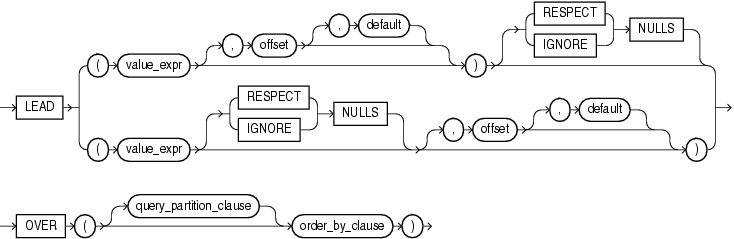

# LEAD 函数
该函数提供了访问结果集中后面的行的能力

## 语法


##描述
LEAD函数是一个分析函数。它提供了获取结果集中指定的向后偏移位置的相关值。该函数与[LAG](./LAG.md)的区别是偏移方向相反。

参数offset是一个大于0的整数值，默认为1，意为在结果集中向后数offset行。参数default用于定义当offset指定的行超出结果集范围时的默认值，该参数是可选的，默认为null。

`{RESPECT | IGNORE} NULLS` 用于确定当value_expr为null时是否被计算在内，默认为RESPECT NULLS，即null值也当作1行

LEAD函数是分析函数，不允许嵌套其它的分析函数，但可嵌套Oracle内置的非分析函数。

##示例
获取销售人员中，在自己之后聘用的人员的聘用日期
```sql
SELECT last_name, hire_date, 
       LEAD(hire_date, 1) OVER (ORDER BY hire_date) AS "NextHired" 
  FROM employees
  WHERE department_id = 30
  ORDER BY last_name, hire_date;
```
结果：

LAST_NAME  | HIRE_DATE | NextHired
-----------| --------- | ---------
Baida      | 24-DEC-05 | 15-NOV-06
Colmenares | 10-AUG-07 |
Himuro     | 15-NOV-06 | 10-AUG-07
Khoo       | 18-MAY-03 | 24-JUL-05
Raphaely   | 07-DEC-02 | 18-MAY-03
Tobias     | 24-JUL-05 | 24-DEC-05

例如：Himuro刚好在Baida之后被聘用，因此Baida的NextHired就是Himuro的HIRE_DATE