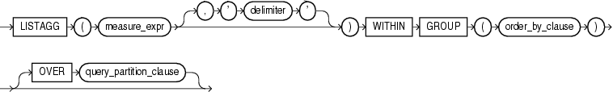

#LISTAGG

##语法



##描述

为了某些特殊的度量，LISTAGG对ORDER BY子句中的字段进行分组，并将结果进行连结。

* 作为一个单数据集的聚合函数，LISTAGG对所有数据行进行计算，并且返回一个输出行。

* 作为一个分组数据集的聚合函数，LISTAGG对每个分组中的所有行进行计算，并为每个分组返回一个输出行。

* 作为分析函数，LISTAGG对每个分片中的分组进行计算。

该函数的参数满足以下规则：

* measure_expr 可以是任意表达式，NULL值将被忽略

* delimiter_expr 作为分隔符，它是可选的，默认为NULL

* order_by_clause 确定返回结果的连结顺序，它只有在ORDER BY子句获得唯一的排序时才是确定的。

如果度量字段是RAW，则返回值类型是RAW。其它情况返回值都是VARCHAR2

##示例

###聚合函数示例

以下示例列出 hr.employees 中，按hire_date和last_name排序的Department 30的所有员工

```sql
SELECT LISTAGG(last_name, '; ')
         WITHIN GROUP (ORDER BY hire_date, last_name) "Emp_list",
       MIN(hire_date) "Earliest"
  FROM employees
  WHERE department_id = 30;
```

```
Emp_list                                                     Earliest
------------------------------------------------------------ ---------
Raphaely; Khoo; Tobias; Baida; Himuro; Colmenares            07-DEC-02
```

以下示例列出每个Department中的所有员工(按hire_date排序)


```sql
SELECT department_id "Dept.",
       LISTAGG(last_name, '; ') WITHIN GROUP (ORDER BY hire_date) "Employees"
  FROM employees
  GROUP BY department_id
  ORDER BY department_id;
```

```
Dept. Employees
------ ------------------------------------------------------------
    10 Whalen
    20 Hartstein; Fay
    30 Raphaely; Khoo; Tobias; Baida; Himuro; Colmenares
    40 Mavris
    50 Kaufling; Ladwig; Rajs; Sarchand; Bell; Mallin; Weiss; Davie
       s; Marlow; Bull; Everett; Fripp; Chung; Nayer; Dilly; Bissot
       ; Vollman; Stiles; Atkinson; Taylor; Seo; Fleaur; Matos; Pat
       el; Walsh; Feeney; Dellinger; McCain; Vargas; Gates; Rogers;
        Mikkilineni; Landry; Cabrio; Jones; Olson; OConnell; Sulliv
       an; Mourgos; Gee; Perkins; Grant; Geoni; Philtanker; Markle
    60 Austin; Hunold; Pataballa; Lorentz; Ernst
    70 Baer
. . .
```


###分析函数示例

以下示例查询在01-SEP-2003之前聘用的员工，并为每个人查询部门内满足相同条件的所有员工。

```sql
SELECT department_id "Dept", hire_date "Date", last_name "Name",
       LISTAGG(last_name, '; ') WITHIN GROUP (ORDER BY hire_date, last_name)
         OVER (PARTITION BY department_id) as "Emp_list"
  FROM employees
  WHERE hire_date < '01-SEP-2003'
  ORDER BY "Dept", "Date", "Name";
```

```
 Dept Date      Name            Emp_list
----- --------- --------------- ---------------------------------------------
   30 07-DEC-02 Raphaely        Raphaely; Khoo
   30 18-MAY-03 Khoo            Raphaely; Khoo
   40 07-JUN-02 Mavris          Mavris
   50 01-MAY-03 Kaufling        Kaufling; Ladwig
   50 14-JUL-03 Ladwig          Kaufling; Ladwig
   70 07-JUN-02 Baer            Baer
   90 13-JAN-01 De Haan         De Haan; King
   90 17-JUN-03 King            De Haan; King
  100 16-AUG-02 Faviet          Faviet; Greenberg
  100 17-AUG-02 Greenberg       Faviet; Greenberg
  110 07-JUN-02 Gietz           Gietz; Higgins
  110 07-JUN-02 Higgins         Gietz; Higgins
```