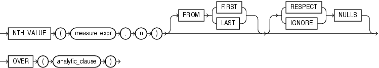

# NTH_VALUE 函数
该函数提供了从一个数据行窗口的第N行中获取值的能力

## 语法


##描述
NTH_VALUE用于获取由analytic_clause定义的数据行窗口中第N行的measure_expr的值，返回值与measure_expr同类型。

* {RESPECT | IGNORE} NULLS 用于确定当measure_expr为null时是否会被计算在内。默认是RESPECT NULLS，即null会被算在内。
* n 用于确定返回第n行的值。n可以是常量、绑定变量、列，或者包含这三者的表达式，只要它的值是一个正整数。如果数据窗口的行数小于n，则返回NULL。如果n为null，则抛出异常。
* FROM {FIRST | LAST} 用于确定行数是从数据窗口的第一行开始数起还是从最后一行开始数起。默认是FROM FIRST，即默认为从第一行开始数。

如果你省略了analytic_clause中的windowing_clause，则默认为`RANGE BETWEEN UNBOUNDED PRECEDING AND CURRENT ROW`。 默认情况下NTH_VALUE...FROM LAST可能返回不可预期的值，因为数据行窗口的最后一行是不确定的，可将windowing_clause定义为`RANGE BETWEEN UNBOUNDED PRECEDING AND UNBOUNDED FOLLOWING`， 或者`RANGE BETWEEN CURRENT ROW AND UNBOUNDED FOLLOWING`。

##示例
以下示例显示prod_id在13到16范围内，按channel_id顺序排序的第2个amount_sold最小值。
```sql
SELECT prod_id, channel_id, MIN(amount_sold),
    NTH_VALUE(MIN(amount_sold), 2) OVER (PARTITION BY prod_id ORDER BY channel_id
    ROWS BETWEEN UNBOUNDED PRECEDING AND UNBOUNDED FOLLOWING) nv
  FROM sales
  WHERE prod_id BETWEEN 13 and 16
  GROUP BY prod_id, channel_id;
```
结果：
```
   PROD_ID CHANNEL_ID MIN(AMOUNT_SOLD)         NV
---------- ---------- ---------------- ----------
        13          2           907.34      906.2
        13          3            906.2      906.2
        13          4           842.21      906.2
        14          2          1015.94    1036.72
        14          3          1036.72    1036.72
        14          4           935.79    1036.72
        15          2           871.19     871.19
        15          3           871.19     871.19
        15          4           871.19     871.19
        16          2           266.84     266.84
        16          3           266.84     266.84
        16          4           266.84     266.84
        16          9            11.99     266.84

13 rows selected.
```