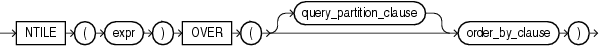

#NTILE

## 语法



##描述

NTIL是一个分析函数，它将一个已排序的数据集切分成expr块，并为每一行标记合适的块编号，块编号从1开始。expr必须是一个正整数，如果传入非整数，oracle将对其执行截断。函数返回值类型为NUMBER。


The number of rows in the buckets can differ by at most 1. The remainder values (the remainder of number of rows divided by buckets) are distributed one for each bucket, starting with bucket 1.

如果expr大于行数，那么每一行的块编号等于行号。

不能嵌套使用NTILE或者其它分析函数，只能在expr中使用其它的内建函数。

##示例

The following example divides into 4 buckets the values in the salary column of the oe.employees table from Department 100. The salary column has 6 values in this department, so the two extra values (the remainder of 6 / 4) are allocated to buckets 1 and 2, which therefore have one more value than buckets 3 or 4.

```sql
SELECT last_name, salary, NTILE(4) OVER (ORDER BY salary DESC) AS quartile
  FROM employees
  WHERE department_id = 100
  ORDER BY last_name, salary, quartile;
```

```
LAST_NAME                     SALARY   QUARTILE
------------------------- ---------- ----------
Chen                            8200          2
Faviet                          9000          1
Greenberg                      12008          1
Popp                            6900          4
Sciarra                         7700          3
Urman                           7800          2
```