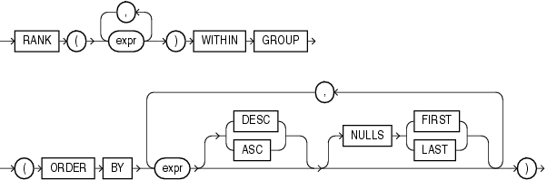
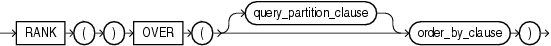

# RANK 函数
该函数用于计算数值在一组值中的排名

## 语法
* **聚合函数语法**

    

* **分析函数语法**

    

##描述
RANK函数用于计算一组数值中某个值的排名。返回值类型为NUMBER。

拥有相等数值的行会获得相同的排名，并且下一个排名将会跳过相应的行数。即排名可能是不连续的数值。此函数对top-N和bottom-NB报告非常有用。

* 作为一个聚合函数，RANK会依据一个已知的排序规则，计算由函数参数组成的虚拟行在排序结果中的排行。函数的每个参数都必须是是常数表达式，它们必须能够确定每个聚合分组中唯一的行。参数必须与ORDER BY 子句中的列一一对应，包括它们的数值类型。
* 作为一个分析函数，RANK用于计算由order by子句中的列值再数据行窗口中的排名

##示例
###聚合函数示例
以下示例显示salary为$15500并且commission为5%的虚拟行在表hr.employees中的排行。
```sql
SELECT RANK(15500, .05) WITHIN GROUP
   (ORDER BY salary, commission_pct) "Rank"
   FROM employees;
```
结果：
```
      Rank
----------
       105
```
相同的，以下示例用于显示salary为$15500在所有员工中的排名：
```sql
SELECT RANK(15500) WITHIN GROUP 
   (ORDER BY salary DESC) "Rank of 15500" 
   FROM employees;
```
结果：
```
Rank of 15500
--------------
             4
```

###分析函数示例
以下示例显示每个部门为60的员工的salary在部门内部的排名。相同salary的员工具有相同的排名，并且下一排名将不连续
```sql
SELECT department_id, last_name, salary,
       RANK() OVER (PARTITION BY department_id ORDER BY salary) RANK
  FROM employees WHERE department_id = 60
  ORDER BY RANK, last_name;
```
结果：
```
DEPARTMENT_ID LAST_NAME                     SALARY       RANK
------------- ------------------------- ---------- ----------
           60 Lorentz                         4200          1
           60 Austin                          4800          2
           60 Pataballa                       4800          2
           60 Ernst                           6000          4
           60 Hunold                          9000          5
```