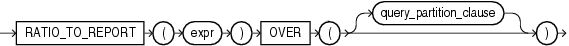

#RATIO_TO_REPORT

## 语法



##描述

RATIO_TO_REPORT是一个分析函数。它用于计算一个数值占集合中数值总和的比例。如果表达式结果为NULL，则计算结果也为NULL。

数值集合由query_partition_clause子句确定。如果该子句被省略，那么函数将针对所有行进行计算。

该函数不能嵌套使用分析函数，但可以在表达式中使用其它内建的函数。


##示例

以下示例为每个销售员计算其销售额占全部销售总额的比例


```sql
SELECT last_name, salary, RATIO_TO_REPORT(salary) OVER () AS rr
   FROM employees
   WHERE job_id = 'PU_CLERK'
   ORDER BY last_name, salary, rr;
```

```
LAST_NAME                     SALARY         RR
------------------------- ---------- ----------
Baida                           2900 .208633094
Colmenares                      2500 .179856115
Himuro                          2600  .18705036
Khoo                            3100 .223021583
Tobias                          2800 .201438849
```