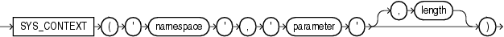

#SYS_CONTEXT函数

##语法



##描述

SYS_CONTEXT用于获取当前实例的上下文(context) namespace中的 parameter 的值，可以在SQL和PL/SQL语句中执行。SYS_CONTEXT只能在本地执行，即不能获取远程实例的上下文。

namespace和parameter可以传入字符串或者表达式，只要他们的计算结果能够指定明确的上下文命名空间和属性名。如果你在SQL语句(而非PL/SQL)使用SYS_CONTEXT函数，并且传入显示的字符参数，那么Oracle数据库只为每条SQL语句中的每个SYS_CONTEXT计算一次。

上下文namespace必须已经存在，并且关联的属性parameter及其值必须已经使用DBMS_SESSION.set_context存储过程设置好了。namespace必须是有效的SQL标识符，parameter可以是任意字符串。参数不区分大小写，但必须保持在30字节符内。

函数的返回值类型是VARCHAR2。默认的返回值最大长度是256个字节，你可以通过可选参数length重新指定。参数lenght是NUMBER类型，或者可以隐式转换为NUMBER的值。返回值长度范围是1~4000个字节，如果length指定一个无效的长度，那么Oracle数据库会忽略它并使用默认的最大长度。

Oracle已内建了两个上下文namespace：

* `USERENV` - 当前会话的信息
* `SYS_SESSION_ROLES` - 标识当前会话是否包含某个role的权限。

> **更多内容请参考**
>
> * [Oracle Database Security Guide](http://docs.oracle.com/database/121/DBSEG/app_context.htm#DBSEG14002) 提供在应用开发中使用上下文特性的相关信息
> * [CREATE CONTEXT](http://docs.oracle.com/database/121/SQLRF/statements_5003.htm#i2060927) 提供创建用户自定义上下文的信息
> * [Oracle Database PL/SQL Packages and Types Reference](http://docs.oracle.com/database/121/ARPLS/d_sessio.htm#ARPLS054) 包含DBMS_SESSION.set_context的相关信息

##示例

以下语句返回当前登录用户的用户名

```sql
CONNECT OE
Enter password: password

SELECT SYS_CONTEXT ('USERENV', 'SESSION_USER') 
   FROM DUAL;

SYS_CONTEXT ('USERENV', 'SESSION_USER')
---------------------------------------
OE
```

以下例子从SESSION_ROLES数据字典视图中查询得出RESOURCE是唯一一个对当前会话启用的角色。那么如果用户使用SYS_CONTEXT分别调用RESOURCE和DBA两个角色，那么前者返回TRUE，后者返回FALSE

```sql
CONNECT OE
Enter password: password

SELECT role FROM session_roles;

ROLE
--------
RESOURCE

SELECT SYS_CONTEXT('SYS_SESSION_ROLES', 'RESOURCE') FROM DUAL;

SYS_CONTEXT('SYS_SESSION_ROLES','RESOURCE')
--------------------------------------
TRUE

SELECT SYS_CONTEXT('SYS_SESSION_ROLES', 'DBA') FROM DUAL;

SYS_CONTEXT('SYS_SESSION_ROLES','DBA')
--------------------------------------
FALSE
```

以下假设上下文hr_apps已经创建，并且其中包含属性group_no。

```sql
SELECT SYS_CONTEXT ('hr_apps', 'group_no') "User Group"  FROM DUAL;
```

##附注：内建的上下文USERENV中预定义的属性

* ACTION
  
  标识在应用程序模块中位置，该位置是通过DBMS_APPLICATION_INFO包或OCI进行设置的。
  
* AUDITED_CURSORID
  
  返回触发审计的SQL的cursor ID，在细粒度的审计环境下无效(始终返回null)
  
* AUTHENTICATED_IDENTITY
  
  返回验证身份时所使用的标识，以下列出各种验证方式所对应的返回值：
  
  * 企业用户Kerberos认证：kerberos主体名称
  * 外部用户Kerberos认证：kerberos主体名称，和模式名(schema)相同
  * 企业用户SSL认证：用户PKI证书中的DN
  * 外部用户SSL认证：用户PKI证书中的DN
  * 企业用户密码认证：昵称，和登录名相同
  * 数据库用户密码认证：数据库用户名，和模式名相同
  * 外部用户OS认证：外部操作系统的用户名
  * 外部用户Radius认证：模式名
  * 使用DN的代理：客户的Oracle Internet Directory DN
  * 使用证书的代理：客户证书中的DN
  * 使用用户名的代码：如果客户是企业用户则是昵称，否则是数据库用户名
  * 使用密码文件的SYSDBA/SYSOPER：登录名
  * 使用OS认证的SYSDBA/SYSOPER：操作系统用户名
  
* AUTHENTICATION_DATA
  
  用于登录认证的数据。使用X.503证书认证的会话返回十六进制格式的证书的内容。当你使用length去修改该属性时，属性值允许超过4000字节，这也是Oracle允许这么干的唯一属性。
  
* AUTHENTICATION_METHOD
  
  返回认证的方法。以下列出各种用户类型所对应的访法：
  
  * PASSWORD：使用密码验证的企业用户、本地数据库用户。使用密码文件的SYSDBA/SYSOPER。使用用户名和密码通过代理验证的用户
  * KERBEROS：使用Kerberos验证的企业用户和外部用户
  * SSL：使用SSL验证的企业用户和外部用户
  * RADIUS：使用Radius验证的外部用户
  * OS：使用OS验证的外部用户或SYSDBA/SYSOPER
  * NONE：使用证书、DN、无需密码的用户名通过代理验证的用户
  * JOB：后台进程
  * PQ_SLAVE：多进程的从进程
  
  当认证方法为PASWORD/KERBEROS/SSL时，你可以使用属性IDENTIFICATION_TYPE来区分外部用户和企业用户
  
* BG_JOB_ID
  
  如果当前会话是由数据库后台进程建立的，则返回Job ID。如果非后台进程建立，则为null
  
* CDB_NAME
  
  如果是在多库环境中的主库(CDB)执行查询，则返回CDB的名称，否则返回null。
  
* CLIENT_IDENTIFIER
  
  Returns an identifier that is set by the application through the DBMS_SESSION.SET_IDENTIFIER procedure, the OCI attribute OCI_ATTR_CLIENT_IDENTIFIER, or Oracle Dynamic Monitoring Service (DMS). This attribute is used by various database components to identify lightweight application users who authenticate as the same database user.
  
* CLIENT_INFO
  
  Returns up to 64 bytes of user session information that can be stored by an application using the DBMS_APPLICATION_INFO package.
  
* CLIENT_PROGRAM_NAME
  
  客户端所使用的应用程序名称
  
* CON_ID
  
  If queried while connected to a CDB, returns the current container ID. Otherwise, returns 0.
  
* CON_NAME
  
  If queried while connected to a CDB, returns the current container name. Otherwise, returns the name of the database as specified in the DB_NAME initialization parameter.
  
* CURRENT_BIND
  
  The bind variables for fine-grained auditing. You can specify this attribute only inside the event handler for the fine-grained auditing feature.
  
* CURRENT_EDITION_ID
  
  当前版本的标识
  
* CURRENT_EDITION_NAME
  
  当前版本的名称
  
* CURRENT_SCHEMA
  
  当前活动中的默认schema名称，可由ALTER SESSION SET CURRENT_SCHEMA语句更改。如果该参数在视图定义中使用，那么它返回的是执行查询视图的用户所在的默认schema，而不是定义者所在的schema。
  
  需要注意的是，除了登录触发器之外，Oracle不推荐在所有类型的PL/SQL程序中使用ALTER SESSION SET CURRENT_SCHEMA。
  
* CURRENT_SCHEMAID
  
  当前活动中的默认schema标识
  
* CURRENT_SQL或CURRENT_SQL *n*
  
  CURRENT_SQL returns the first 4K bytes of the current SQL that triggered the fine-grained auditing event. The CURRENT_SQLn attributes return subsequent 4K-byte increments, where n can be an integer from 1 to 7, inclusive. CURRENT_SQL1 returns bytes 4K to 8K; CURRENT_SQL2 returns bytes 8K to 12K, and so forth. You can specify these attributes only inside the event handler for the fine-grained auditing feature.
  
* CURRENT_SQL_LENGTH
  
  The length of the current SQL statement that triggers fine-grained audit or row-level security (RLS) policy functions or event handlers. You can specify this attribute only inside the event handler for the fine-grained auditing feature.
  
* CURRENT_USER
  
  当前活动中的数据库用户名。它会因会话是否已锁定而不同。它还会因为对象定义者是否处于激活状态而不同。当对象的创建者不是处于激活状态，则CURRENT_USER返回和SESSION_USER相同值。如果该参数在视图定义中使用到，那么它返回的是执行查询视图的用户的用户名。企业用户返回的是schema。如果一个Real Application Security用户处于激活状态，则返回用户的XS$NULL。
  
* CURRENT_USERID
  
  The identifier of the database user whose privileges are currently active.
  
* DATABASE_ROLE
  
  使用SYS_CONTEXT函数的USERENV上下文的数据库角色. 可能的返回值包括: PRIMARY, PHYSICAL STANDBY, LOGICAL STANDBY, SNAPSHOT STANDBY.
  
* DB_DOMAIN
  
  初始化参数DB_DOMAIN指定的域
  
* DB_NAME
  
  初始化参数DB_NAME指定的数据库名
  
* DB_SUPPLEMENTAL_LOG_LEVEL
  
  If supplemental logging is enabled, returns a string containing the list of enabled supplemental logging levels. Possible values are: ALL_COLUMN, FOREIGN_KEY, MINIMAL, PRIMARY_KEY, PROCEDURAL, and UNIQUE_INDEX. If supplemental logging is not enabled, returns null.
  
* DB_UNIQUE_NAME
  
  初始化参数DB_UNIQUE_NAME指定的数据库名
  
* DBLINK_INFO
  
  返回DBLINK会话的信息
  
  ```
  SOURCE_GLOBAL_NAME=dblink_src_global_name, DBLINK_NAME=dblink_name, SOURCE_AUDIT_SESSIONID=dblink_src_audit_sessionid
  ```
  
  * dblink_src_global_name，源数据库的全局名称
  * dblink_name，DBLINK的名称
  * dblink_src_audit_sessionid，使用DBLINK连接远程数据库时，在远程数据库创建的会话ID
  
  
* ENTRYID
  
  The current audit entry number. The audit entryid sequence is shared between fine-grained audit records and regular audit records. You cannot use this attribute in distributed SQL statements. The correct auditing entry identifier can be seen only through an audit handler for standard or fine-grained audit.
  
* ENTERPRISE_IDENTITY
  
  Returns the user's enterprise-wide identity:

  * For enterprise users: the Oracle Internet Directory DN.
  * For external users: the external identity (Kerberos principal name, Radius schema names, OS user name, Certificate DN).
  * For local users and SYSDBA/SYSOPER logins: NULL.

  The value of the attribute differs by proxy method:

  * For a proxy with DN: the Oracle Internet Directory DN of the client
  * For a proxy with certificate: the certificate DN of the client for external users; the Oracle Internet Directory DN for global users
  * For a proxy with username: the Oracle Internet Directory DN if the client is an enterprise users; Null if the client is a local database user.
  
* FG_JOB_ID
  
  If queried from within a job that was created using the DBMS_JOB package: Returns the job ID of the current session if it was established by a client foreground process. Null if the session was not established by a foreground process. Otherwise: Returns 0.
  
* GLOBAL_CONTEXT_MEMORY
  
  Returns the number being used in the System Global Area by the globally accessed context.
  
* GLOBAL_UID
  
  Returns the global user ID from Oracle Internet Directory for Enterprise User Security (EUS) logins; returns null for all other logins.
  
* HOST
  
  客户端的主机名
  
* IDENTIFICATION_TYPE
  
  返回创建用户时所指定的验证类型，它是由CREATE / ALTER USER语句中的IDENTIFIED子句指定的。可包含以下值（及其对应的INDENTIFIED子句）：
  
  * LOCAL: IDENTIFIED BY *password*
  * EXTERNAL: IDENTIFIED EXTERNALLY
  * GLOBAL SHARED: IDENTIFIED GLOBALLY
  * GLOBAL PRIVATE: IDENTIFIED GLOBALLY AS DN
  
* INSTANCE
  
  当前实例的唯一数字标识
  
* INSTANCE_NAME
  
  当前实例名称
  
* IP_ADDRESS
  
  客户端主机的IP地址。如果客户端和服务器是同一台机器并且使用IPv6则返回::1
  
* IS_APPLY_SERVER
  
  Returns TRUE if queried from within a SQL Apply server in a logical standby database. Otherwise, returns FALSE.
  
* IS_DG_ROLLING_UPGRADE
  
  Returns TRUE if a rolling upgrade of the database software in a Data Guard configuration, initiated by way of the DBMS_ROLLING package, is active. Otherwise, returns FALSE.
  
* ISDBA
  
  如果当前用户拥有DBA权限，或者是使用密码文件通过操作系统认证登录的用户，则返回TRUE
  
* LANG
  
  语言的缩写形式，是LANGUAGE参数的值的简称
  
* LANGUAGE
  
  当前会话所使用的语言，格式为：`language_territory.characterset`
  
* MODULE
  
  使用DBMS_APPLICATION_INFO包或OCI设置的应用程序名称
  
* NETWORK_PROTOCOL
  
  客户端连接使用的网络协议
  
* NLS_CALENDAR
  
  当前会话所使用的日历
  
* NLS_CURRENCY
  
  当前会话所使用的钱币符号
  
* NLS_DATE_FORMAT
  
  当前会话所使用的日期格式
  
* NLS_DATE_LANGUAGE
  
  用于描述日期的语言
  
* NLS_SORT
  
  返回BINARY，或者其他排序方式
  
* NLS_TERRITORY
  
  当前会话所在的国家
  
* ORACLE_HOME
  
  Oracle主目录
  
* OS_USER
  
  客户端进程所在的操作系统的登录名
  
* PLATFORM_SLASH
  
  基于不同平台的文件目录中的分隔符(斜线)
  
* POLICY_INVOKER
  
  The invoker of row-level security (RLS) policy functions.
  
* PROXY_ENTERPRISE_IDENTITY
  
  Returns the Oracle Internet Directory DN when the proxy user is an enterprise user.
  
* PROXY_USER
  
  Name of the database user who opened the current session on behalf of SESSION_USER.
  
* PROXY_USERID
  
  Identifier of the database user who opened the current session on behalf of SESSION_USER.
  
* SCHEDULER_JOB
  
  Returns Y if the current session belongs to a foreground job or background job. Otherwise, returns N.
  
* SERVER_HOST
  
  运行数据库实例的主机名
  
* SERVICE_NAME
  
  The name of the service to which a given session is connected.
  
* SESSION_EDITION_ID
  
  The identifier of the session edition.
  
* SESSION_EDITION_NAME
  
  The name of the session edition.
  
* SESSION_USER
  
  The name of the session user (the user who logged on). This may change during the duration of a database session as Real Application Security sessions are attached or detached. For enterprise users, returns the schema. For other users, returns the database user name. If a Real Application Security session is currently attached to the database session, returns user XS$NULL.
  
* SESSION_USERID
  
  会话用户(登录用户)的唯一标识
  
* SESSIONID
  
  用于审计的会话标识。不能在分布式SQL语句中使用该参数
  
* SID
  
  会话ID
  
* STATEMENTID
  
  The auditing statement identifier. STATEMENTID represents the number of SQL statements audited in a given session. You cannot use this attribute in distributed SQL statements. The correct auditing statement identifier can be seen only through an audit handler for standard or fine-grained audit.
  
* TERMINAL
  
  The operating system identifier for the client of the current session. In distributed SQL statements, this attribute returns the identifier for your local session. In a distributed environment, this is supported only for remote SELECT statements, not for remote INSERT, UPDATE, or DELETE operations. (The return length of this parameter may vary by operating system.)
  
* UNIFIED_AUDIT_SESSIONID
  
  If queried while connected to a database that uses unified auditing or mixed mode auditing, returns the unified audit session ID.

  If queried while connected to a database that uses traditional auditing, returns null.

  **Note**: This parameter is available starting with Oracle Database 12c Release 1 (12.1.0.2).