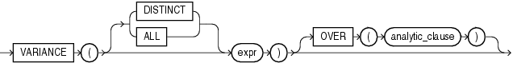

#VARIANCE

## 语法



##描述

VARIANCE返回expr的方差，可作为聚合函数或分析函数

Oracle数据库按如下方式计算expr的方差：

* 如果expr中的行数为1，则返回0

* 如果expr中的行数 > 1，则返回[VAR_SAMP](VAR_SAMP.md)

    > VAR_SAMP用于计算样本方差

如果在表达式中定义DISTINCT，那么在analytic_clause子句只能使用query_partition_clause，order_by_clause和windowing_clause都不允许使用。

传入参数必须是任意的数值类型或者可隐式转换为数值类型的其它类型。返回值类型与传入的参数值类型一致


##示例

##聚合函数示例

以下示例计算employees表中所有销售额的方差


```sql
SELECT VARIANCE(salary) "Variance"
   FROM employees;
```

```
  Variance
----------
15283140.5
```

##分析函数示例

以下示例计算Department 30中按hire date排序后销售额的累积方差

```sql
SELECT last_name, salary, VARIANCE(salary) 
      OVER (ORDER BY hire_date) "Variance"
   FROM employees 
   WHERE department_id = 30
   ORDER BY last_name, salary, "Variance"; 
```

```
LAST_NAME                     SALARY   Variance
------------------------- ---------- ----------
Baida                           2900 16283333.3
Colmenares                      2500   11307000
Himuro                          2600   13317000
Khoo                            3100   31205000
Raphaely                       11000          0
Tobias                          2800 21623333.3
```