#Oracle 11gR2在CentOS 6.6安装实录

##安装环境概述

* 操作系统：CentOS 6.6 Minual Desktop(VMware Workstation 10)
* 主机名：oracle11g.itrunc.com
* 主机IP：192.168.100.100
* 硬盘空间：500G(100M /boot，剩下的全部挂载到/，swap为4G)
* 物理内存：2G
* 登录用户：panben (sudoers)

>**参考**
>
>* [CentOS静态网络配置](../../OS/linux/centos/CentOS静态网络配置.md)
>* [将普通用户添加到sudoers](../../OS/linux/centos/将普通用户添加到sudoers.md)
>* [sudoers管理](../../OS/linux/sudoers管理.md)

```
[panben@oracle11g ~]$ hostname
oracle11g.itrunc.com
[panben@oracle11g ~]$ cat /etc/hosts
127.0.0.1   localhost localhost.localdomain localhost4 localhost4.localdomain4
::1         localhost localhost.localdomain localhost6 localhost6.localdomain6
192.168.100.100 oracle11g.itrunc.com
[panben@oracle11g ~]$ free
             total       used       free     shared    buffers     cached
Mem:       1915456     508000    1407456       3856      21736     182776
-/+ buffers/cache:     303488    1611968
Swap:      4194300          0    4194300
[panben@oracle11g ~]$ df -h
Filesystem            Size  Used Avail Use% Mounted on
/dev/mapper/vg_centos-LogVol01
                      488G  3.1G  461G   1% /
tmpfs                 936M  228K  936M   1% /dev/shm
/dev/sda1              93M   33M   56M  37% /boot
[panben@oracle11g ~]$ ifconfig
eth1      Link encap:Ethernet  HWaddr 00:0C:29:D2:FA:FA  
          inet addr:192.168.100.100  Bcast:192.168.100.255  Mask:255.255.255.0
          inet6 addr: fe80::20c:29ff:fed2:fafa/64 Scope:Link
          UP BROADCAST RUNNING MULTICAST  MTU:1500  Metric:1
          RX packets:54 errors:0 dropped:0 overruns:0 frame:0
          TX packets:12 errors:0 dropped:0 overruns:0 carrier:0
          collisions:0 txqueuelen:1000 
          RX bytes:4968 (4.8 KiB)  TX bytes:831 (831.0 b)

lo        Link encap:Local Loopback  
          inet addr:127.0.0.1  Mask:255.0.0.0
          inet6 addr: ::1/128 Scope:Host
          UP LOOPBACK RUNNING  MTU:65536  Metric:1
          RX packets:76 errors:0 dropped:0 overruns:0 frame:0
          TX packets:76 errors:0 dropped:0 overruns:0 carrier:0
          collisions:0 txqueuelen:0 
          RX bytes:5836 (5.6 KiB)  TX bytes:5836 (5.6 KiB)

[panben@oracle11g ~]$ uname -a
Linux oracle11g.itrunc.com 2.6.32-504.el6.x86_64 #1 SMP Wed Oct 15 04:27:16 UTC 2014 x86_64 x86_64 x86_64 GNU/Linux
```

##安装依赖的程序包

###配置yum可安装32位软件包

编辑配置文件 /etc/yum.conf

```
[panben@oracle11g ~]$ sudo vi /etc/yum.conf
```

添加一行：

```
multilib_policy=all
```

###挂载操作系统盘并配置yum仓库

插入CentOS 6.6安装光盘，系统自动挂载到 /media/CentOS_6.6_Final/，将该目录配置为yum的本地仓库：

```
[panben@oracle11g ~]$ sudo vi /etc/yum.repos.d/CentOS-Media.repo
```

添加一行：

```
file:///media/CentOS_6.6_Final/
```

结果如下：

```
[c6-media]
name=CentOS-$releasever - Media
baseurl=file:///media/CentOS/
        file:///media/cdrom/
        file:///media/cdrecorder/
        file:///media/CentOS_6.6_Final/
gpgcheck=1
enabled=0
gpgkey=file:///etc/pki/rpm-gpg/RPM-GPG-KEY-CentOS-6
```

###安装依赖包

Oracle Database 11g R2依赖的程序包如下：

```
binutils-2.20.51.0.2-5.11.el6 (x86_64)
compat-libcap1-1.10-1 (x86_64)
compat-libstdc++-33-3.2.3-69.el6 (x86_64)
compat-libstdc++-33-3.2.3-69.el6.i686
gcc-4.4.4-13.el6 (x86_64)
gcc-c++-4.4.4-13.el6 (x86_64)
glibc-2.12-1.7.el6 (i686)
glibc-2.12-1.7.el6 (x86_64)
glibc-devel-2.12-1.7.el6 (x86_64)
glibc-devel-2.12-1.7.el6.i686
ksh
libgcc-4.4.4-13.el6 (i686)
libgcc-4.4.4-13.el6 (x86_64)
libstdc++-4.4.4-13.el6 (x86_64)
libstdc++-4.4.4-13.el6.i686
libstdc++-devel-4.4.4-13.el6 (x86_64)
libstdc++-devel-4.4.4-13.el6.i686
libaio-0.3.107-10.el6 (x86_64)
libaio-0.3.107-10.el6.i686
libaio-devel-0.3.107-10.el6 (x86_64)
libaio-devel-0.3.107-10.el6.i686
make-3.81-19.el6
sysstat-9.0.4-11.el6 (x86_64)
unixODBC-2.2.14-11.el6 (x86_64) or later (可选)
unixODBC-2.2.14-11.el6.i686 or later (可选)
unixODBC-devel-2.2.14-11.el6 (x86_64) or later (可选)
unixODBC-devel-2.2.14-11.el6.i686 or later (可选)
```

执行以下命令安装程序包：

```
[panben@oracle11g ~]$ sudo yum --disablerepo=\* --enablerepo=c6-media -y install binutils compat-libcap1 compat-libstdc++-33 gcc gcc-c++ glibc glibc-devel ksh libgcc libstdc++ libstdc++-devel libaio libaio-devel make sysstat unixODBC unixODBC-devel
```

安装完成后，检查是否全部安装：

```
[panben@oracle11g ~]$ rpm -q binutils compat-libcap1 compat-libstdc++-33 gcc gcc-c++ glibc glibc-devel ksh libgcc libstdc++ libstdc++-devel libaio libaio-devel make sysstat unixODBC unixODBC-devel
binutils-2.20.51.0.2-5.42.el6.x86_64
compat-libcap1-1.10-1.x86_64
compat-libcap1-1.10-1.i686
compat-libstdc++-33-3.2.3-69.el6.x86_64
compat-libstdc++-33-3.2.3-69.el6.i686
gcc-4.4.7-11.el6.x86_64
gcc-c++-4.4.7-11.el6.x86_64
glibc-2.12-1.149.el6.x86_64
glibc-2.12-1.149.el6.i686
glibc-devel-2.12-1.149.el6.x86_64
glibc-devel-2.12-1.149.el6.i686
ksh-20120801-21.el6.x86_64
libgcc-4.4.7-11.el6.x86_64
libgcc-4.4.7-11.el6.i686
libstdc++-4.4.7-11.el6.x86_64
libstdc++-4.4.7-11.el6.i686
libstdc++-devel-4.4.7-11.el6.x86_64
libstdc++-devel-4.4.7-11.el6.i686
libaio-0.3.107-10.el6.x86_64
libaio-0.3.107-10.el6.i686
libaio-devel-0.3.107-10.el6.x86_64
libaio-devel-0.3.107-10.el6.i686
make-3.81-20.el6.x86_64
sysstat-9.0.4-27.el6.x86_64
unixODBC-2.2.14-14.el6.x86_64
unixODBC-2.2.14-14.el6.i686
unixODBC-devel-2.2.14-14.el6.x86_64
unixODBC-devel-2.2.14-14.el6.i686
```

##创建用户组和用户

###检查并创建用户组

```
[panben@oracle11g ~]$ grep dba /etc/group
[panben@oracle11g ~]$ grep oinstall /etc/group
[panben@oracle11g ~]$ grep oper /etc/group
[panben@oracle11g ~]$ sudo groupadd dba
[panben@oracle11g ~]$ sudo groupadd oinstall
[panben@oracle11g ~]$ sudo groupadd oper
[panben@oracle11g ~]$ grep dba /etc/group
dba:x:501:
[panben@oracle11g ~]$ grep oinstall /etc/group
oinstall:x:502:
[panben@oracle11g ~]$ grep oper /etc/group
oper:x:503:
```

###检查并创建用户

```
[panben@oracle11g ~]$ id oracle
id: oracle：无此用户
[panben@oracle11g ~]$ sudo useradd -g oinstall -G dba,oper oracle
[panben@oracle11g ~]$ id oracle
uid=501(oracle) gid=502(oinstall) 组=502(oinstall),501(dba),503(oper)
[panben@oracle11g ~]$ sudo passwd oracle
更改用户 oracle 的密码 。
新的 密码：
无效的密码： 过于简单化/系统化
无效的密码： 过于简单
重新输入新的 密码：
passwd： 所有的身份验证令牌已经成功更新。
```

##修改内核参数

编辑配置文件：/etc/sysctl.conf

```
[panben@oracle11g ~]$ sudo vi /etc/sysctl.conf
```

在文件末尾添加以下内容：

```
fs.aio-max-nr = 1048576
fs.file-max = 6815744
kernel.sem = 250 32000 100 128
net.ipv4.ip_local_port_range = 9000 65500
net.core.rmem_default = 262144
net.core.rmem_max = 4194304
net.core.wmem_default = 262144
net.core.wmem_max = 1048576
```

##修改oracle用户的资源限制

编辑配置文件：/etc/security/limits.conf

```
[oracle@oracle11g ~]$ sudo vi /etc/security/limits.conf
```

在文件中添加以下内容：

```
oracle soft nofile 4096
oracle hard nofile 65536
oracle soft nproc 2047
oracle hard nproc 16384
oracle soft stack 10240
oracle hard stack 32768
```

##重启系统

重启系统，以让修改的内核参数和资源限制生效

```
[panben@oracle11g ~]$ reboot
```

##创建或修改配置文件 /etc/oraInst.loc

```
[panben@oracle11g ~]$ sudo vi /etc/oraInst.loc
```

添加或修改以下内容：

```
inventory_loc=/u01/app/oraInventory
inst_group=oinstall
```

##创建目录

```
[panben@oracle11g ~]$ sudo mkdir -p /u01/app/oraInventory
[sudo] password for panben: 
[panben@oracle11g ~]$ sudo chown -R oracle:oinstall /u01/
[panben@oracle11g ~]$ sudo chmod -R 755 /u01/
[panben@oracle11g ~]$ ll / | grep u01
drwxr-xr-x.   3 oracle oinstall  4096 4月  11 14:06 u01
[panben@oracle11g ~]$ ll /u01
总用量 4
drwxr-xr-x. 3 oracle oinstall 4096 4月  11 14:06 app
[panben@oracle11g ~]$ ll /u01/app
总用量 4
drwxr-xr-x. 2 oracle oinstall 4096 4月  11 14:06 oraInventory
```

##为oracle用户配置环境变量

编辑文件 /home/oracle/.bash_profile

```
[panben@oracle11g ~]$ sudo vi /home/oracle/.bash_profile
```

添加以下内容：

```
ORACLE_BASE=/u01/app
ORACLE_HOME=$ORACLE_BASE/11gR2
ORACLE_SID=orcl
LD_LIBRARY_PATH=$ORACLE_HOME/lib
PATH=$PATH:$ORACLE_HOME/bin
export ORACLE_BASE ORACLE_HOME ORACLE_SID LD_LIBRARY_PATH PATH
```

##准备安装

插入安装光盘，系统自动挂载到 /media/linux.x64_11gR2，将其中的database文件夹拷贝到/home/oracle/database

```
[panben@oracle11g ~]$ sudo cp -R /media/linux.x64_11gR2/database /home/oracle/database
```

修改安装文件所有者为oracle，并添加执行权限

```
[panben@oracle11g ~]$ sudo chown -R oracle:oinstall /home/oracle/database
[panben@oracle11g ~]$ sudo chmod -R u+x /home/oracle/database
[panben@oracle11g ~]$ sudo ls -l /home/oracle
总用量 4
dr-x------. 8 oracle oinstall 4096 4月  11 14:16 database
[panben@oracle11g ~]$ sudo ls -l /home/oracle/database
总用量 36
dr-x------. 12 oracle oinstall 4096 4月  11 14:15 doc
dr-x------.  4 oracle oinstall 4096 4月  11 14:15 install
dr-x------.  2 oracle oinstall 4096 4月  11 14:15 response
dr-x------.  2 oracle oinstall 4096 4月  11 14:15 rpm
-r-x------.  1 oracle oinstall 3226 4月  11 14:15 runInstaller
dr-x------.  2 oracle oinstall 4096 4月  11 14:15 sshsetup
dr-x------. 14 oracle oinstall 4096 4月  11 14:16 stage
-r-x------.  1 oracle oinstall 5402 4月  11 14:16 welcome.html
[panben@oracle11g ~]$ sudo ls -al /home/oracle/database/install
总用量 360
dr-x------. 4 oracle oinstall   4096 4月  11 14:15 .
dr-x------. 8 oracle oinstall   4096 4月  11 14:16 ..
-r-x------. 1 oracle oinstall     28 4月  11 14:15 addLangs.sh
-r-x------. 1 oracle oinstall    127 4月  11 14:15 addNode.sh
-r-x------. 1 oracle oinstall    275 4月  11 14:15 attachHome.sh
-r-x------. 1 oracle oinstall    182 4月  11 14:15 detachHome.sh
dr-x------. 2 oracle oinstall   4096 4月  11 14:15 images
-r-x------. 1 oracle oinstall  19892 4月  11 14:15 lsnodes
-r-x------. 1 oracle oinstall   1934 4月  11 14:15 oraparam.ini
-r-x------. 1 oracle oinstall   6437 4月  11 14:15 oraparamsilent.ini
-r-x------. 1 oracle oinstall 152477 4月  11 14:15 .oui
dr-x------. 2 oracle oinstall   4096 4月  11 14:15 resource
-r-x------. 1 oracle oinstall  22033 4月  11 14:15 runSSHSetup.sh
-r-x------. 1 oracle oinstall 119416 4月  11 14:15 unzip
```

##执行安装

切换到oracle用户：

```
[panben@oracle11g ~]$ su - oracle
密码：
[oracle@oracle11g ~]$ source /home/oracle/.bash_profile
```

执行安装向导，为了避免安装向导中文乱码，切换成英文安装

```
[oracle@oracle11g ~]$ export LANG=en_US
[oracle@oracle11g ~]$ /home/oracle/database/runInstaller
Starting Oracle Universal Installer...

Checking Temp space: must be greater than 120 MB.   Actual 468714 MB    Passed
Checking swap space: must be greater than 150 MB.   Actual 4095 MB    Passed
Checking monitor: must be configured to display at least 256 colors.    Actual 16777216    Passed
Preparing to launch Oracle Universal Installer from /tmp/OraInstall2015-04-11_02-24-23PM. Please wait ...
```

##安装向导

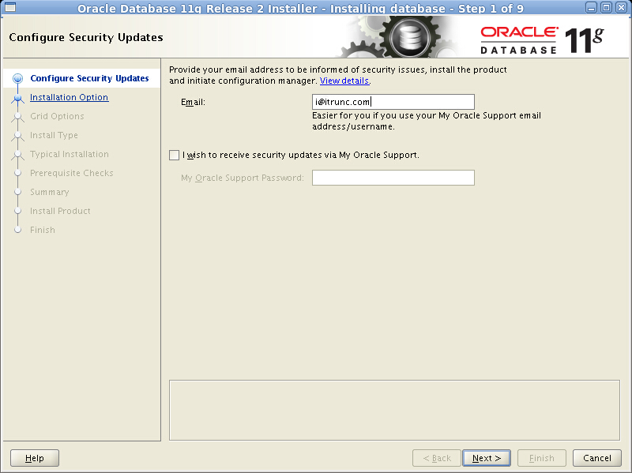


输入邮箱地址，取消`I wish to receive security updates via My Oracle Support`，点击Next

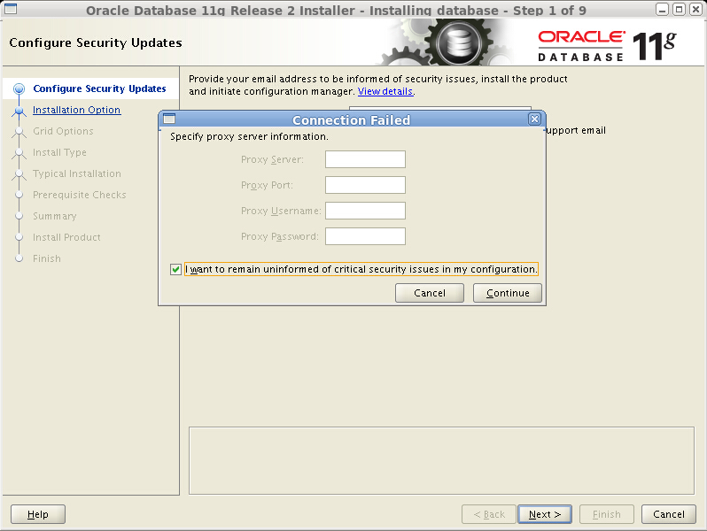

选中`I want to remain uninformed of critical security issues in my configuration`，点击Continue

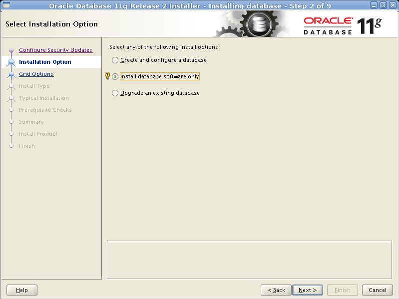

选中`Install database software only`，只安装数据库软件，后续再使用DBCA创建数据库，点击Next

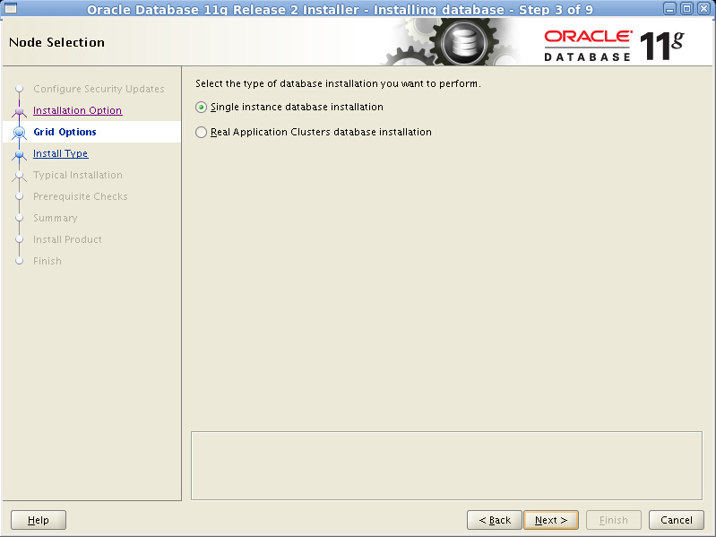

选中`Single instance database installation`，点击Next

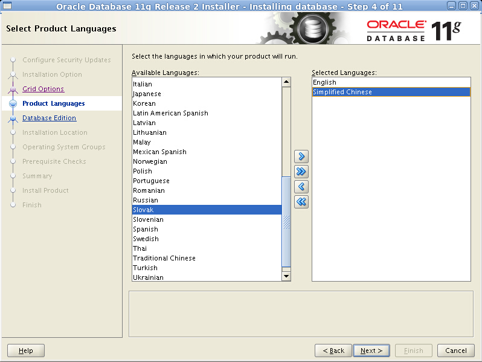

默认只选中语言English，从左侧列表中选中`Simplified Chinese`，并按箭头选中该语言，以让数据库支持简体中文。点击Next

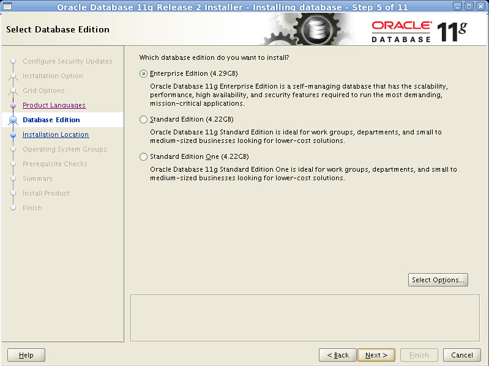

选中`Enterprise Edition`，安装企业版，点击Next

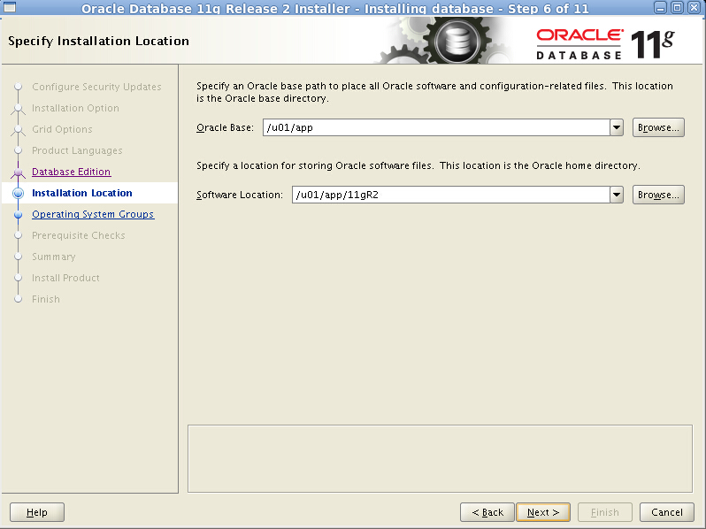

由于已经配置了用户环境变量，所以此处无需再次选择安装目录，点击Next

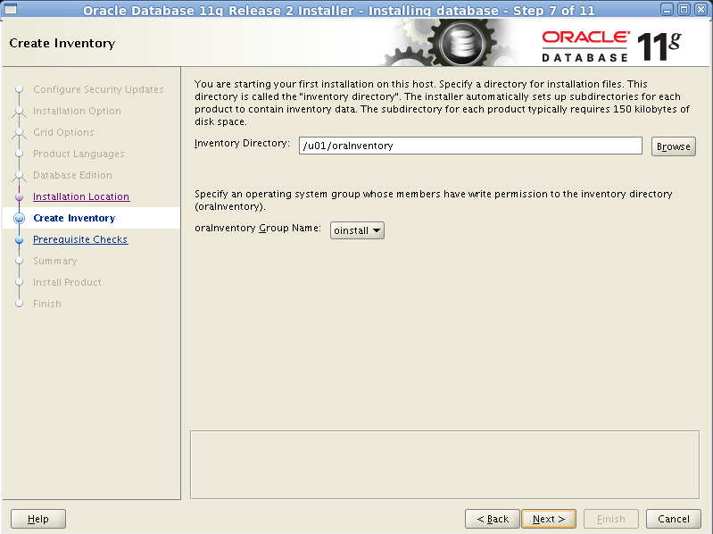

由于已经配置了/etc/oraInst.loc，因此无需再修改，点击Next

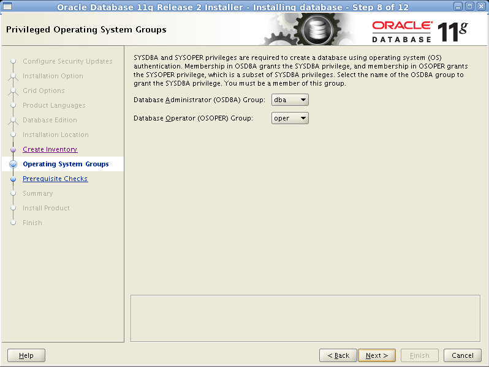

已在创建oracle用户是指定用户组，安装向导自动辨认，无需修改，点击Next

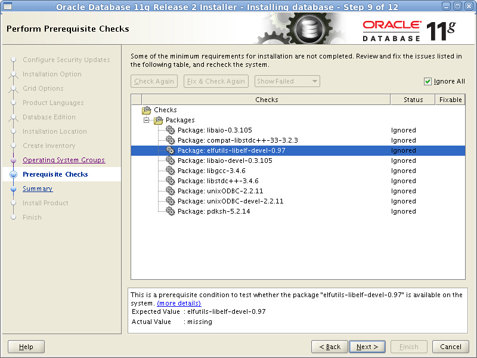

检查环境，有部分软件包无法检测到，选中`Ignore All`，点击Next

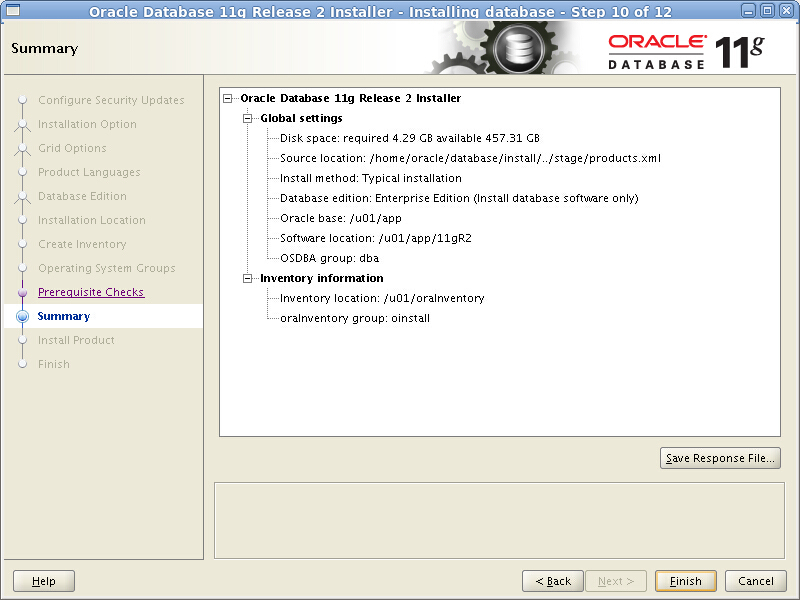

点击Finish

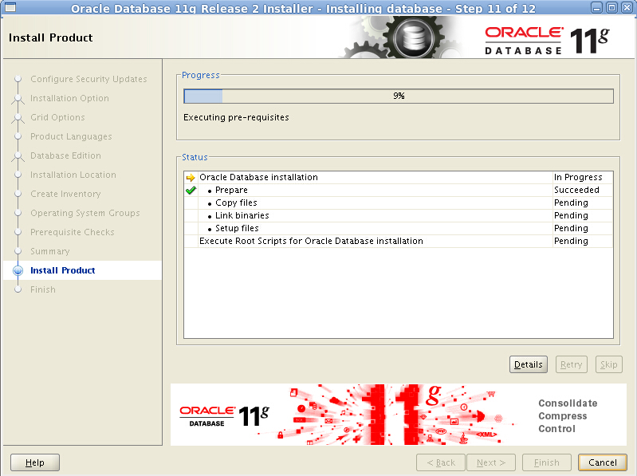

开始安装，默默等待。。。

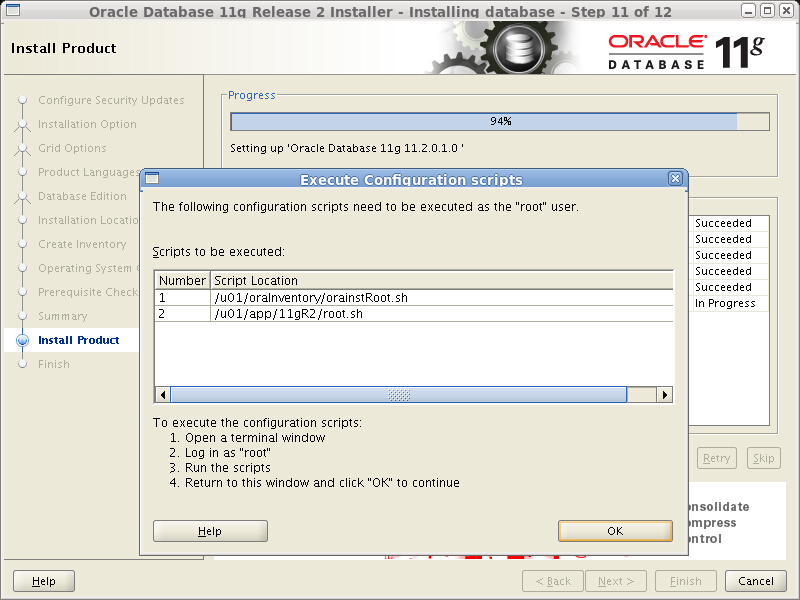

另外打开一个终端，以root身份执行这个两个脚本

```
[panben@oracle11g ~]$ sudo /u01/oraInventory/orainstRoot.sh
[sudo] password for panben: 
Changing permissions of /u01/oraInventory.
Adding read,write permissions for group.
Removing read,write,execute permissions for world.

Changing groupname of /u01/oraInventory to oinstall.
The execution of the script is complete.
[panben@oracle11g ~]$ sudo /u01/app/11gR2/root.sh
Running Oracle 11g root.sh script...

The following environment variables are set as:
    ORACLE_OWNER= oracle
    ORACLE_HOME=  /u01/app/11gR2

Enter the full pathname of the local bin directory: [/usr/local/bin]: 
   Copying dbhome to /usr/local/bin ...
   Copying oraenv to /usr/local/bin ...
   Copying coraenv to /usr/local/bin ...


Creating /etc/oratab file...
Entries will be added to the /etc/oratab file as needed by
Database Configuration Assistant when a database is created
Finished running generic part of root.sh script.
Now product-specific root actions will be performed.
Finished product-specific root actions.
```

执行完成，点击OK

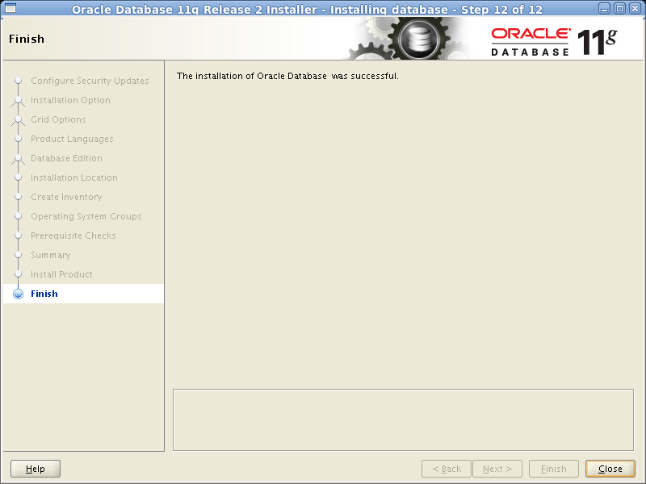

安装成功，点击Close


