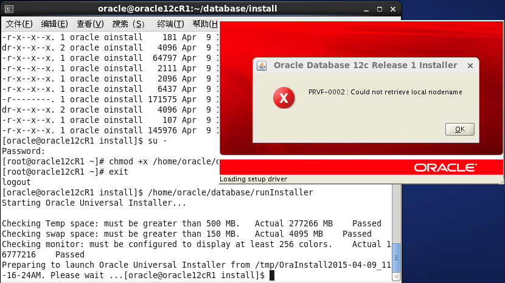
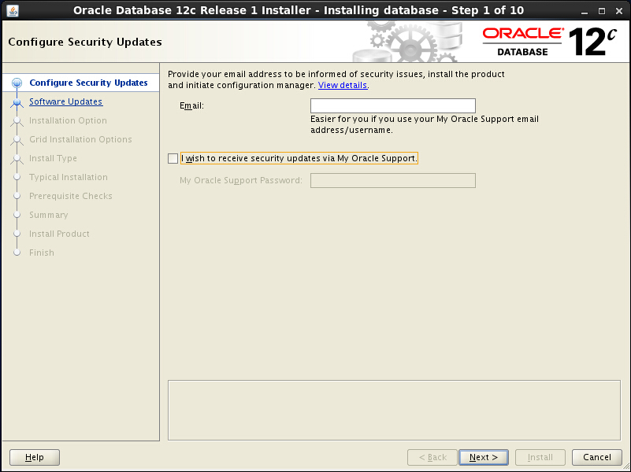
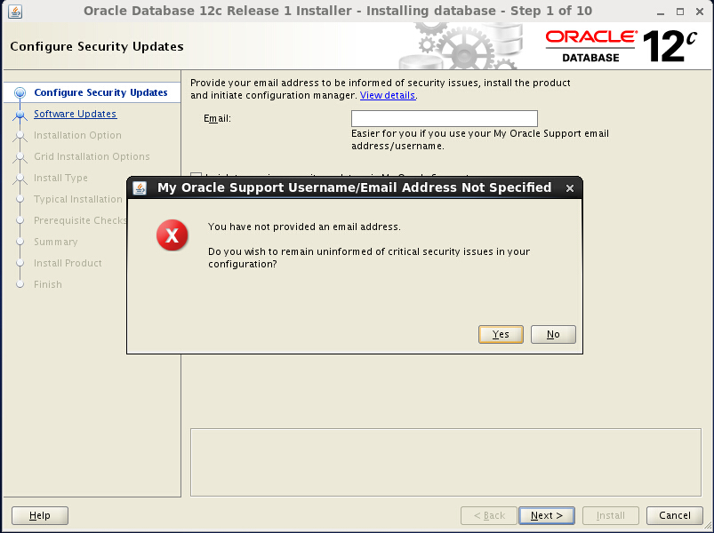
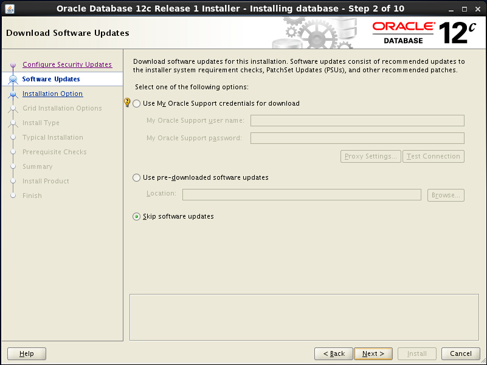
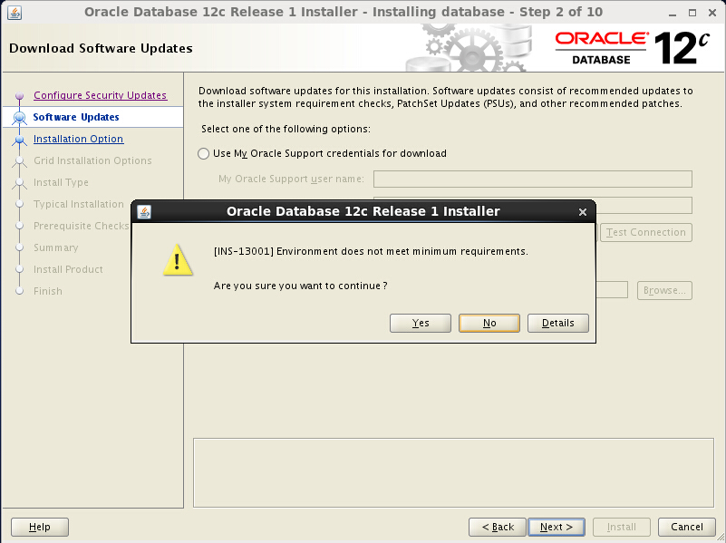
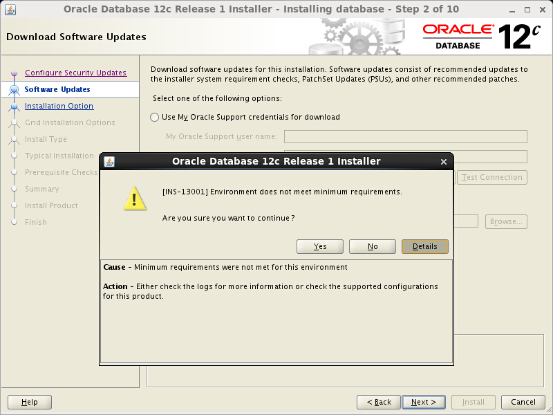
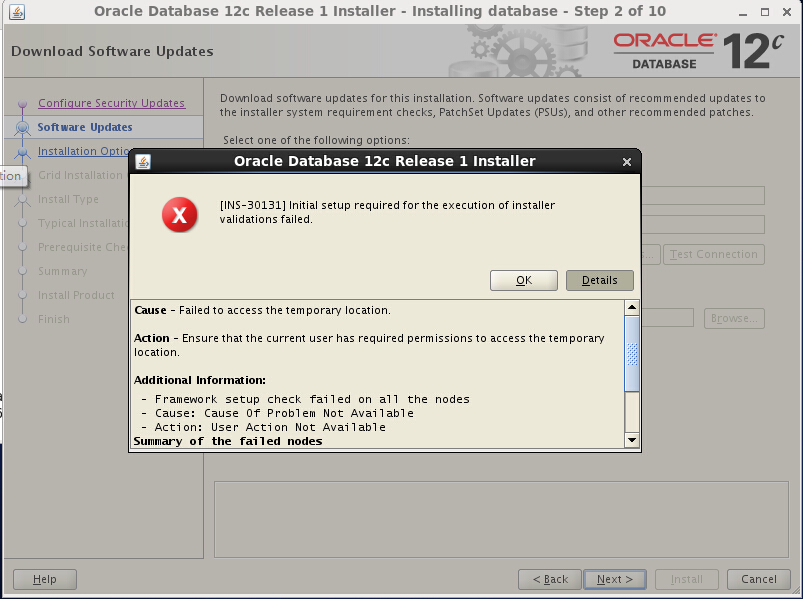

#Oracle Database 12c Release 1在CentOS 6.4安装实录

##安装环境

* VMware Workstation 10
* 操作系统：CentOS 6.4 x86-64
* 硬盘空间：300G（4G swap，其它全部分给根目录）
* 内存：2G
* 数据库版本：Oracle Database 12c Release 1
* 主机名：oracle12cR1.itrunc.com
* IP地址：192.168.100.99

##配置网络环境(以root用户登录，或者登录用户为sudoers)

使用静态IP，设置主机名。参考另一篇笔记：《[CentOS静态网络配置.md](../../OS/linux/centos/CentOS静态网络配置.md)》

```
[ben@oracle12cR1 ~]$ ifconfig
eth1      Link encap:Ethernet  HWaddr 00:0C:29:38:69:B3  
          inet addr:192.168.100.99  Bcast:192.168.100.255  Mask:255.255.255.0
          inet6 addr: fe80::20c:29ff:fe38:69b3/64 Scope:Link
          UP BROADCAST RUNNING MULTICAST  MTU:1500  Metric:1
          RX packets:31 errors:0 dropped:0 overruns:0 frame:0
          TX packets:12 errors:0 dropped:0 overruns:0 carrier:0
          collisions:0 txqueuelen:1000 
          RX bytes:1860 (1.8 KiB)  TX bytes:816 (816.0 b)

lo        Link encap:Local Loopback  
          inet addr:127.0.0.1  Mask:255.0.0.0
          inet6 addr: ::1/128 Scope:Host
          UP LOOPBACK RUNNING  MTU:16436  Metric:1
          RX packets:8 errors:0 dropped:0 overruns:0 frame:0
          TX packets:8 errors:0 dropped:0 overruns:0 carrier:0
          collisions:0 txqueuelen:0 
          RX bytes:480 (480.0 b)  TX bytes:480 (480.0 b)

[ben@oracle12cR1 ~]$ hostname
oracle12cR1.itrunc.com
```

##检查操作系统内核发行版

```
[ben@oracle12cR1 ~]$ uname -a
Linux oracle12cR1.itrunc.com 2.6.32-358.el6.x86_64 #1 SMP Fri Feb 22 00:31:26 UTC 2013 x86_64 x86_64 x86_64 GNU/Linux
```

操作系统是Linux 6，x86_64架构，满足2.6.32-71.el6.x86_64及以上的需求。

##检查存储需求

```
[ben@oracle12cR1 ~]$ df -h
文件系统	      容量  已用  可用 已用%% 挂载点
/dev/mapper/vg_centos64-LogVol01
                      292G  3.0G  274G   2% /
tmpfs                 936M   80K  936M   1% /dev/shm
/dev/sda1              97M   33M   60M  36% /boot
[ben@oracle12cR1 ~]$ df -h /tmp
文件系统	      容量  已用  可用 已用%% 挂载点
/dev/mapper/vg_centos64-LogVol01
                      292G  3.0G  274G   2% /
```

企业版需要最小磁盘存储空间为6.4GB，临时目录/tmp空间为1GB以上，还需要快速闪回去空间。由于主机有300G空间，因此磁盘存储空间满足需求。

##检查内存需求

```
[ben@oracle12cR1 ~]$ free
             total       used       free     shared    buffers     cached
Mem:       1915712     565992    1349720          0      21792     236564
-/+ buffers/cache:     307636    1608076
Swap:      4194296          0    4194296
```

主机内存2GB，满足1GB的最小需求。swap分配了4GB，建议当物理内存为2GB时保持与物理内存同大小，但可分配更大空间。

##检查OpenSSH

```
[ben@oracle12cR1 ~]$ chkconfig --list sshd
sshd           	0:关闭	1:关闭	2:启用	3:启用	4:启用	5:启用	6:关闭
```

sshd服务已经安装，CentOS默认有安装。如果未安装，则需到网上找资料如何安装OpenSSH。

##检查和安装依赖的程序包

```bash
rpm -q binutils compat-libcap1 compat-libstdc++ gcc gcc-c++ glibc glibc-devel ksh libgcc libstdc++ libstdc++-devel libaio libaio-devel libXext libXtst libX11 libXau libxcb libXi make sysstat
```

```
binutils-2.20.51.0.2-5.36.el6.x86_64
package compat-libcap1 is not installed
package compat-libstdc++ is not installed
package gcc is not installed
package gcc-c++ is not installed
glibc-2.12-1.107.el6.x86_64
package glibc-devel is not installed
package ksh is not installed
libgcc-4.4.7-3.el6.x86_64
libstdc++-4.4.7-3.el6.x86_64
package libstdc++-devel is not installed
libaio-0.3.107-10.el6.x86_64
package libaio-devel is not installed
libXext-1.3.1-2.el6.x86_64
libXtst-1.2.1-2.el6.x86_64
libX11-1.5.0-4.el6.x86_64
libXau-1.0.6-4.el6.x86_64
libxcb-1.8.1-1.el6.x86_64
libXi-1.6.1-3.el6.x86_64
make-3.81-20.el6.x86_64
sysstat-9.0.4-20.el6.x86_64
```

摘取未安装的软件包，如下：

```
package compat-libcap1 is not installed
package compat-libstdc++ is not installed
package gcc is not installed
package gcc-c++ is not installed
package glibc-devel is not installed
package ksh is not installed
package libstdc++-devel is not installed
package libaio-devel is not installed
```

安装以上未安装的软件包：

```bash
sudo yum --disablerepo=\* --enablerepo=c6-media install compat-libcap1 compat-libstdc++ gcc gcc-c++ glibc-devel ksh libstdc++-devel libaio-devel
```

```
(此处省略)

Dependencies Resolved

================================================================================================================================================================
 Package                                   Arch                             Version                                    Repository                          Size
================================================================================================================================================================
Installing:
 compat-libcap1                            x86_64                           1.10-1                                     c6-media                            17 k
 gcc                                       x86_64                           4.4.7-3.el6                                c6-media                            10 M
 gcc-c++                                   x86_64                           4.4.7-3.el6                                c6-media                           4.7 M
 glibc-devel                               x86_64                           2.12-1.107.el6                             c6-media                           974 k
 ksh                                       x86_64                           20100621-19.el6                            c6-media                           686 k
 libaio-devel                              x86_64                           0.3.107-10.el6                             c6-media                            13 k
 libstdc++-devel                           x86_64                           4.4.7-3.el6                                c6-media                           1.6 M
Installing for dependencies:
 cloog-ppl                                 x86_64                           0.15.7-1.2.el6                             c6-media                            93 k
 cpp                                       x86_64                           4.4.7-3.el6                                c6-media                           3.7 M
 glibc-headers                             x86_64                           2.12-1.107.el6                             c6-media                           604 k
 kernel-headers                            x86_64                           2.6.32-358.el6                             c6-media                           2.3 M
 mpfr                                      x86_64                           2.4.1-6.el6                                c6-media                           157 k
 ppl                                       x86_64                           0.10.2-11.el6                              c6-media                           1.3 M

Transaction Summary
================================================================================================================================================================
Install      13 Package(s)

Total download size: 26 M
Installed size: 60 M
Is this ok [y/N]: y
```

完成以上安装后，除了compat-libstdc++包之外，64位的依赖包就都安装了，可使用上文的检查命令进行检查。

>**纠错**
>正确的报名是compat-libstdc++-33

安装compat-libstdc++-33

```bash
sudo yum --disablerepo=\* --enablerepo=c6-media -y install compat-libstdc++-33
```

再次检查所有软件包：

```
rpm -q binutils compat-libcap1 compat-libstdc++-33 gcc gcc-c++ glibc glibc-devel ksh libgcc libstdc++ libstdc++-devel libaio libaio-devel libXext libXtst libX11 libXau libxcb libXi make sysstat
```

```
binutils-2.20.51.0.2-5.36.el6.x86_64
compat-libcap1-1.10-1.x86_64
compat-libstdc++-33-3.2.3-69.el6.x86_64
gcc-4.4.7-3.el6.x86_64
gcc-c++-4.4.7-3.el6.x86_64
glibc-2.12-1.107.el6.x86_64
glibc-devel-2.12-1.107.el6.x86_64
ksh-20100621-19.el6.x86_64
libgcc-4.4.7-3.el6.x86_64
libstdc++-4.4.7-3.el6.x86_64
libstdc++-devel-4.4.7-3.el6.x86_64
libaio-0.3.107-10.el6.x86_64
libaio-devel-0.3.107-10.el6.x86_64
libXext-1.3.1-2.el6.x86_64
libXtst-1.2.1-2.el6.x86_64
libX11-1.5.0-4.el6.x86_64
libXau-1.0.6-4.el6.x86_64
libxcb-1.8.1-1.el6.x86_64
libXi-1.6.1-3.el6.x86_64
make-3.81-20.el6.x86_64
sysstat-9.0.4-20.el6.x86_64
```

已全部安装了，并且所有软件包的版本都比文档中要求的版本高，但所有的32位版本都没有安装，且继续，看是否有关系。

##安装unixODBC

CentOS6.4安装光盘中的unixODBC的版本为2.2.14，而oracle要求2.3.1或更高。因此只能到网上去下载 http://www.unixodbc.org/

安装略，且看是否有关系。

##创建相关的用户和用户组

```
[ben@oracle12cR1 ~]$ sudo vi /etc/oraInst.loc
[sudo] password for ben: 
[ben@oracle12cR1 ~]$ ll /etc | grep ora
-rw-r--r--.  1 root root     56 4月   8 16:53 oraInst.loc
```

创建 /etc/oraInst.loc 文件，并写入以下内容：

```
inventory_loc=/u01/app/oraInventory
inst_group=oinstall
```

检查dba组和oinstall组是否存在，若不存在则添加

```
[ben@oracle12cR1 ~]$ grep dba /etc/group
[ben@oracle12cR1 ~]$ grep oinstall /etc/group
[ben@oracle12cR1 ~]$ grep oper /etc/group
[ben@oracle12cR1 ~]$ sudo groupadd dba
[ben@oracle12cR1 ~]$ sudo groupadd oinstall
[ben@oracle12cR1 ~]$ sudo groupadd oper
[ben@oracle12cR1 ~]$ grep dba /etc/group
dba:x:501:
[ben@oracle12cR1 ~]$ grep oinstall /etc/group
oinstall:x:502:
[ben@oracle12cR1 ~]$ grep oper /etc/group
oper:x:503:
```

检查oracle用户是否存在，如果不存在则添加，并设置密码。

```
[ben@oracle12cR1 ~]$ id oracle
id: oracle：无此用户
[ben@oracle12cR1 ~]$ sudo useradd -g oinstall -G dba,oper oracle
[ben@oracle12cR1 ~]$ sudo passwd oracle
更改用户 oracle 的密码 。
新的 密码：
无效的密码： 过于简单化/系统化
重新输入新的 密码：
passwd： 所有的身份验证令牌已经成功更新。
[ben@oracle12cR1 ~]$ id oracle
uid=501(oracle) gid=502(oinstall) 组=502(oinstall),501(dba),503(oper)
```

##检查并修改内核参数

```
[ben@oracle12cR1 ~]$ sudo sysctl -a | grep sem
kernel.sem = 250	32000	32	128
```

以上数值分别对应semmsl, semmns, semopm, semmni，要求250,32000,100,128，只有semopm未达到最小值100

```
[ben@oracle12cR1 ~]$ sudo sysctl -a | grep shm
kernel.shmmax = 68719476736
kernel.shmall = 4294967296
kernel.shmmni = 4096
kernel.shm_rmid_forced = 0
vm.hugetlb_shm_group = 0
```

以上显示shmmax,shmall,shmmni均达到需求的最小值：536870912,2097152,4096

```
[ben@oracle12cR1 ~]$ sudo sysctl -a | grep ip_local_port_range
net.ipv4.ip_local_port_range = 32768	61000
```

以上显示ip_local_port_range范围不满足要求的最小范围，应改为9000,65500

```
[ben@oracle12cR1 ~]$ sudo sysctl -a | grep rmem_default
net.core.rmem_default = 229376
[ben@oracle12cR1 ~]$ sudo sysctl -a | grep rmem_max
net.core.rmem_max = 229376
[ben@oracle12cR1 ~]$ sudo sysctl -a | grep wmem_default
net.core.wmem_default = 229376
[ben@oracle12cR1 ~]$ sudo sysctl -a | grep wmem_max
net.core.wmem_max = 229376
```

以上显示，这4个参数均不满足要求的最小值：

```
net.core.rmem_default = 262144
net.core.rmem_max = 4194304
net.core.wmem_default = 262144
net.core.wmem_max = 1048586
```

```
[ben@oracle12cR1 ~]$ sudo sysctl -a | grep panic_on_oops
kernel.panic_on_oops = 1
```

以上显示，panic_on_oops参数满足需求。

```
[ben@oracle12cR1 ~]$ sudo sysctl -a | grep file-max
fs.file-max = 187706
[ben@oracle12cR1 ~]$ sudo sysctl -a | grep aio-max-nr
fs.aio-max-nr = 65536
```

以上显示，file-max和aio-max-nr两个参数不满足要求的最小值：

```
fs.aio-max-nr = 1048576
fs.file-max = 6815744
```

综上，需调整的内核参数包括：

```
fs.aio-max-nr = 1048576
fs.file-max = 6815744
kernel.sem = 250 32000 100 128
net.ipv4.ip_local_port_range = 9000 65500
net.core.rmem_default = 262144
net.core.rmem_max = 4194304
net.core.wmem_default = 262144
net.core.wmem_max = 1048586
```

将以上参数及其所需的数值更新到配置文件 /etc/sysctl.conf 中

```bash
sudo vi /etc/sysctl.conf
```

在文件末尾添加以上调整后的参数，并保存。

重启系统。

```bash
reboot
```

##检查和修改oracle用户的资源限制

切换到oracle用户检查资源限制

```
[ben@oracle12cR1 ~]$ su - oracle
密码：
[oracle@oracle12cR1 ~]$ ulimit -Sn
1024
[oracle@oracle12cR1 ~]$ ulimit -Hn
4096
[oracle@oracle12cR1 ~]$ ulimit -Su
1024
[oracle@oracle12cR1 ~]$ ulimit -Hu
14810
[oracle@oracle12cR1 ~]$ ulimit -Ss
10240
[oracle@oracle12cR1 ~]$ ulimit -Hs
unlimited
[oracle@oracle12cR1 ~]$ ulimit -Sl
64
[oracle@oracle12cR1 ~]$ ulimit -Hl
64
[oracle@oracle12cR1 ~]$ exit
logout
```

以上翻译成配置文件/etc/security/limits.conf中的格式

```
oracle soft nofile 1024 #期望1024，一般设为4096
oracle hard nofile 4096 #期望65535
oracle soft nproc 1024  #期望2047
oracle hard nproc 14810 #期望16384
oracle soft stack 10240 #期望10240
oracle hard stack unlimited #期望32768
oracle soft memlock 64  #期望启动HugePages时为90%物理内存，禁用时3145728
oracle hard memlock 64  #期望启动HugePages时为90%物理内存，禁用时3145728
```

调整后的结果：

```
oracle soft nofile 4096
oracle hard nofile 65535
oracle soft nproc 2047
oracle hard nproc 16384
oracle soft stack 10240
oracle hard stack 32768
oracle soft memlock 3145728
oracle hard memlock 3145728
```

将以上内容追加到文件/etc/security/limits.conf中：

```
[ben@oracle12cR1 ~]$ sudo vi /etc/security/limits.conf
```

##创建所需的目录

```
[ben@oracle12cR1 ~]$ sudo mkdir -p /u01/app/
[ben@oracle12cR1 ~]$ sudo chown -R oracle:oinstall /u01/app/
[ben@oracle12cR1 ~]$ sudo chmod -R 775 /u01/app/
[ben@oracle12cR1 ~]$ ll /u01
总用量 4
drwxrwxr-x. 2 oracle oinstall 4096 4月   9 10:16 app
```

##用户环境变量设置（以oracle身份登录系统）

编辑文件 /home/oracle/.bash_profile

```
[oracle@oracle12cR1 ~]$ vi /home/oracle/.bash_profile
```

向文件内容追加以下内容：

```
ORACLE_BASE=/u01/app
ORACLE_HOME=$ORACLE_BASE/12cR1
ORACLE_SID=orcl
LD_LIBRARY_PATH=$ORACLE_HOME/lib
PATH=$PATH:$ORACLE_HOME/bin
export ORACLE_BASE ORACLE_HOME ORACLE_SID LD_LIBRARY_PATH PATH
```

保存后，执行命令：

```
source /home/oracle/.bash_profile
```

##插入光盘，开始安装（当前登录用户为oracle）

插入光盘，切换到安装文件所在的目录：

```
[oracle@oracle12cR1 database]$ pwd
/media/OracleDB12cR1_Li/database
[oracle@oracle12cR1 database]$ ll
总用量 19
dr-x------. 1 oracle oinstall 2048 4月   9 10:29 install
dr-x------. 1 oracle oinstall 2048 4月   9 10:29 response
dr-x------. 1 oracle oinstall 2048 4月   9 10:29 rpm
-r--------. 1 oracle oinstall 7808 5月  24 2013 runInstaller
dr-x------. 1 oracle oinstall 2048 4月   9 10:29 sshsetup
dr-x------. 1 oracle oinstall 2048 4月   9 10:29 stage
-r--------. 1 oracle oinstall  500 6月   9 2013 welcome.html
```

runInstaller没有可执行权限。将整个database文件夹拷贝到主目录中：

```
[oracle@oracle12cR1 OracleDB12cR1_Li]$ pwd
/media/OracleDB12cR1_Li
[oracle@oracle12cR1 OracleDB12cR1_Li]$ ll
total 2
dr-x------. 1 oracle oinstall 2048 Apr  9 10:29 database
[oracle@oracle12cR1 OracleDB12cR1_Li]$ cp -R database ~/
[oracle@oracle12cR1 OracleDB12cR1_Li]$ ll ~/database
total 32
dr-x------.  4 oracle oinstall 4096 Apr  9 10:58 install
dr-x------.  2 oracle oinstall 4096 Apr  9 10:58 response
dr-x------.  2 oracle oinstall 4096 Apr  9 10:58 rpm
-r--------.  1 oracle oinstall 7808 Apr  9 10:58 runInstaller
dr-x------.  2 oracle oinstall 4096 Apr  9 10:58 sshsetup
dr-x------. 14 oracle oinstall 4096 Apr  9 11:00 stage
-r--------.  1 oracle oinstall  500 Apr  9 11:00 welcome.html
[oracle@oracle12cR1 OracleDB12cR1_Li]$ cd ~/database
[oracle@oracle12cR1 database]$ pwd
/home/oracle/database
```

切换到root用户，并将runInstaller改成可执行：

```
[oracle@oracle12cR1 database]$ su -
Password: 
[root@oracle12cR1 ~]# chmod 500 /home/oracle/database/runInstaller
[root@oracle12cR1 ~]# exit
logout
[oracle@oracle12cR1 database]$ ll
total 32
dr-x------.  4 oracle oinstall 4096 Apr  9 10:58 install
dr-x------.  2 oracle oinstall 4096 Apr  9 10:58 response
dr-x------.  2 oracle oinstall 4096 Apr  9 10:58 rpm
-r-x------.  1 oracle oinstall 7808 Apr  9 10:58 runInstaller
dr-x------.  2 oracle oinstall 4096 Apr  9 10:58 sshsetup
dr-x------. 14 oracle oinstall 4096 Apr  9 11:00 stage
-r--------.  1 oracle oinstall  500 Apr  9 11:00 welcome.html
```

执行安装向导：

```
[oracle@oracle12cR1 database]$ /home/oracle/database/runInstaller
/home/oracle/database/runInstaller: line 240: /home/oracle/database/install/.oui: Permission denied
```

/home/oracle/database/install/.oui没有执行权限。。。

切换到root，为/home/oracle/database/install/目录下的所有文件都添加执行权限(不安全，安装完成后，把安装包删掉)：

```
[oracle@oracle12cR1 install]$ su -
Password: 
[root@oracle12cR1 ~]# chmod +x /home/oracle/database/install/*
[root@oracle12cR1 ~]# chmod +x /home/oracle/database/install/.oui
[root@oracle12cR1 ~]# ll /home/oracle/database/install/
总用量 256
-r-x--x--x. 1 oracle oinstall     28 4月   9 10:58 addLangs.sh
-r-x--x--x. 1 oracle oinstall    275 4月   9 10:58 attachHome.sh
-r-x--x--x. 1 oracle oinstall   7499 4月   9 10:58 clusterparam.ini
-r-x--x--x. 1 oracle oinstall    181 4月   9 10:58 detachHome.sh
dr-x--x--x. 2 oracle oinstall   4096 4月   9 10:58 images
-r-x--x--x. 1 oracle oinstall  64797 4月   9 10:58 lsnodes
-r-x--x--x. 1 oracle oinstall   2111 4月   9 10:58 oraparam.ini
-r-x--x--x. 1 oracle oinstall   2096 4月   9 10:58 oraparam.ini.deinstall
-r-x--x--x. 1 oracle oinstall   6437 4月   9 10:58 oraparamsilent.ini
dr-x--x--x. 2 oracle oinstall   4096 4月   9 10:58 resource
-r-x--x--x. 1 oracle oinstall    107 4月   9 10:58 runInstaller.sh
-r-x--x--x. 1 oracle oinstall 145976 4月   9 10:58 unzip
[root@oracle12cR1 ~]# exit
```

再次执行安装：

```
[oracle@oracle12cR1 database]$ /home/oracle/database/runInstaller
```

很不幸，再次出错了。



原因是/etc/hosts文件中未添加主机名，解决方法如下：

```
[oracle@oracle12cR1 install]$ hostname
oracle12cR1.itrunc.com
[oracle@oracle12cR1 install]$ cat /etc/hosts
127.0.0.1   localhost localhost.localdomain localhost4 localhost4.localdomain4
::1         localhost localhost.localdomain localhost6 localhost6.localdomain6
[oracle@oracle12cR1 install]$ su -
Password: 
[root@oracle12cR1 ~]# vi /etc/hosts
[root@oracle12cR1 ~]# exit
logout
[oracle@oracle12cR1 install]$ cat /etc/hosts
127.0.0.1   localhost localhost.localdomain localhost4 localhost4.localdomain4
::1         localhost localhost.localdomain localhost6 localhost6.localdomain6
127.0.0.1   oracle12cR1.itrunc.com
```

##再次启程安装

```
[oracle@oracle12cR1 ~]$ export LANG=en_US
[oracle@oracle12cR1 database]$ /home/oracle/database/runInstaller
Starting Oracle Universal Installer...

Checking Temp space: must be greater than 500 MB.   Actual 276776 MB    Passed
Checking swap space: must be greater than 150 MB.   Actual 4095 MB    Passed
Checking monitor: must be configured to display at least 256 colors.    Actual 16777216    Passed
Preparing to launch Oracle Universal Installer from /tmp/OraInstall2015-04-09_12-50-46PM. Please wait ...
```



去掉接受安全更新的选项，点击Next



点击Yes



点击Next



点击Details，看一下是什么没有满足要求



继续，点击Yes



Details内容如下：

```
Cause - Failed to access the temporary location.  
Action - Ensure that the current user has required permissions to access the temporary location.  
Additional Information:
 - Framework setup check failed on all the nodes  
 - Cause: Cause Of Problem Not Available  
 - Action: User Action Not Available 
Summary of the failed nodes 
oracle12cR1  
 - Version of exectask could not be retrieved from node "oracle12cR1"  
 - Cause: Cause Of Problem Not Available  
 - Action: User Action Not Available 
```

关闭 SELinux，问题未能解决

关闭防火墙，问题未能解决