#Oracle Database 12c Release 1在CentOS 6.4安装实录二

##安装环境

* VMware Workstation 10
* 操作系统：CentOS 6.4 x86-64
* 硬盘空间：300G（4G swap，其它全部分给根目录）
* 内存：2G
* 数据库版本：Oracle Database 12c Release 1
* 主机名：oracle12cR1.itrunc.com
* IP地址：192.168.100.99

安装过程中以一个sudoer登录，需要用到root权限的时候都会使用sudo。期间可能需要与oracle用户之间进行切换。

>关于sudoers的配置可参考：
>
>* [CentOS中如何将普通用哈添加到sudoers中](../../OS/linux/centos/将普通用户添加到sudoers.md)
>* [Linux中sudoers管理](../../OS/linux/sudoers管理.md)

##检查网络环境

>主机网络环境的配置可参考：
>
>[CentOS静态网络配置](../../OS/linux/centos/CentOS静态网络配置.md)

###检查主机名：

```
[ben@oracle12cR1 ~]$ hostname
oracle12cR1.itrunc.com
```

###检查主机IP地址：

```
[ben@oracle12cR1 ~]$ ifconfig
eth1      Link encap:Ethernet  HWaddr 00:0C:29:38:69:B3  
          inet addr:192.168.100.99  Bcast:192.168.100.255  Mask:255.255.255.0
          inet6 addr: fe80::20c:29ff:fe38:69b3/64 Scope:Link
          UP BROADCAST RUNNING MULTICAST  MTU:1500  Metric:1
          RX packets:687 errors:0 dropped:0 overruns:0 frame:0
          TX packets:18 errors:0 dropped:0 overruns:0 carrier:0
          collisions:0 txqueuelen:1000 
          RX bytes:62944 (61.4 KiB)  TX bytes:1132 (1.1 KiB)

lo        Link encap:Local Loopback  
          inet addr:127.0.0.1  Mask:255.0.0.0
          inet6 addr: ::1/128 Scope:Host
          UP LOOPBACK RUNNING  MTU:16436  Metric:1
          RX packets:8 errors:0 dropped:0 overruns:0 frame:0
          TX packets:8 errors:0 dropped:0 overruns:0 carrier:0
          collisions:0 txqueuelen:0 
          RX bytes:480 (480.0 b)  TX bytes:480 (480.0 b)
```

###检查host文件

```
[ben@oracle12cR1 ~]$ cat /etc/hosts
127.0.0.1   localhost localhost.localdomain localhost4 localhost4.localdomain4
::1         localhost localhost.localdomain localhost6 localhost6.localdomain6
192.168.100.99 oracle12cR1.itrunc.com
```

已追加主机名与IP的映射关系：`192.168.100.99 oracle12cR1.itrunc.com`

##检查操作系统内核发行版

```
[ben@oracle12cR1 ~]$ uname -a
Linux oracle12cR1.itrunc.com 2.6.32-358.el6.x86_64 #1 SMP Fri Feb 22 00:31:26 UTC 2013 x86_64 x86_64 x86_64 GNU/Linux
```

操作系统是Linux 6，x86_64架构，满足2.6.32-71.el6.x86_64及以上的需求。

##检查存储需求

```
[ben@oracle12cR1 ~]$ df -h
文件系统	      容量  已用  可用 已用%% 挂载点
/dev/mapper/vg_centos64-LogVol01
                      292G  3.0G  274G   2% /
tmpfs                 936M   80K  936M   1% /dev/shm
/dev/sda1              97M   33M   60M  36% /boot
```

要求：用于安装的最小磁盘空间为6.4GB，临时目录最小空间为1GB。以上条件均满足


##检查内存需求

```
[ben@oracle12cR1 ~]$ free -m
             total       used       free     shared    buffers     cached
Mem:          1870        548       1321          0         21        228
-/+ buffers/cache:        299       1571
Swap:         4095          0       4095
```

要求：内存至少1GB，由于实际物理内存为2GB，建议swap至少与物理内存大小相同。

##检查是否已安装OpenSSH

```
[ben@oracle12cR1 ~]$ chkconfig --list sshd
sshd           	0:关闭	1:关闭	2:启用	3:启用	4:启用	5:启用	6:关闭
```

sshd服务已经运行。

##安装依赖的程序包

系统默认只安装64位的软件包，而oracle还要求32位的软件包。因此需修改配置使yum也安装32位软件包。

```
[ben@oracle12cR1 ~]$ sudo vi /etc/yum.conf
```

添加一行：

```
multilib_policy=all
```

插入CentOS 6.4安装光盘，系统自动挂载到 /media/CentOS_6.4_Final/，将该目录配置为yum的本地仓库：

```
[ben@oracle12cR1 ~]$ sudo vi /etc/yum.repos.d/CentOS-Media.repo
```

添加一行：`file:///media/CentOS_6.4_Final/`，如下：

```
[c6-media]
name=CentOS-$releasever - Media
baseurl=file:///media/CentOS/
        file:///media/cdrom/
        file:///media/cdrecorder/
        file:///media/CentOS_6.4_Final/
gpgcheck=1
enabled=0
gpgkey=file:///etc/pki/rpm-gpg/RPM-GPG-KEY-CentOS-6
```

开始安装：

```
sudo yum --disablerepo=\* --enablerepo=c6-media -y install binutils compat-libcap1 compat-libstdc++-33 gcc gcc-c++ glibc glibc-devel ksh libgcc libstdc++ libstdc++-devel libaio libaio-devel libXext libXtst libX11 libXau libxcb libXi make sysstat unixODBC unixODBC-devel
```

完成后，检查安装状态：

```
[ben@oracle12cR1 ~]$ rpm -q binutils compat-libcap1 compat-libstdc++-33 gcc gcc-c++ glibc glibc-devel ksh libgcc libstdc++ libstdc++-devel libaio libaio-devel libXext libXtst libX11 libXau libxcb libXi make sysstat unixODBC unixODBC-devel
binutils-2.20.51.0.2-5.36.el6.x86_64
compat-libcap1-1.10-1.x86_64
compat-libcap1-1.10-1.i686
compat-libstdc++-33-3.2.3-69.el6.x86_64
compat-libstdc++-33-3.2.3-69.el6.i686
gcc-4.4.7-3.el6.x86_64
gcc-c++-4.4.7-3.el6.x86_64
glibc-2.12-1.107.el6.x86_64
glibc-2.12-1.107.el6.i686
glibc-devel-2.12-1.107.el6.i686
glibc-devel-2.12-1.107.el6.x86_64
ksh-20100621-19.el6.x86_64
libgcc-4.4.7-3.el6.x86_64
libgcc-4.4.7-3.el6.i686
libstdc++-4.4.7-3.el6.x86_64
libstdc++-4.4.7-3.el6.i686
libstdc++-devel-4.4.7-3.el6.x86_64
libstdc++-devel-4.4.7-3.el6.i686
libaio-0.3.107-10.el6.x86_64
libaio-0.3.107-10.el6.i686
libaio-devel-0.3.107-10.el6.x86_64
libaio-devel-0.3.107-10.el6.i686
libXext-1.3.1-2.el6.x86_64
libXext-1.3.1-2.el6.i686
libXtst-1.2.1-2.el6.x86_64
libXtst-1.2.1-2.el6.i686
libX11-1.5.0-4.el6.x86_64
libX11-1.5.0-4.el6.i686
libXau-1.0.6-4.el6.x86_64
libXau-1.0.6-4.el6.i686
libxcb-1.8.1-1.el6.x86_64
libxcb-1.8.1-1.el6.i686
libXi-1.6.1-3.el6.x86_64
libXi-1.6.1-3.el6.i686
make-3.81-20.el6.x86_64
sysstat-9.0.4-20.el6.x86_64
unixODBC-2.2.14-12.el6_3.x86_64
unixODBC-2.2.14-12.el6_3.i686
unixODBC-devel-2.2.14-12.el6_3.x86_64
unixODBC-devel-2.2.14-12.el6_3.i686
```

Oracle要求在Linux 6下安装时依赖的软件包及其最低版本如下：

```
binutils-2.20.51.0.2-5.11.el6 (x86_64)
compat-libcap1-1.10-1 (x86_64)
compat-libstdc++-33-3.2.3-69.el6 (x86_64)
compat-libstdc++-33-3.2.3-69.el6 (i686)
gcc-4.4.4-13.el6 (x86_64)
gcc-c++-4.4.4-13.el6 (x86_64)
glibc-2.12-1.7.el6 (i686)
glibc-2.12-1.7.el6 (x86_64)
glibc-devel-2.12-1.7.el6 (x86_64)
glibc-devel-2.12-1.7.el6 (i686)
ksh
libgcc-4.4.4-13.el6 (i686)
libgcc-4.4.4-13.el6 (x86_64)
libstdc++-4.4.4-13.el6 (x86_64)
libstdc++-4.4.4-13.el6 (i686)
libstdc++-devel-4.4.4-13.el6 (x86_64)
libstdc++-devel-4.4.4-13.el6 (i686)
libaio-0.3.107-10.el6 (x86_64)
libaio-0.3.107-10.el6 (i686)
libaio-devel-0.3.107-10.el6 (x86_64)
libaio-devel-0.3.107-10.el6 (i686)
libXext-1.1 (x86_64)
libXext-1.1 (i686)
libXtst-1.0.99.2 (x86_64)
libXtst-1.0.99.2 (i686)
libX11-1.3 (x86_64)
libX11-1.3 (i686)
libXau-1.0.5 (x86_64)
libXau-1.0.5 (i686)
libxcb-1.5 (x86_64)
libxcb-1.5 (i686)
libXi-1.3 (x86_64)
libXi-1.3 (i686)
make-3.81-19.el6
sysstat-9.0.4-11.el6 (x86_64)
unixODBC-2.3.1 or later (可选)
```

其中已安装的unixODBC版本稍低，后续如果有需要升级，可参考：http://www.unixodbc.org/

##创建所需的用户组和用户

检查并添加用户组：

```
[ben@oracle12cR1 ~]$ grep dba /etc/group
[ben@oracle12cR1 ~]$ grep oinstall /etc/group
[ben@oracle12cR1 ~]$ grep oper /etc/group
[ben@oracle12cR1 ~]$ sudo groupadd dba
[ben@oracle12cR1 ~]$ sudo groupadd oinstall
[ben@oracle12cR1 ~]$ sudo groupadd oper
[ben@oracle12cR1 ~]$ grep dba /etc/group
dba:x:501:
[ben@oracle12cR1 ~]$ grep oinstall /etc/group
oinstall:x:502:
[ben@oracle12cR1 ~]$ grep oper /etc/group
oper:x:503:
```

检查并添加用户oracle：

```
[ben@oracle12cR1 ~]$ id oracle
id: oracle：无此用户
[ben@oracle12cR1 ~]$ sudo useradd -g oinstall -G dba,oper oracle
[ben@oracle12cR1 ~]$ id oracle
uid=501(oracle) gid=502(oinstall) 组=502(oinstall),501(dba),503(oper)
[ben@oracle12cR1 ~]$ sudo passwd oracle
更改用户 oracle 的密码 。
新的 密码：
无效的密码： 过于简单化/系统化
无效的密码： 过于简单
重新输入新的 密码：
passwd： 所有的身份验证令牌已经成功更新。
```

##创建或修改配置文件 /etc/oraInst.loc

```
[ben@oracle12cR1 ~]$ sudo vi /etc/oraInst.loc
```

添加或修改以下内容：

```
inventory_loc=/u01/app/oraInventory
inst_group=oinstall
```

##修改内核参数

编辑内核参数配置文件：/etc/sysctl.conf

```
[ben@oracle12cR1 ~]$ sudo vi /etc/sysctl.conf
```

在文件末尾添加以下内容：

```
fs.aio-max-nr = 1048576
fs.file-max = 6815744
kernel.sem = 250 32000 100 128
net.ipv4.ip_local_port_range = 9000 65500
net.core.rmem_default = 262144
net.core.rmem_max = 4194304
net.core.wmem_default = 262144
net.core.wmem_max = 1048586
```

>**提示**
>
>以上参数及其值只针对CentOS 6.4有效，如果在其它系统版本中安装，需根据文档对相应内核参数进行检查以确定是否在该配置文件中重新设置。

##修改oracle用户的资源限制

编辑配置文件：/etc/security/limits.conf

```
[ben@oracle12cR1 ~]$ sudo vi /etc/security/limits.conf
```

在文件中添加以下内容：

```
oracle soft nofile 4096
oracle hard nofile 65535
oracle soft nproc 2047
oracle hard nproc 16384
oracle soft stack 10240
oracle hard stack 32768
oracle soft memlock 3145728
oracle hard memlock 3145728
```

>**提示**
>
>以上设置只针对CentOS 6.4有效，如果在其它系统版本中安装，需根据文档对相应资源限制进行检查以确定是否在该诶只文件中设置

##重启系统，以让修改的内核参数和资源限制生效

```
[ben@oracle12cR1 ~]$ reboot
```

##创建所需的目录

```
[ben@oracle12cR1 ~]$ sudo mkdir -p /u01/app/oraInventory
[sudo] password for ben: 
[ben@oracle12cR1 ~]$ sudo chown -R oracle:oinstall /u01/
[ben@oracle12cR1 ~]$ sudo chmod -R 755 /u01/
[ben@oracle12cR1 ~]$ ll / | grep u01
drwxr-xr-x.   3 oracle oinstall  4096 4月   9 16:19 u01
[ben@oracle12cR1 ~]$ ll /u01
总用量 4
drwxr-xr-x. 3 oracle oinstall 4096 4月   9 16:19 app
[ben@oracle12cR1 ~]$ ll /u01/app
总用量 4
drwxr-xr-x. 2 oracle oinstall 4096 4月   9 16:19 oraInventory
```

##为oracle用户添加环境变量

编辑文件 /home/oracle/.bash_profile

```
[oracle@oracle12cR1 ~]$ vi /home/oracle/.bash_profile
```

向文件内容追加以下内容：

```
ORACLE_BASE=/u01/app
ORACLE_HOME=$ORACLE_BASE/12cR1
ORACLE_SID=orcl
LD_LIBRARY_PATH=$ORACLE_HOME/lib
PATH=$PATH:$ORACLE_HOME/bin
export ORACLE_BASE ORACLE_HOME ORACLE_SID LD_LIBRARY_PATH PATH
```

##插入安装光盘，将安装包复制到系统中

将安装光盘中的整个database文件夹复制到/home/oracle/database，假设我的安装光盘被挂载到 /media/OracleDB12cR1_Li/

```
[ben@oracle12cR1 ~]$ sudo cp -R /media/OracleDB12cR1_Li/database /home/oracle/database
```

修改安装文件所有者，并添加执行权限

```
[ben@oracle12cR1 ~]$ sudo chown -R oracle:oinstall /home/oracle/database
[ben@oracle12cR1 ~]$ sudo chmod -R u+x /home/oracle/database
[ben@oracle12cR1 ~]$ sudo ls -l /home/oracle
总用量 4
dr-x------. 7 oracle oinstall 4096 4月   9 16:31 database
[ben@oracle12cR1 ~]$ sudo ls -l /home/oracle/database
总用量 32
dr-x------.  4 oracle oinstall 4096 4月   9 16:28 install
dr-x------.  2 oracle oinstall 4096 4月   9 16:28 response
dr-x------.  2 oracle oinstall 4096 4月   9 16:28 rpm
-r-x------.  1 oracle oinstall 7808 4月   9 16:28 runInstaller
dr-x------.  2 oracle oinstall 4096 4月   9 16:28 sshsetup
dr-x------. 14 oracle oinstall 4096 4月   9 16:31 stage
-r-x------.  1 oracle oinstall  500 4月   9 16:31 welcome.html
[ben@oracle12cR1 ~]$ sudo ls -al /home/oracle/database/install
总用量 432
dr-x------. 4 oracle oinstall   4096 4月   9 16:28 .
dr-x------. 7 oracle oinstall   4096 4月   9 16:31 ..
-r-x------. 1 oracle oinstall     28 4月   9 16:28 addLangs.sh
-r-x------. 1 oracle oinstall    275 4月   9 16:28 attachHome.sh
-r-x------. 1 oracle oinstall   7499 4月   9 16:28 clusterparam.ini
-r-x------. 1 oracle oinstall    181 4月   9 16:28 detachHome.sh
dr-x------. 2 oracle oinstall   4096 4月   9 16:28 images
-r-x------. 1 oracle oinstall  64797 4月   9 16:28 lsnodes
-r-x------. 1 oracle oinstall   2111 4月   9 16:28 oraparam.ini
-r-x------. 1 oracle oinstall   2096 4月   9 16:28 oraparam.ini.deinstall
-r-x------. 1 oracle oinstall   6437 4月   9 16:28 oraparamsilent.ini
-r-x------. 1 oracle oinstall 171575 4月   9 16:28 .oui
dr-x------. 2 oracle oinstall   4096 4月   9 16:28 resource
-r-x------. 1 oracle oinstall    107 4月   9 16:28 runInstaller.sh
-r-x------. 1 oracle oinstall 145976 4月   9 16:28 unzip
```

##切换到oracle用户，并运行安装向导

```
[ben@oracle12cR1 ~]$ su - oracle
密码：
[ben@oracle12cR1 ~]$ source /home/oracle/.bash_profile
[oracle@oracle12cR1 ~]$ /home/oracle/database/runInstaller
正在启动 Oracle Universal Installer...

检查临时空间: 必须大于 500 MB。   实际为 277318 MB    通过
检查交换空间: 必须大于 150 MB。   实际为 4095 MB    通过
检查监视器: 监视器配置至少必须显示 256 种颜色。    实际为 16777216    通过
准备从以下地址启动 Oracle Universal Installer /tmp/OraInstall2015-04-09_04-37-38PM. 请稍候...
```

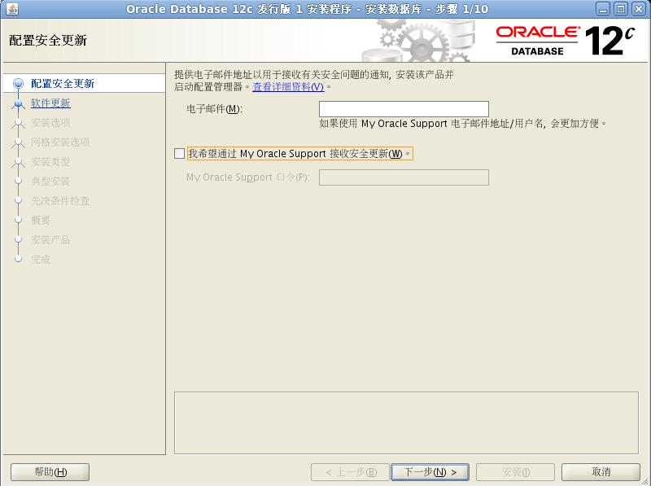

去掉安全更新的选项后，点击下一步

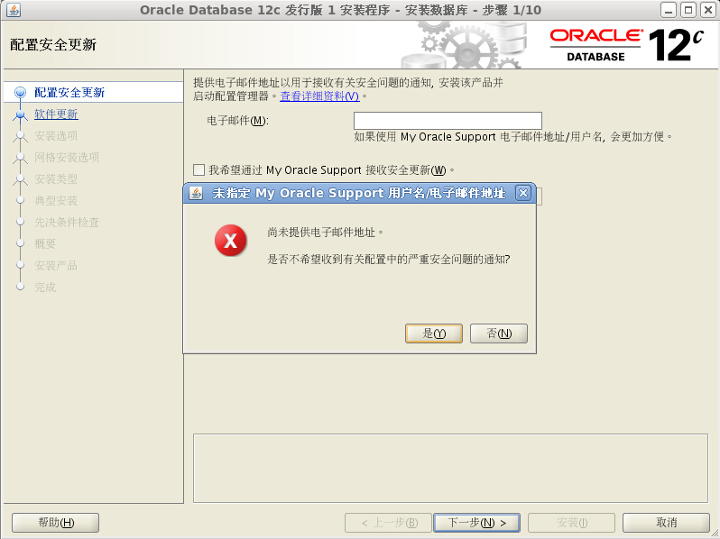

点击是

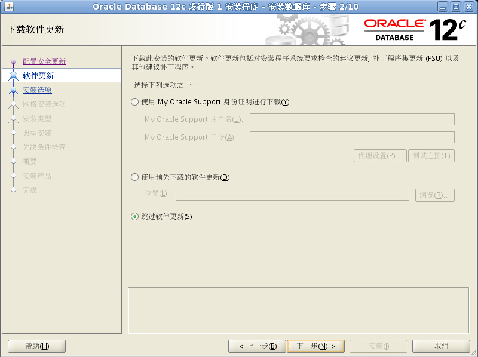

点击下一步，如果弹出`[INS-13001] 环境不满足最低要求。`的警告，点击是，忽略它！

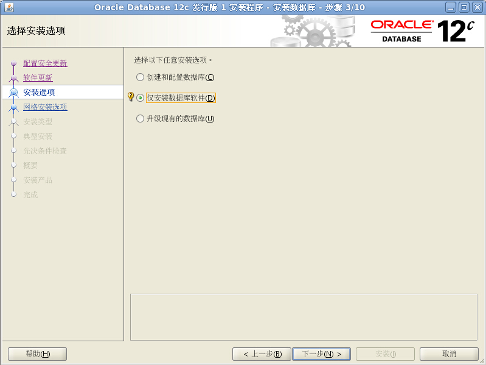

选择 `仅安装数据库软件`，点击下一步

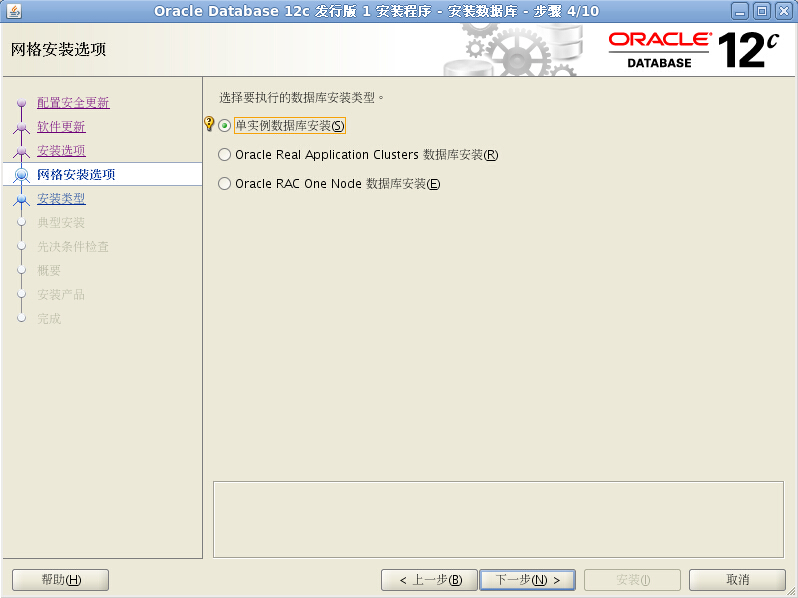

选择 `单实例数据库安装`，点击下一步

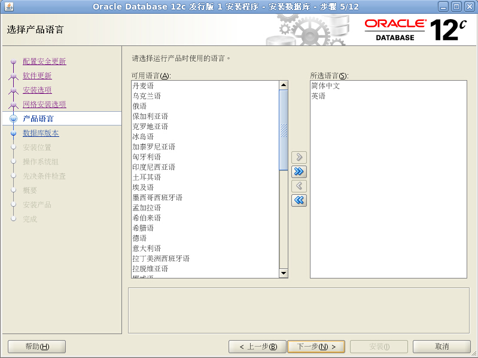

默认选择语言：简体中文和英语，无需改动，点击下一步

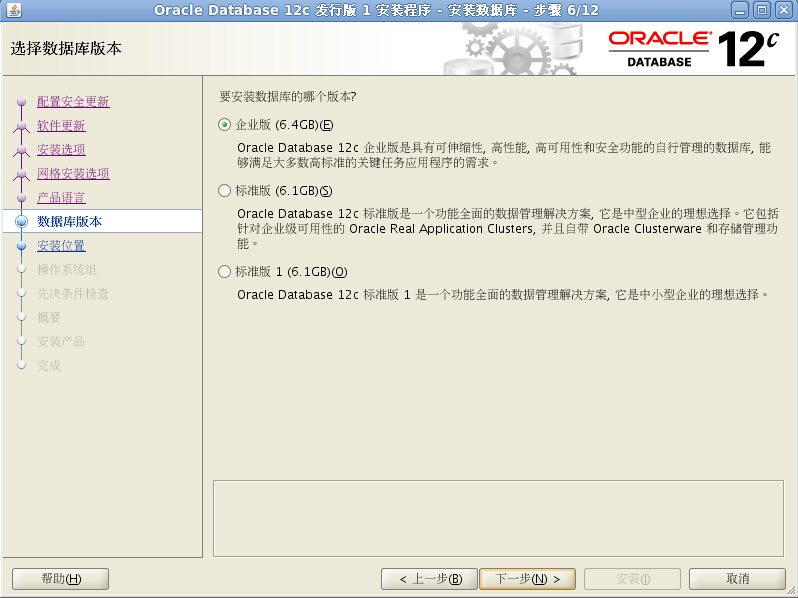

选择 `企业版`，点击下一步

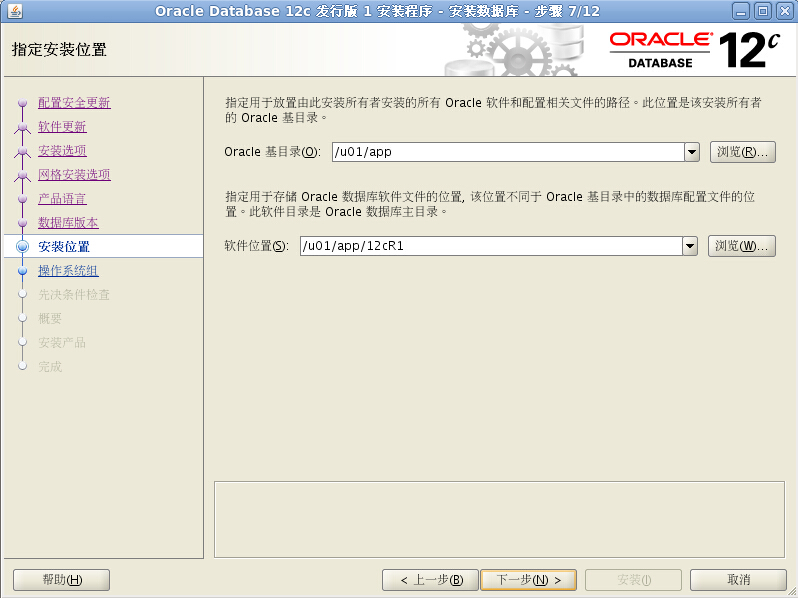

由于已经在此前设置好了环境变量，因此此不也无需修改，点击下一步

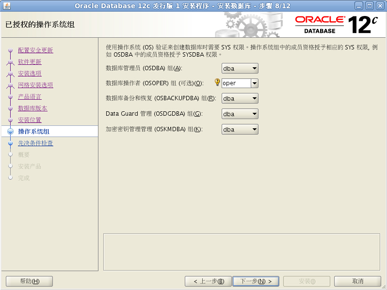

由此步可见，我们可以把备份和恢复、Data Guard、密钥管理分给单独的用户组，但由于此前没有创建相应分组，默认使用dba用户组。点击下一步

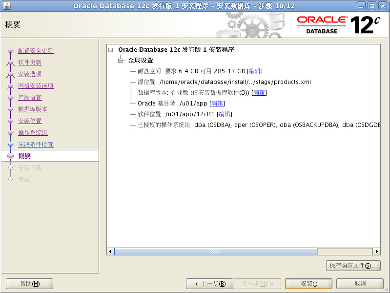

界面上显示一些概要信息，点击安装

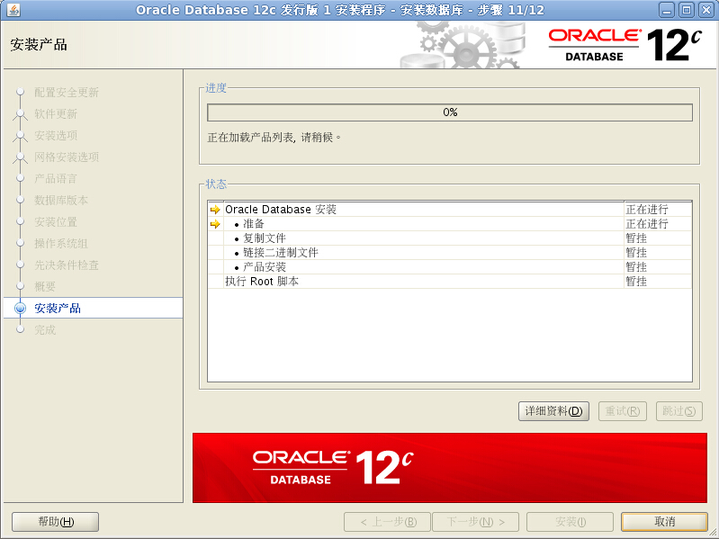

开始安装了，静静等待吧。。。

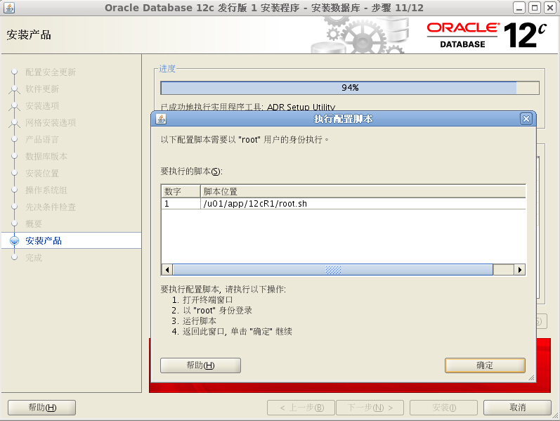

按照要求，另外打开一个终端，以root身份执行那个脚本

```
[ben@oracle12cR1 ~]$ sudo /u01/app/12cR1/root.sh
[sudo] password for ben: 
Performing root user operation for Oracle 12c 

The following environment variables are set as:
    ORACLE_OWNER= oracle
    ORACLE_HOME=  /u01/app/12cR1

Enter the full pathname of the local bin directory: [/usr/local/bin]: 
   Copying dbhome to /usr/local/bin ...
   Copying oraenv to /usr/local/bin ...
   Copying coraenv to /usr/local/bin ...


Creating /etc/oratab file...
Entries will be added to the /etc/oratab file as needed by
Database Configuration Assistant when a database is created
Finished running generic part of root script.
Now product-specific root actions will be performed.
```

执行完脚本后，点击确定

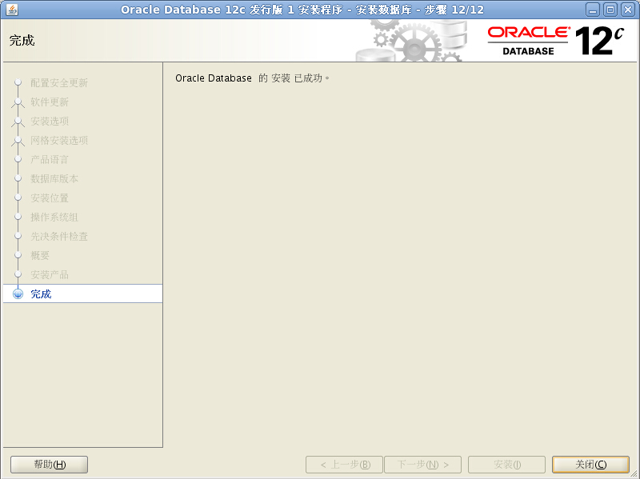

完成安装，点击关闭