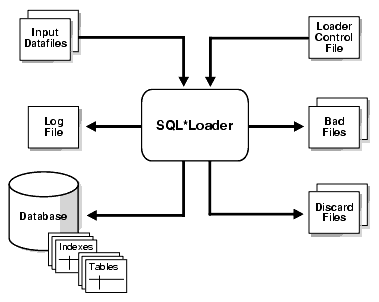

#SQL*Loader Concepts
You should understand the following basic concepts before using SQL*Loader to load data into an Oracle database.

##SQL*Loader Features

SQL*Loader loads data from external files into tables of an Oracle database. It has a powerful data parsing engine that puts little limitation on the format of the data in the data file. You can use SQL*Loader to do the following:

* Load data across a network if your data files are on a different system than the database.
* Load data from multiple data files during the same load session.
* Load data into multiple tables during the same load session.
* Specify the character set of the data.
* Selectively load data (you can load records based on the records' values).
* Manipulate the data before loading it, using SQL functions.
* Generate unique sequential key values in specified columns.
* Use the operating system's file system to access the data files.
* Load data from disk, tape, or named pipe.
* Generate sophisticated error reports, which greatly aid troubleshooting.
* Load arbitrarily complex object-relational data.
* Use secondary data files for loading LOBs and collections.
* Use conventional, direct path, or external table loads. See "[Conventional Path Loads, Direct Path Loads, and External Table Loads](http://docs.oracle.com/database/121/SUTIL/GUID-C4C1A6D6-4C85-478F-9A43-148E1812CCE8.htm)".

You can use SQL*Loader in two ways: with or without a control file. A control file controls the behavior of SQL*Loader and one or more data files used in the load. Using a control file gives you more control over the load operation, which might be desirable for more complicated load situations. But for simple loads, you can use SQL*Loader without specifying a control file; this is referred to as SQL*Loader express mode. See [SQL*Loader Express](http://docs.oracle.com/database/121/SUTIL/GUID-8C235861-2A8B-4196-9705-E6FFED0C0C99.htm) .

The output of SQL*Loader is an Oracle database (where the data is loaded), a log file, a bad file if there are rejected records, and potentially, a discard file.

Figure 7-1 shows an example of the flow of a typical SQL*Loader session that uses a control file.

**Figure 7-1 SQL*Loader Overview**



##SQL*Loader Parameters

SQL*Loader is started when you specify the sqlldr command and, optionally, parameters that establish various characteristics of the load operation.

In situations where you always use the same parameters for which the values seldom change, it can be more efficient to specify parameters using the following methods, rather than on the command line:

* Parameters can be grouped together in a parameter file. You could then specify the name of the parameter file on the command line using the PARFILE parameter.
* Certain parameters can also be specified within the SQL*Loader control file by using the OPTIONS clause.

Parameters specified on the command line override any parameter values specified in a parameter file or OPTIONS clause.

> **See Also:**
> 
> * [SQL*Loader Command-Line Reference](http://docs.oracle.com/database/121/SUTIL/GUID-CD662CD8-DAA7-4A30-BC84-546E4C40DB31.htm) for descriptions of the SQL*Loader parameters
> * "[PARFILE](http://docs.oracle.com/database/121/SUTIL/GUID-958AD711-DAAA-4185-9055-FD7535CF413D.htm)"
> * "[OPTIONS Clause](http://docs.oracle.com/database/121/SUTIL/GUID-34A050B6-3FD7-4B77-97D2-04C03D359D16.htm#GUID-2BB41EA6-C94D-41C1-94DE-966B291943E6)"

##SQL*Loader Control File

The control file is a text file written in a language that SQL*Loader understands. The control file tells SQL*Loader where to find the data, how to parse and interpret the data, where to insert the data, and more.

In general, the control file has three main sections, in the following order:

* Session-wide information
* Table and field-list information
* Input data (optional section)

Some control file syntax considerations to keep in mind are:

* The syntax is free-format (statements can extend over multiple lines).
* The syntax is case-insensitive; however, strings enclosed in single or double quotation marks are taken literally, including case.
* In control file syntax, comments extend from the two hyphens (--) that mark the beginning of the comment to the end of the line. The optional third section of the control file is interpreted as data rather than as control file syntax; consequently, comments in this section are not supported.
* The keywords CONSTANT and ZONE have special meaning to SQL*Loader and are therefore reserved. To avoid potential conflicts, Oracle recommends that you do not use either CONSTANT or ZONE as a name for any tables or columns.

> **See Also:**
> 
> [SQL*Loader Control File Reference](http://docs.oracle.com/database/121/SUTIL/GUID-7F8983A0-CA5D-41D9-A096-CB1858CEDB4C.htm) for details about control file syntax and semantics

##Input Data and Data Files

SQL*Loader reads data from one or more data files (or operating system equivalents of files) specified in the control file. From SQL*Loader's perspective, the data in the data file is organized as records. A particular data file can be in fixed record format, variable record format, or stream record format. The record format can be specified in the control file with the INFILE parameter. If no record format is specified, then the default is stream record format.

> **Note:**
> 
> If data is specified inside the control file (that is, INFILE * was specified in the control file), then the data is interpreted in the stream record format with the default record terminator.

##LOBFILEs and Secondary Data Files (SDFs)

LOB data can be lengthy enough that it makes sense to load it from a LOBFILE. In LOBFILEs, LOB data instances are still considered to be in fields (predetermined size, delimited, length-value), but these fields are not organized into records (the concept of a record does not exist within LOBFILEs). Therefore, the processing overhead of dealing with records is avoided. This type of organization of data is ideal for LOB loading.

For example, you might have a table that stores employee names, IDs, and their resumes. When loading this table, you could read the employee names and IDs from the main data files and you could read the resumes, which can be quite lengthy, from LOBFILEs.

You might also use LOBFILEs to facilitate the loading of XML data. You can use XML columns to hold data that models structured and semistructured data. Such data can be quite lengthy.

Secondary data files (SDFs) are similar in concept to primary data files. Like primary data files, SDFs are a collection of records, and each record is made up of fields. The SDFs are specified on a per control-file-field basis. Only a collection_fld_spec can name an SDF as its data source.

SDFs are specified using the SDF parameter. The SDF parameter can be followed by either the file specification string, or a FILLER field that is mapped to a data field containing one or more file specification strings.

> **See Also:**
> 
> * "[Loading LOB Data from LOBFILEs](http://docs.oracle.com/database/121/SUTIL/GUID-E02C2828-ABD1-4B8D-9561-124D221B4BE3.htm)"
> * "[Secondary Data Files (SDFs)](http://docs.oracle.com/database/121/SUTIL/GUID-EB6B23EE-B2AB-4AC2-9032-0F9798F539BC.htm)"

##Data Conversion and Data Type Specification

During a conventional path load, data fields in the data file are converted into columns in the database (direct path loads are conceptually similar, but the implementation is different). There are two conversion steps:

* SQL*Loader uses the field specifications in the control file to interpret the format of the data file, parse the input data, and populate the bind arrays that correspond to a SQL INSERT statement using that data. A bind array is an area in memory where SQL*Loader stores data that is to be loaded. When the bind array is full, the data is transmitted to the database. The bind array size is controlled by the SQL*Loader BINDSIZE and READSIZE parameters.
* The database accepts the data and executes the INSERT statement to store the data in the database.

Oracle Database uses the data type of the column to convert the data into its final, stored form. Keep in mind the distinction between a field in a data file and a column in the database. Remember also that the field data types defined in a SQL*Loader control file are not the same as the column data types.

> **See Also:**
> 
> * "[BINDSIZE](http://docs.oracle.com/database/121/SUTIL/GUID-15D32D8B-93AD-46B7-8D5F-8736289A9803.htm)"
> * "[READSIZE](http://docs.oracle.com/database/121/SUTIL/GUID-846265A6-3B66-45FD-99AE-009EC9380490.htm)"

##Discarded and Rejected Records

Records read from the input file might not be inserted into the database. Such records are placed in either a bad file or a discard file.

##Log File and Logging Information

When SQL*Loader begins execution, it creates a log file. If it cannot create a log file, then execution terminates. The log file contains a detailed summary of the load, including a description of any errors that occurred during the load.

##Conventional Path Loads, Direct Path Loads, and External Table Loads

SQL*Loader provides the following methods to load data:

###Conventional Path Loads

During conventional path loads, the input records are parsed according to the field specifications, and each data field is copied to its corresponding bind array (an area in memory where SQL*Loader stores data to be loaded). When the bind array is full (or no more data is left to read), an array insert operation is performed.

SQL*Loader stores LOB fields after a bind array insert is done. Thus, if there are any errors in processing the LOB field (for example, the LOBFILE could not be found), then the LOB field is left empty. Note also that because LOB data is loaded after the array insert has been performed, BEFORE and AFTER row triggers may not work as expected for LOB columns. This is because the triggers fire before SQL*Loader has a chance to load the LOB contents into the column. For instance, suppose you are loading a LOB column, C1, with data and you want a BEFORE row trigger to examine the contents of this LOB column and derive a value to be loaded for some other column, C2, based on its examination. This is not possible because the LOB contents will not have been loaded at the time the trigger fires.

> **See Also:**
> 
> * "[Data Loading Methods](http://docs.oracle.com/database/121/SUTIL/GUID-9787AA3E-1640-4039-BB98-8374BE3553A2.htm#GUID-9787AA3E-1640-4039-BB98-8374BE3553A2)"
> * "[Bind Arrays and Conventional Path Loads](http://docs.oracle.com/database/121/SUTIL/GUID-34765838-CECC-45D3-9533-92D821DB051B.htm)"

###Direct Path Loads

A direct path load parses the input records according to the field specifications, converts the input field data to the column data type, and builds a column array. The column array is passed to a block formatter, which creates data blocks in Oracle database block format. The newly formatted database blocks are written directly to the database, bypassing much of the data processing that normally takes place. Direct path load is much faster than conventional path load, but entails several restrictions.

**Parallel Direct Path**

A parallel direct path load allows multiple direct path load sessions to concurrently load the same data segments (allows intrasegment parallelism). Parallel direct path is more restrictive than direct path.

> **See Also:**
> 
> * "[Parallel Data Loading Models](http://docs.oracle.com/database/121/SUTIL/GUID-ECBC6D01-4273-4102-983A-2139C5FB2887.htm)"
> * "[Direct Path Load](http://docs.oracle.com/database/121/SUTIL/GUID-26686C49-D768-4F55-8AED-771B9A8C6552.htm)"

###External Table Loads

External tables are defined as tables that do not reside in the database, and can be in any format for which an access driver is provided. Oracle Database provides two access drivers: ORACLE_LOADER and ORACLE_DATAPUMP. By providing the database with metadata describing an external table, the database is able to expose the data in the external table as if it were data residing in a regular database table.

An external table load creates an external table for data that is contained in an external data file. The load executes INSERT statements to insert the data from the data file into the target table.

The advantages of using external table loads over conventional path and direct path loads are as follows:

* If a data file is big enough, then an external table load attempts to load that file in parallel.
* An external table load allows modification of the data being loaded by using SQL functions and PL/SQL functions as part of the INSERT statement that is used to create the external table.

> **Note:**
> 
> An external table load is not supported using a named pipe on Windows operating systems.

> **See Also:**
> 
> * [The ORACLE_LOADER Access Driver](http://docs.oracle.com/database/121/SUTIL/GUID-EA56D498-E8BB-4E02-8ABF-12E7083ED9D5.htm)
> * [The ORACLE_DATAPUMP Access Driver](http://docs.oracle.com/database/121/SUTIL/GUID-084DC623-9656-499C-885B-D8180C07704B.htm)
> * [Oracle Database Administrator's Guide](http://docs.oracle.com/database/121/ADMIN/tables.htm#ADMIN01507) for information about creating and managing external tables

##Loading Objects_ Collections_ and LOBs

You can use SQL*Loader to bulk load objects, collections, and LOBs.

##Partitioned Object Support

SQL*Loader supports loading partitioned objects in the database. A partitioned object in an Oracle database is a table or index consisting of partitions (pieces) that have been grouped, typically by common logical attributes. For example, sales data for a particular year might be partitioned by month. The data for each month is stored in a separate partition of the sales table. Each partition is stored in a separate segment of the database and can have different physical attributes.

SQL*Loader partitioned object support enables SQL*Loader to load the following:

* A single partition of a partitioned table
* All partitions of a partitioned table
* A nonpartitioned table

##Application Development: Direct Path Load API

Oracle provides a direct path load API for application developers. See the [Oracle Call Interface Programmer's Guide](http://docs.oracle.com/database/121/LNOCI/oci01int.htm#LNOCI010) for more information.

##SQL*Loader Case Studies

SQL*Loader features are illustrated in a variety of case studies. The case studies are based upon the Oracle demonstration database tables, emp and dept, owned by the user scott. (In some case studies, additional columns have been added.)The case studies are numbered 1 through 11, starting with the simplest scenario and progressing in complexity.

> **Note:**
> 
> Files for use in the case studies are located in the $ORACLE_HOME/rdbms/demo directory. These files are installed when you install the Oracle Database 12c Examples (formerly Companion) media. See Table 7-1 for the names of the files.

The following is a summary of the case studies:

* Case Study 1: Loading Variable-Length Data - Loads stream format records in which the fields are terminated by commas and may be enclosed by quotation marks. The data is found at the end of the control file.
* Case Study 2: Loading Fixed-Format Fields - Loads data from a separate data file.
* Case Study 3: Loading a Delimited, Free-Format File - Loads data from stream format records with delimited fields and sequence numbers. The data is found at the end of the control file.
* Case Study 4: Loading Combined Physical Records - Combines multiple physical records into one logical record corresponding to one database row.
* Case Study 5: Loading Data into Multiple Tables - Loads data into multiple tables in one run.
* Case Study 6: Loading Data Using the Direct Path Load Method - Loads data using the direct path load method.
* Case Study 7: Extracting Data from a Formatted Report - Extracts data from a formatted report.
* Case Study 8: Loading Partitioned Tables - Loads partitioned tables.
* Case Study 9: Loading LOBFILEs (CLOBs) - Adds a CLOB column called resume to the table emp, uses a FILLER field (res_file), and loads multiple LOBFILEs into the emp table.
* Case Study 10: REF Fields and VARRAYs - Loads a customer table that has a primary key as its OID and stores order items in a VARRAY. Loads an order table that has a reference to the customer table and the order items in a VARRAY.
* Case Study 11: Loading Data in the Unicode Character Set - Loads data in the Unicode character set, UTF16, in little-endian byte order. This case study uses character-length semantics.

###Case Study Files

Generally, each case study is comprised of the following types of files:

* Control files (for example, ulcase5.ctl)
* Data files (for example, ulcase5.dat)
* Setup files (for example, ulcase5.sql)

These files are installed when you install the Oracle Database 12c Examples (formerly Companion) media. They are installed in the $ORACLE_HOME/rdbms/demo directory.

If the sample data for the case study is contained within the control file, then there will be no .dat file for that case.

Case study 2 does not require any special set up, so there is no .sql script for that case. Case study 7 requires that you run both a starting (setup) script and an ending (cleanup) script.

Table 7-1 lists the files associated with each case.

**Table 7-1 Case Studies and Their Related Files**

Case | .ctl | .dat | .sql
-----|------|------|-----
1 | ulcase1.ctl | N/A | ulcase1.sql
2 | ulcase2.ctl | ulcase2.dat | N/A
3 | ulcase3.ctl | N/A | ulcase3.sql
4 | ulcase4.ctl | ulcase4.dat | ulcase4.sql
5 | ulcase5.ctl | ulcase5.dat | ulcase5.sql
6 | ulcase6.ctl | ulcase6.dat | ulcase6.sql
7 | ulcase7.ctl | ulcase7.dat | ulcase7s.sql, ulcase7e.sql
8 | ulcase8.ctl | ulcase8.dat | ulcase8.sql
9 | ulcase9.ctl | ulcase9.dat | ulcase9.sql
10 | ulcase10.ctl | N/A | ulcase10.sql
11 | ulcase11.ctl | ulcase11.dat | ulcase11.sql

###Running the Case Studies

In general, you use the following steps to run the case studies (be sure you are in the $ORACLE_HOME/rdbms/demo directory, which is where the case study files are located):

* At the system prompt, type sqlplus and press Enter to start SQL*Plus. At the user-name prompt, enter scott. At the password prompt, enter tiger.

    The SQL prompt is displayed.

* At the SQL prompt, execute the SQL script for the case study. For example, to execute the SQL script for case study 1, enter the following:

    ```
    SQL> @ulcase1
    ```

    This prepares and populates tables for the case study and then returns you to the system prompt.

* At the system prompt, start SQL*Loader and run the case study, as follows:

    ```
    sqlldr USERID=scott CONTROL=ulcase1.ctl LOG=ulcase1.log
    ```

    Substitute the appropriate control file name and log file name for the CONTROL and LOG parameters and press Enter. When you are prompted for a password, type tiger and then press Enter.

Be sure to read the control file for each case study before you run it. The beginning of the control file contains information about what is being demonstrated in the case study and any other special information you need to know. For example, case study 6 requires that you add DIRECT=TRUE to the SQL*Loader command line.

###Case Study Log Files

Log files for the case studies are not provided in the $ORACLE_HOME/rdbms/demo directory. This is because the log file for each case study is produced when you execute the case study, provided that you use the LOG parameter. If you do not want to produce a log file, then omit the LOG parameter from the command line.

###Checking the Results of a Case Study

To check the results of running a case study, start SQL*Plus and perform a select operation from the table that was loaded in the case study. This is done, as follows:

* At the system prompt, type sqlplus and press Enter to start SQL*Plus. At the user-name prompt, enter scott. At the password prompt, enter tiger.

    The SQL prompt is displayed.

* At the SQL prompt, use the SELECT statement to select all rows from the table that the case study loaded. For example, if the table emp was loaded, then enter:

    ```    
    SQL> SELECT * FROM emp;
    ```

    The contents of each row in the emp table will be displayed.

##Reference

* [1] [7 SQL*Loader Concepts](http://docs.oracle.com/database/121/SUTIL/GUID-DD843EE2-1FAB-4E72-A115-21D97A501ECC.htm)