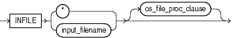
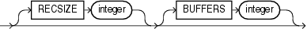
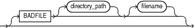

#SQL*Loader Control File Reference

The SQL*Loader control file is a text file that contains data definition language (DDL) instructions for a SQL*Loader job. Successfully using a SQL*Loader control file requires an understanding of the following topics:

##Control File Contents

The SQL*Loader control file is a text file that contains data definition language (DDL) instructions. DDL is used to control the following aspects of a SQL*Loader session:

* Where SQL*Loader will find the data to load
* How SQL*Loader expects that data to be formatted
* How SQL*Loader will be configured (memory management, rejecting records, interrupted load handling, and so on) as it loads the data
* How SQL*Loader will manipulate the data being loaded

See [SQL*Loader Syntax Diagrams](http://docs.oracle.com/database/121/SUTIL/GUID-4BD87035-FE6D-4735-86A4-31C844ACC59A.htm) for syntax diagrams of the SQL*Loader DDL.

To create the SQL*Loader control file, use a text editor such as vi or xemacs.

In general, the control file has three main sections, in the following order:

* Session-wide information
* Table and field-list information
* Input data (optional section)

Example 9-1 shows a sample control file.

**Example 9-1 Sample Control File**

```
1    -- This is a sample control file
2    LOAD DATA
3    INFILE 'sample.dat'
4    BADFILE 'sample.bad'
5    DISCARDFILE 'sample.dsc'
6    APPEND
7    INTO TABLE emp
8    WHEN (57) = '.'
9    TRAILING NULLCOLS
10  (hiredate SYSDATE,
      deptno POSITION(1:2)  INTEGER EXTERNAL(2)
              NULLIF deptno=BLANKS,
       job    POSITION(7:14)  CHAR  TERMINATED BY WHITESPACE
              NULLIF job=BLANKS  "UPPER(:job)",
       mgr    POSITION(28:31) INTEGER EXTERNAL 
              TERMINATED BY WHITESPACE, NULLIF mgr=BLANKS,
       ename  POSITION(34:41) CHAR 
              TERMINATED BY WHITESPACE  "UPPER(:ename)",
       empno  POSITION(45) INTEGER EXTERNAL 
              TERMINATED BY WHITESPACE,
       sal    POSITION(51) CHAR  TERMINATED BY WHITESPACE
              "TO_NUMBER(:sal,'$99,999.99')",
       comm   INTEGER EXTERNAL  ENCLOSED BY '(' AND '%'
              ":comm * 100"
    )
```

In this sample control file, the numbers that appear to the left would not appear in a real control file. They are keyed in this sample to the explanatory notes in the following list:

1. This is how comments are entered in a control file. See "[Comments in the Control File](http://docs.oracle.com/database/121/SUTIL/GUID-413DEE17-FA16-4AD7-A5E6-0A6D8BFE0057.htm#GUID-E66EB53D-F641-45C2-9B92-6946D695CD71)".
2. The LOAD DATA statement tells SQL*Loader that this is the beginning of a new data load. See [SQL*Loader Syntax Diagrams](http://docs.oracle.com/database/121/SUTIL/GUID-4BD87035-FE6D-4735-86A4-31C844ACC59A.htm) for syntax information.
3. The INFILE clause specifies the name of a data file containing the data you want to load. See "[Specifying Data Files](http://docs.oracle.com/database/121/SUTIL/GUID-7EBEA709-4192-4B5A-A3FA-450D41BE2EC7.htm)".
4. The BADFILE clause specifies the name of a file into which rejected records are placed. See "[Specifying the Bad File](http://docs.oracle.com/database/121/SUTIL/GUID-5C9400BE-5321-4727-9D50-265AB620155D.htm)".
5. The DISCARDFILE clause specifies the name of a file into which discarded records are placed. See "[Specifying the Discard File](http://docs.oracle.com/database/121/SUTIL/GUID-0A8BB28E-96D3-4553-8345-D1EDCAF599E4.htm)".
6. The APPEND clause is one of the options you can use when loading data into a table that is not empty. See "[Loading Data into Nonempty Tables](http://docs.oracle.com/database/121/SUTIL/GUID-2F1B7E71-AE90-40CB-9A7F-B44187FD059C.htm#GUID-2F1B7E71-AE90-40CB-9A7F-B44187FD059C)".
    To load data into a table that is empty, you would use the INSERT clause. See "[Loading Data into Empty Tables](http://docs.oracle.com/database/121/SUTIL/GUID-63D25923-62F8-41A4-8062-662744CB1C84.htm#GUID-63D25923-62F8-41A4-8062-662744CB1C84)".
7. The INTO TABLE clause enables you to identify tables, fields, and data types. It defines the relationship between records in the data file and tables in the database. See "[Specifying Table Names](http://docs.oracle.com/database/121/SUTIL/GUID-AE99BBF7-ED2E-4628-844E-703EEF8A5A5C.htm#GUID-AE99BBF7-ED2E-4628-844E-703EEF8A5A5C)".
8. The WHEN clause specifies one or more field conditions. SQL*Loader decides whether to load the data based on these field conditions. See "[Loading Records Based on a Condition](http://docs.oracle.com/database/121/SUTIL/GUID-81C21533-7B7F-4DE8-8C15-1FDD8D31B581.htm)".
9. The TRAILING NULLCOLS clause tells SQL*Loader to treat any relatively positioned columns that are not present in the record as null columns. See "[Handling Short Records with Missing Data](http://docs.oracle.com/database/121/SUTIL/GUID-A95F46F6-A8FC-449A-BCB0-81B01858A73D.htm#GUID-A95F46F6-A8FC-449A-BCB0-81B01858A73D)".
10. The remainder of the control file contains the field list, which provides information about column formats in the table being loaded. See [SQL*Loader Field List Reference](http://docs.oracle.com/database/121/SUTIL/GUID-DB309002-461D-42F7-8C94-727B32FA8B85.htm) for information about that section of the control file.

###Comments in the Control File

Comments can appear anywhere in the parameter section of the file, but they should not appear within the data. Precede any comment with two hyphens, for example:

```
--This is a comment
```

All text to the right of the double hyphen is ignored, until the end of the line.

##Specifying Command-Line Parameters in the Control File

You can specify command-line parameters in the SQL*Loader control file using the OPTIONS clause. This can be useful if you often use a control file with the same set of options. The OPTIONS clause precedes the LOAD DATA statement.

###OPTIONS Clause

The following command-line parameters can be specified using the OPTIONS clause. These parameters are described in greater detail in [SQL*Loader Command-Line Reference](http://docs.oracle.com/database/121/SUTIL/GUID-CD662CD8-DAA7-4A30-BC84-546E4C40DB31.htm).

```
BINDSIZE = n
COLUMNARRAYROWS = n
DATE_CACHE = n
DEGREE_OF_PARALLELISM= {degree-num|DEFAULT|AUTO|NONE}
DIRECT = {TRUE | FALSE} 
ERRORS = n
EXTERNAL_TABLE = {NOT_USED | GENERATE_ONLY | EXECUTE}
FILE = tablespace file 
LOAD = n 
MULTITHREADING = {TRUE | FALSE}
PARALLEL = {TRUE | FALSE}
READSIZE = n
RESUMABLE = {TRUE | FALSE}
RESUMABLE_NAME = 'text string'
RESUMABLE_TIMEOUT = n
ROWS = n 
SILENT = {HEADER | FEEDBACK | ERRORS | DISCARDS | PARTITIONS | ALL} 
SKIP = n   
SKIP_INDEX_MAINTENANCE = {TRUE | FALSE}
SKIP_UNUSABLE_INDEXES = {TRUE | FALSE}
STREAMSIZE = n
TRIM= {LRTRIM|NOTRIM|LTRIM|RTRIM|LDRTRIM}
```

The following is an example use of the OPTIONS clause that you could use in a SQL*Loader control file:

```
OPTIONS (BINDSIZE=100000, SILENT=(ERRORS, FEEDBACK) )
```

> **Note:**
> 
> Parameter values specified on the command line override parameter values specified in the control file OPTIONS clause.

##Specifying File Names and Object Names

In general, SQL*Loader follows the SQL standard for specifying object names (for example, table and column names). The information in this section discusses the following topics:

###File Names That Conflict with SQL and SQL*Loader Reserved Words

SQL and SQL*Loader reserved words must be specified within double quotation marks. The only SQL*Loader reserved word is CONSTANT.

You must use double quotation marks if the object name contains special characters other than those recognized by SQL ($, #, _), or if the name is case sensitive.

> **See Also:**
> 
> [Oracle Database SQL Language Reference](http://docs.oracle.com/database/121/SQLRF/ap_keywd.htm#SQLRF022)

###Specifying SQL Strings

You must specify SQL strings within double quotation marks. The SQL string applies SQL operators to data fields.

> **See Also:**
> 
> "[Applying SQL Operators to Fields](http://docs.oracle.com/database/121/SUTIL/GUID-83FF6EDC-C7F8-4F29-8994-59153BE31924.htm)"

###Operating System Considerations

The following sections discuss situations in which your course of action may depend on the operating system you are using.

####Specifying a Complete Path

If you encounter problems when trying to specify a complete path name, it may be due to an operating system-specific incompatibility caused by special characters in the specification. In many cases, specifying the path name within single quotation marks prevents errors.

####Backslash Escape Character

In DDL syntax, you can place a double quotation mark inside a string delimited by double quotation marks by preceding it with the backslash escape character (\), if the escape character is allowed on your operating system. The same rule applies when single quotation marks are required in a string delimited by single quotation marks.

For example, homedir\data"norm\mydata contains a double quotation mark. Preceding the double quotation mark with a backslash indicates that the double quotation mark is to be taken literally:

```
INFILE 'homedir\data\"norm\mydata'
```

You can also put the escape character itself into a string by entering it twice.

For example:

```
"so'\"far"     or  'so\'"far'     is parsed as   so'"far 
"'so\\far'"    or  '\'so\\far\''  is parsed as  'so\far' 
"so\\\\far"    or  'so\\\\far'    is parsed as   so\\far 
```

> **Note:**
> 
> A double quotation mark in the initial position cannot be preceded by an escape character. Therefore, you should avoid creating strings with an initial quotation mark.

####Nonportable Strings

There are two kinds of character strings in a SQL*Loader control file that are not portable between operating systems: filename and file processing option strings. When you convert to a different operating system, you will probably need to modify these strings. All other strings in a SQL*Loader control file should be portable between operating systems.

####Using the Backslash as an Escape Character

If your operating system uses the backslash character to separate directories in a path name, and if the release of the Oracle database running on your operating system implements the backslash escape character for file names and other nonportable strings, then you must specify double backslashes in your path names and use single quotation marks.

####Escape Character Is Sometimes Disallowed

The release of the Oracle database running on your operating system may not implement the escape character for nonportable strings. When the escape character is disallowed, a backslash is treated as a normal character, rather than as an escape character (although it is still usable in all other strings). Then path names such as the following can be specified normally:

```
INFILE 'topdir\mydir\myfile'
```

Double backslashes are not needed.

Because the backslash is not recognized as an escape character, strings within single quotation marks cannot be embedded inside another string delimited by single quotation marks. This rule also holds for double quotation marks. A string within double quotation marks cannot be embedded inside another string delimited by double quotation marks.

##Identifying XMLType Tables

As of Oracle Database 10g, the XMLTYPE clause is available for use in a SQL*Loader control file. This clause is of the format XMLTYPE(field name). It is used to identify XMLType tables so that the correct SQL statement can be constructed. Example 9-2 shows how the XMLTYPE clause can be used in a SQL*Loader control file to load data into a schema-based XMLType table.

> **See Also:**
> 
> [Oracle XML DB Developer's Guide](http://docs.oracle.com/database/121/ADXDB/xdb25loa.htm#ADXDB2900) for more information about loading XML data using SQL*Loader

**Example 9-2 Identifying XMLType Tables in the SQL*Loader Control File**

The XML schema definition is as follows. It registers the XML schema, xdb_user.xsd, in the Oracle XML DB, and then creates the table, xdb_tab5.

```
begin dbms_xmlschema.registerSchema('xdb_user.xsd',
'<xs:schema xmlns:xs="http://www.w3.org/2001/XMLSchema"
            xmlns:xdb="http://xmlns.oracle.com/xdb">
 <xs:element name = "Employee"
        xdb:defaultTable="EMP31B_TAB">
   <xs:complexType>
    <xs:sequence>
      <xs:element name = "EmployeeId" type = "xs:positiveInteger"/>
      <xs:element name = "Name" type = "xs:string"/>
      <xs:element name = "Salary" type = "xs:positiveInteger"/>
      <xs:element name = "DeptId" type = "xs:positiveInteger"
             xdb:SQLName="DEPTID"/>
    </xs:sequence>
   </xs:complexType>
 </xs:element>
</xs:schema>',
TRUE, TRUE, FALSE); end;
/
```

The table is defined as follows:

```
CREATE TABLE xdb_tab5 OF XMLTYPE XMLSCHEMA "xdb_user.xsd" ELEMENT "Employee";
```

The control file used to load data into the table, xdb_tab5, looks as follows. It loads XMLType data using the registered XML schema, xdb_user.xsd. The XMLTYPE clause is used to identify this table as an XMLType table. Either direct path or conventional mode can be used to load the data into the table.

```
LOAD DATA
INFILE *
INTO TABLE xdb_tab5 TRUNCATE
xmltype(xmldata)
(
  xmldata   char(4000)
)
BEGINDATA
<Employee>  <EmployeeId>111</EmployeeId>  <Name>Ravi</Name>  <Salary>100000</Sal
ary>  <DeptId>12</DeptId></Employee>
<Employee>  <EmployeeId>112</EmployeeId>  <Name>John</Name>  <Salary>150000</Sal
ary>  <DeptId>12</DeptId></Employee>
<Employee>  <EmployeeId>113</EmployeeId>  <Name>Michael</Name>  <Salary>75000</S
alary>  <DeptId>12</DeptId></Employee>
<Employee>  <EmployeeId>114</EmployeeId>  <Name>Mark</Name>  <Salary>125000</Sal
ary>  <DeptId>16</DeptId></Employee>
<Employee>  <EmployeeId>115</EmployeeId>  <Name>Aaron</Name>  <Salary>600000</Sa
lary>  <DeptId>16</DeptId></Employee>
```

##Specifying Field Order

You can use the FIELD NAMES clause in the SQL*Loader control file to specify field order. The syntax is as follows:

```
FIELD NAMES {FIRST FILE|FIRST FILE IGNORE|ALL FILES|ALL FILES IGNORE|NONE}
```

The FIELD NAMES options are:

* FIRST FILE--Indicates that the first data file contains a list of field names for the data in the first record. This list uses the same delimiter as the data in the data file. The record is read for setting up the mapping between the fields in the data file and the columns in the target table. The record is skipped when the data is processed. This can be useful if the order of the fields in the data file is different from the order of the columns in the table, or if the number of fields in the data file is different from the number of columns in the target table
* FIRST FILE IGNORE--Indicates that the first data file contains a list of field names for the data in the first record, but that the information should be ignored. The record will be skipped when the data is processed, but it will not be used for setting up the fields.
* ALL FILES--Indicates that all data files contain a list of field names for the data in the first record. The first record is skipped in each data file when the data is processed. The fields can be in a different order in each data file. SQL*Loader sets up the load based on the order of the fields in each data file.
* ALL FILES IGNORE--Indicates that all data files contain a list of field names for the data in the first record, but that the information should be ignored. The record is skipped when the data is processed in every data file, but it will not be used for setting up the fields.
* NONE--Indicates that the data file contains normal data in the first record. This is the default.

The FIELD NAMES clause cannot be used for complex column types such as column objects, nested tables, or VARRAYs.

##Specifying Data Files

To specify a data file that contains the data to be loaded, use the INFILE keyword, followed by the file name and optional file processing options string. You can specify multiple single files by using multiple INFILE keywords. You can also use wildcards in the file names (an asterisk (*) for multiple characters and a question mark (?) for a single character).

> **Note:**
> 
> You can also specify the data file from the command line, using the DATA parameter described in "[Command-Line Parameters for SQL*Loader](http://docs.oracle.com/database/121/SUTIL/GUID-D7A661F1-5EE3-43DF-B3A5-050B2CF66844.htm)". A file name specified on the command line overrides the first INFILE clause in the control file.

If no file name is specified, then the file name defaults to the control file name with an extension or file type of .dat.

If the control file itself contains the data to be loaded, then specify an asterisk (*). This specification is described in "[Identifying Data in the Control File with BEGINDATA](http://docs.oracle.com/database/121/SUTIL/GUID-3965BD1F-4450-4E78-B480-62EA27BAEFFE.htm)" .

> Note:
> 
> The information in this section applies only to primary data files. It does not apply to LOBFILEs or SDFs.
> 
> For information about LOBFILES, see "[Loading LOB Data from LOBFILEs](http://docs.oracle.com/database/121/SUTIL/GUID-E02C2828-ABD1-4B8D-9561-124D221B4BE3.htm)".
> 
> For information about SDFs, see "[Secondary Data Files (SDFs)](http://docs.oracle.com/database/121/SUTIL/GUID-EB6B23EE-B2AB-4AC2-9032-0F9798F539BC.htm)".

The syntax for INFILE is as follows:



Table 9-1 describes the parameters for the INFILE keyword.

**Table 9-1 Parameters for the INFILE Keyword**

* INFILE

    Specifies that a data file specification follows.

* input_filename

    Name of the file containing the data. The file name can contain wildcards. An asterisk (*) represents multiple characters and a question mark (?) represents a single character. For example:

    ```
    INFILE 'emp*.dat'
    INFILE 'm?emp.dat'
    ```

    Any spaces or punctuation marks in the file name must be enclosed in single quotation marks. See "[Specifying File Names and Object Names](http://docs.oracle.com/database/121/SUTIL/GUID-F1F2C271-0E34-4247-A833-3D02374CBFD7.htm)".

* *

    If your data is in the control file itself, then use an asterisk instead of the file name. If you have data in the control file and in data files, then you must specify the asterisk first in order for the data to be read.

* os_file_proc_clause

    This is the file-processing options string. It specifies the data file format. It also optimizes data file reads. The syntax used for this string is specific to your operating system. See "[Specifying Data File Format and Buffering](http://docs.oracle.com/database/121/SUTIL/GUID-4C481785-1FFE-4EB8-837E-DCB5236B6222.htm)".

##Specifying CSV Format Files

To direct SQL*Loader to access the data files as comma-separated-values format files, use the CSV clause. This assumes that the file is a stream record format file with the normal carriage return string (for example, \n on UNIX or Linux operating systems and either \n or \r\n on Windows operating systems). Record terminators can be included (embedded) in data values. The syntax for the CSV clause is as follows:

```
FIELDS CSV [WITH EMBEDDED|WITHOUT EMBEDDED] [FIELDS TERMINATED BY ','] [OPTIONALLY ENCLOSED BY '"']
```

The following are key points regarding the FIELDS CSV clause:

* The SQL*Loader default is to not use the FIELDS CSV clause.
* The WITH EMBEDDED and WITHOUT EMBEDDED options specify whether record terminators are included (embedded) within any fields in the data.
* If WITH EMBEDDED is used, then embedded record terminators must be enclosed, and intra-datafile parallelism is disabled for external table loads.
* The TERMINATED BY ',' and OPTIONALLY ENCLOSED BY '"' options are the defaults and do not have to be specified. You can override them with different termination and enclosure characters.
* When the CSV clause is used, only delimitable data types are allowed as control file fields. Delimitable data types include CHAR, datetime, interval, and numeric EXTERNAL.
* The TERMINATED BY and ENCLOSED BY clauses cannot be used at the field level when the CSV clause is specified.
* When the CSV clause is specified, normal SQL*Loader blank trimming is done by default. You can specify PRESERVE BLANKS to avoid trimming of spaces. Or, you can use the SQL functions LTRIM and RTRIM in the field specification to remove left and/or right spaces.
* When the CSV clause is specified, the INFILE * clause in not allowed. This means that there cannot be any data included in the SQL*Loader control file.

The following sample SQL*Loader control file uses the FIELDS CSV clause with the default delimiters:

```
LOAD DATA
INFILE "mydata.dat"
TRUNCATE
INTO TABLE mytable
FIELDS CSV WITH EMBEDDED
TRAILING NULLCOLS
(
  c0 char,
  c1 char,
  c2 char,
)
```

##Identifying Data in the Control File with BEGINDATA

If the data is included in the control file itself, then the INFILE clause is followed by an asterisk rather than a file name. The actual data is placed in the control file after the load configuration specifications.

Specify the BEGINDATA statement before the first data record. The syntax is:

```
BEGINDATA 
first_data_record
```

Keep the following points in mind when using the BEGINDATA statement:

* If you omit the BEGINDATA statement but include data in the control file, then SQL*Loader tries to interpret your data as control information and issues an error message. If your data is in a separate file, then do not use the BEGINDATA statement.
* Do not use spaces or other characters on the same line as the BEGINDATA statement, or the line containing BEGINDATA will be interpreted as the first line of data.
* Do not put comments after BEGINDATA, or they will also be interpreted as data.

> **See Also:**
> 
> * "[Specifying Data Files](http://docs.oracle.com/database/121/SUTIL/GUID-7EBEA709-4192-4B5A-A3FA-450D41BE2EC7.htm)" for an explanation of using INFILE
> * Case study 1, Loading Variable-Length Data (see "[SQL*Loader Case Studies](http://docs.oracle.com/database/121/SUTIL/GUID-96DDFFBB-7BFD-4370-A43C-0211A24FA323.htm#GUID-96DDFFBB-7BFD-4370-A43C-0211A24FA323)" for information on how to access case studies)

##Specifying Data File Format and Buffering

When configuring SQL*Loader, you can specify an operating system-dependent file processing options string (os_file_proc_clause) in the control file to specify file format and buffering.

For example, suppose that your operating system has the following option-string syntax:



In this syntax, RECSIZE is the size of a fixed-length record, and BUFFERS is the number of buffers to use for asynchronous I/O.

To declare a file named mydata.dat as a file that contains 80-byte records and instruct SQL*Loader to use 8 I/O buffers, you would use the following control file entry:

```
INFILE 'mydata.dat' "RECSIZE 80 BUFFERS 8" 
```

> **Note:**
> 
> This example uses the recommended convention of single quotation marks for file names and double quotation marks for everything else.

> **See Also:**
> 
> [Oracle Database Platform Guide for Microsoft Windows](http://docs.oracle.com/database/121/NTQRF/tools.htm#NTQRF040) for information about using the os_file_proc_clause on Windows systems.

##Specifying the Bad File

When SQL*Loader executes, it can create a file called a bad file or reject file in which it places records that were rejected because of formatting errors or because they caused Oracle errors. If you have specified that a bad file is to be created, then the following applies:

* If one or more records are rejected, then the bad file is created and the rejected records are logged.
* If no records are rejected, then the bad file is not created.
* If the bad file is created, then it overwrites any existing file with the same name; ensure that you do not overwrite a file you want to retain.

> **Note:**
> 
> On some systems, a new version of the file may be created if a file with the same name already exists.

To specify the name of the bad file, use the BADFILE clause. You can also specify the bad file from the command line with the BAD parameter described in "[Command-Line Parameters for SQL*Loader](http://docs.oracle.com/database/121/SUTIL/GUID-D7A661F1-5EE3-43DF-B3A5-050B2CF66844.htm)".

A file name specified on the command line is associated with the first INFILE clause in the control file, overriding any bad file that may have been specified as part of that clause.

The bad file is created in the same record and file format as the data file so that you can reload the data after you correct it. For data files in stream record format, the record terminator that is found in the data file is also used in the bad file.

The syntax for the BADFILE clause is as follows:



The BADFILE clause specifies that a directory path or file name, or both, for the bad file follows. If you specify BADFILE, then you must supply either a directory path or a file name, or both.

The directory parameter specifies a directory path to which the bad file will be written.

The filename parameter specifies a valid file name specification for your platform. Any spaces or punctuation marks in the file name must be enclosed in single quotation marks. If you do not specify a name for the bad file, then the name defaults to the name of the data file with an extension or file type of .bad.

##Specifying the Discard File

During execution, SQL*Loader can create a discard file for records that do not meet any of the loading criteria. The records contained in this file are called discarded records. Discarded records do not satisfy any of the WHEN clauses specified in the control file. These records differ from rejected records. Discarded records do not necessarily have any bad data. No insert is attempted on a discarded record.

A discard file is created according to the following rules:

* You have specified a discard file name and one or more records fail to satisfy all of the WHEN clauses specified in the control file. (Be aware that if the discard file is created, then it overwrites any existing file with the same name.)
* If no records are discarded, then a discard file is not created.

You can specify the discard file from within the control file either by specifying its directory, or name, or both, or by specifying the maximum number of discards. Any of the following clauses result in a discard file being created, if necessary:

* DISCARDFILE=[[directory/][filename]]
* DISCARDS
* DISCARDMAX

The discard file is created in the same record and file format as the data file. For data files in stream record format, the same record terminator that is found in the data file is also used in the discard file.

You can also create a discard file from the command line by specifying either the DISCARD or DISCARDMAX parameter. See [SQL*Loader Command-Line Reference](http://docs.oracle.com/database/121/SUTIL/GUID-CD662CD8-DAA7-4A30-BC84-546E4C40DB31.htm).

If no discard clauses are included in the control file or on the command line, then a discard file is not created even if there are discarded records (that is, records that fail to satisfy all of the WHEN clauses specified in the control file).

##Specifying a NULLIF Clause At the Table Level

You can specify a NULLIF clause at the table level. The syntax is as follows:

```
NULLIF {=|!=}{"char_string"|x'hex_string'|BLANKS}
```

The char_string and hex_string values must be enclosed in either single quotation marks or double quotation marks.

This specification is used for each mapped character field unless a NULLIF clause is specified at the field level. A NULLIF clause specified at the field level overrides a NULLIF clause specified at the table level.

SQL*Loader checks the specified value against the value of the field in the record. If there is a match using the equal or not equal specification, then the field is set to NULL for that row. Any field that has a length of 0 after blank trimming is also set to NULL.

If you do not want the default NULLIF or any other NULLIF clause applied to a field, you can specify NO NULLIF at the field level.

> **See Also:**
> 
> "[Using the WHEN_ NULLIF_ and DEFAULTIF Clauses](http://docs.oracle.com/database/121/SUTIL/GUID-30775EC3-8BC0-40F9-8F32-E785ACF028A0.htm)" for more information about specifying a NULLIF clause at the field level

##Specifying Datetime Formats At the Table Level

You can specify certain datetime formats at the table level in a SQL*Loader control file. The syntax for each is as follows:

```
DATE FORMAT mask
TIMESTAMP FORMAT mask
TIMESTAMP WITH TIME ZONE mask
TIMESTAMP WITH LOCAL TIME ZONE mask
```

This specification is used for every date or timestamp field unless a different mask is specified at the field level. A mask specified at the field level overrides a mask specified at the table level.

The following is an example of using the DATE FORMAT clause in a SQL*Loader control file. The DATE FORMAT clause is overridden by DATE at the field level for the hiredate and entrydate fields:

```
LOAD DATA 
     INFILE myfile.dat
     APPEND
     INTO TABLE EMP
     FIELDS TERMINATED BY ","
     DATE FORMAT "DD-Month-YYYY"
     (empno,
      ename,
      job, 
      mgr,
      hiredate DATE,
      sal,
      comm,
      deptno,
      entrydate DATE)
```

> **See Also:**
> 
> "[Datetime and Interval Data Types](http://docs.oracle.com/database/121/SUTIL/GUID-169DE9FB-36A5-4087-9857-7F03DCF8D3C6.htm)" for information about specifying datetime data types at the field level

##Handling Different Character Encoding Schemes

SQL*Loader supports different character encoding schemes (called character sets, or code pages). SQL*Loader uses features of Oracle's globalization support technology to handle the various single-byte and multibyte character encoding schemes available today.

> **See Also:**
> 
> [Oracle Database Globalization Support Guide](http://docs.oracle.com/database/121/NLSPG/ch2charset.htm#NLSPG157)

The following sections provide a brief introduction to some of the supported character encoding schemes.

##Interrupted Loads

Loads are interrupted and discontinued for several reasons. A primary reason is space errors, in which SQL*Loader runs out of space for data rows or index entries. A load might also be discontinued because the maximum number of errors was exceeded, an unexpected error was returned to SQL*Loader from the server, a record was too long in the data file, or a Ctrl+C was executed.

The behavior of SQL*Loader when a load is discontinued varies depending on whether it is a conventional path load or a direct path load, and on the reason the load was interrupted. Additionally, when an interrupted load is continued, the use and value of the SKIP parameter can vary depending on the particular case. The following sections explain the possible scenarios.

> **See Also:**
> 
> "[SKIP](http://docs.oracle.com/database/121/SUTIL/GUID-84244C46-6AFD-412D-9240-BEB0B5C2718B.htm)"

##Assembling Logical Records from Physical Records

To combine multiple physical records into one logical record, you can use one of the following clauses, depending on your data:

* CONCATENATE
* CONTINUEIF

##Loading Logical Records into Tables

This section describes the way in which you specify:

- Which tables you want to load
- Which records you want to load into them
- Default data delimiters for those records
- How to handle short records with missing data

##Index Options

This section describes the following SQL*Loader options that control how index entries are created:

- SORTED INDEXES
- SINGLEROW

###SORTED INDEXES Clause
The SORTED INDEXES clause applies to direct path loads. It tells SQL*Loader that the incoming data has already been sorted on the specified indexes, allowing SQL*Loader to optimize performance.

> **See Also:**
> 
> "[SORTED INDEXES Clause](http://docs.oracle.com/database/121/SUTIL/GUID-571EC032-0C25-483A-BC0D-2C27A7B64D64.htm#GUID-65D50809-CCB9-41BB-A72E-AFDF625234E5)"

###SINGLEROW Option

The SINGLEROW option is intended for use during a direct path load with APPEND on systems with limited memory, or when loading a small number of records into a large table. This option inserts each index entry directly into the index, one record at a time.

By default, SQL*Loader does not use SINGLEROW to append records to a table. Instead, index entries are put into a separate, temporary storage area and merged with the original index at the end of the load. This method achieves better performance and produces an optimal index, but it requires extra storage space. During the merge operation, the original index, the new index, and the space for new entries all simultaneously occupy storage space.

With the SINGLEROW option, storage space is not required for new index entries or for a new index. The resulting index may not be as optimal as a freshly sorted one, but it takes less space to produce. It also takes more time because additional UNDO information is generated for each index insert. This option is suggested for use when either of the following situations exists:

* Available storage is limited.
* The number of records to be loaded is small compared to the size of the table (a ratio of 1:20 or less is recommended).

##Benefits of Using Multiple INTO TABLE Clauses

Multiple INTO TABLE clauses enable you to:

- Load data into different tables
- Extract multiple logical records from a single input record
- Distinguish different input record formats
- Distinguish different input row object subtypes

In the first case, it is common for the INTO TABLE clauses to refer to the same table. This section illustrates the different ways to use multiple INTO TABLE clauses and shows you how to use the POSITION parameter.

> **Note:**
> 
> A key point when using multiple INTO TABLE clauses is that field scanning continues from where it left off when a new INTO TABLE clause is processed. The remainder of this section details important ways to make use of that behavior. It also describes alternative ways of using fixed field locations or the POSITION parameter.

##Bind Arrays and Conventional Path Loads

SQL*Loader uses the SQL array-interface option to transfer data to the database. Multiple rows are read at one time and stored in the bind array. When SQL*Loader sends the Oracle database an INSERT command, the entire array is inserted at one time. After the rows in the bind array are inserted, a COMMIT statement is issued.

The determination of bind array size pertains to SQL*Loader's conventional path option. In general, it does not apply to the direct path load method because a direct path load uses the direct path API. However, the bind array might be used for special cases of direct path load where data conversion is necessary.

> **See Also:**
> 
> [Oracle Call Interface Programmer's Guide](http://docs.oracle.com/database/121/LNOCI/oci13obn.htm#LNOCI120) for more information about the concepts of direct path loading

> **Note:**
> 
> You can also use SQL*Loader without a control file; this is known as SQL*Loader express mode. See SQL*Loader Express for more information.

##Reference

* [1] [SQL*Loader Control File Reference](http://docs.oracle.com/database/121/SUTIL/GUID-7F8983A0-CA5D-41D9-A096-CB1858CEDB4C.htm)