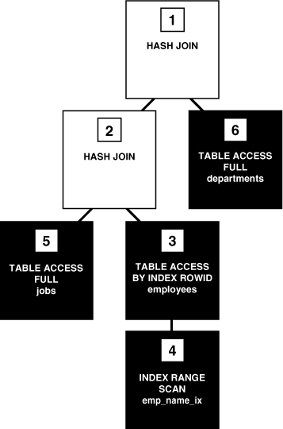

#SQL语句执行过程

本章描述Oracle数据库如何执行SQL语句，包括DDL语句如何创建对象、DML如何修改数据、如何查询数据。

##执行SQL语句

SQL语句执行过程包括解析、优化、生成数据行信息、执行语句。针对不同的语句，数据库可能会省略某些步骤。


###SQL解析

SQL解析是整个执行过程的第一阶段。本阶段将SQL语句分片并重构成其他程序能够执行的结构。数据库会接受应用程序的委托对语句进行解析，即只有应用程序能够重用解析的结果。

当应用程序分配了一条SQL语句，它就会向数据库发送解析请求。解析请求会打开或者创建一个游标(cursor)。游标是private SQL area中的一个句柄，用于标识一条已解析的语句和其他可执行信息。游标和private SQL area均位于PGA。

在处理解析请求时，数据库会执行一些检查：语法检查、语义检查、共享池检查。这些检查可以在语句执行之前发现其中的部分错误。

>**提示**
>
>像死锁和数据转换这样的错误不能在解析过程中发现，它们将在语句执行(execute)时被捕获

* **语法检查(Syntax Check)**
  
  Oracle数据库一定会验证每一条SQL语句的语法，不符合SQL语句语法规范的语句都会在检查中失败。例如以下的语句因关键字FROM被错误拼写成FORM而无法通过检查
  
  ```
  SQL> SELECT * FORM employees;
  SELECT * FORM employees
           *
  ERROR at line 1:
  ORA-00923: FROM keyword not found where expected
  ```

* **语义检查(Semantic Check)**
  
  语句的语义，顾名思义就是语句必须有其明确的定义，例如语句中的对象必须存在、列必须存在等。一条满足语法规则的语句仍有可能不能通过语义检查，如下例子展示从一张不存在的数据表中查询数据：
  
  ```
  SQL> SELECT * FROM nonexistent_table;
  SELECT * FROM nonexistent_table
                *
  ERROR at line 1:
  ORA-00942: table or view does not exist
  ```

* **共享池检查(Shared Pool Check)**
  
  在解析过程中，数据库会检查共享池以判断是否可以跳过某些占用资源的步骤。数据库使用HASH算法为每条SQL语句生成hash值，该值存储在动态性能视图V$SQL.SQL_ID。该hash值是基于Oracle数据库版本的，也就是说一条SQL语句的hash值在一个单机实例或者多个不同的实例中始终是相同的。
  
  当用户提交一条SQL语句，数据库会从shared SQL area中搜索是否已存在拥有该hash值的已完成解析的语句。SQL语句的hash值与下列数值的区别：
  
  * 语句在内存中的地址
    
    数据库使用SQL ID找出语句在内存中的地址。
  
  * 语句执行计划的hash值
    
    一条SQL语句在共享池中可能有多个执行计划，每个执行计划拥有不同的hash值。
  
  解析的执行根据提交的语句类型和检查出的hash值分成两类：硬解析和软解析：
  
  * 硬解析(hard parse)
    
    如果Oracle数据库无法复用内存中已存在的解析结果，那么它会创建一个新的解析，即没有命中库缓冲区(library cache miss)而进行硬解析。
    
    >**提示**
    >
    >Oracle数据库对DDL始终执行硬解析。
    
    在硬解析的过程中，数据库多次访问库缓冲区和数据字典缓冲区来检查数据字典。当数据库访问这些缓冲区时，会在所请求的对象上建议一个锁以确保对象的定义不会改变。锁的争用会增大语句语句执行时间和减少并发。
  
  * 软解析
    
    软解析指硬解析之外的那部分解析。如果语句在提交时发现共享池中存在相同的可复用的语句，那么数据库会选择使用现成的。这里的复用也称作命中库缓冲区(library cache hit)。
    
    软解析可大大提高语句执行的性能。例如软解析有时可以减少会话中锁的数量。通常地，数据库使用软解析时会跳过优化和生成数据行信息的步骤而直接执行语句，因此应该更多地使用软解析。
    
  下图简单地描述在专用服务器体系结构中UPDATE语句进行共享池检查的过程
  
  
  
  如果检查时发现共享池中存在一条拥有相同hash值的语句，那么数据库就会进行语义和环境检查以判断它们是否相同的意思。只是判断语法相同是不够充分的。例如，假设两个不同的用户进入数据库执行以下语句：
  
  ```sql
  CREATE TABLE my_table ( some_col INTEGER );
  SELECT * FROM my_table;
  ```
  
  SELECT语句在语法结构上是相同的，但表 my_table 是两个不同schema下的对象。语义上的不同意为着第二次执行的语句无法使用第一次执行过的语句的执行计划。
  
  即使是两条语句的语义一致，在不同的环境下执行也会强制硬解析。
  
  ```sql
  ALTER SESSION SET OPTIMIZER_MODE=ALL_ROWS;
  ALTER SYSTEM FLUSH SHARED_POOL;               # optimizer environment 1
  SELECT * FROM sh.sales;
  
  ALTER SESSION SET OPTIMIZER_MODE=FIRST_ROWS;  # optimizer environment 2
  SELECT * FROM sh.sales;
  
  ALTER SESSION SET SQL_TRACE=true;             # optimizer enviornment 3
  SELECT * FROM sh.sales;
  ```
  
  优化器的环境不同导致以上相同的SELECT语句分别使用了3个独立的shared SQL areas，并且每天语句都进行硬解析。

###SQL优化(SQL Optimization)

在SQL语句优化阶段，Oracle数据库必须已经为每条不重复的DML语句进行过至少一次硬解析，并在此解析结果的基础上进行优化。DDL不会进行优化，除非语句中包含要求进行优化的DML子句。

###生成数据行信息(SQL Row Source Generation)

数据行资源生成器(row source generator)可从优化器接收已优化的执行计划并产生可复用的执行计划。可复用的执行计划是能够被SQL引擎执行并生成最终结果集的二进制程序。

执行计划是一组执行步骤的组合，每个步骤返回一个行集。The next step either uses the rows in this set, or the last step returns the rows to the application issuing the SQL statement.

row source是一个由执行计划返回的行集，以及一个可以重复处理数据行的控制结构(control structure)，它可以是表、视图、一个由联结或聚合生成的结果集。

数据行资源生成器产生一棵行资源树：

* 语句中有序的表列表
* 语句中相关的每个表的访问方式
* 语句中需做联结的表的链接方式
* 数据操作，例如过滤、排序、聚合

以下示例展示启用AUTOTRACE后SELECT语句的执行计划。

```sql
SELECT e.last_name, j.job_title, d.department_name 
FROM   hr.employees e, hr.departments d, hr.jobs j
WHERE  e.department_id = d.department_id
AND    e.job_id = j.job_id
AND    e.last_name LIKE 'A%';
```

```
Execution Plan
----------------------------------------------------------
Plan hash value: 975837011
 
---------------------------------------------------------------------------------------------
| Id  | Operation                     | Name        | Rows  | Bytes | Cost (%CPU)| Time     |
---------------------------------------------------------------------------------------------
|   0 | SELECT STATEMENT              |             |     3 |   189 |     7  (15)| 00:00:01 |
|*  1 |  HASH JOIN                    |             |     3 |   189 |     7  (15)| 00:00:01 |
|*  2 |   HASH JOIN                   |             |     3 |   141 |     5  (20)| 00:00:01 |
|   3 |    TABLE ACCESS BY INDEX ROWID| EMPLOYEES   |     3 |    60 |     2   (0)| 00:00:01 |
|*  4 |     INDEX RANGE SCAN          | EMP_NAME_IX |     3 |       |     1   (0)| 00:00:01 |
|   5 |    TABLE ACCESS FULL          | JOBS        |    19 |   513 |     2   (0)| 00:00:01 |
|   6 |   TABLE ACCESS FULL           | DEPARTMENTS |    27 |   432 |     2   (0)| 00:00:01 |
---------------------------------------------------------------------------------------------
 
Predicate Information (identified by operation id):
---------------------------------------------------
 
   1 - access("E"."DEPARTMENT_ID"="D"."DEPARTMENT_ID")
   2 - access("E"."JOB_ID"="J"."JOB_ID")
   4 - access("E"."LAST_NAME" LIKE 'A%')
       filter("E"."LAST_NAME" LIKE 'A%')
```

###执行(SQL Execution)

在执行过程中，SQL引擎会执行row source tree中的每个row source。这一步是DML必须执行的步骤。



上图展示一棵execution tree，也可成为解析树(parse tree)。图中显示如何一步一步执行树中的每个row source。通常要从树的底部开始读起。

在执行计划中每一步都会用一个ID进行标识，该ID对应于上一小节示例中的Id列。Operation列的前导空格用于标识执行顺序，空格越多越先执行，再按顺序递减。

上图展示的执行计划是这样执行的：

* 黑色盒子代表的步骤表示从数据库对象中取出数据，步骤中包含访问对象的方法
  
  * Step 6，使用全表扫描从departments表中取出数据
  * Step 5，使用全表扫描从jobs表中取出数据
  * Step 4，按每个键扫描索引emp_name_ix获取对应的rowid
  * Step 3，使用Step 4获取的rowid取出employees表中对应的数据行。
  
* 白色盒子代表的操作如下：
  
  * Step 2，对Step5和Step3返回的数据行进行hash join，Step5的每一行将与Step3对应的行进行联结，并将结果返回给Step1
  * Step 1，对Step2和Step6返回的数据行进行hash join，Step6的每一行将与Step2对应的行进行链接，并返回结果集给用户。
  
有些执行计划存在重复的步骤，而有些是按顺序执行的。以上展示的案例是按顺序执行的。数据库按照联结顺序来完成每个步骤。数据库从对索引emp_name_ix进行index range扫描开始，使用从索引中扫描到的rowid到employees表获取匹配的数据，然后扫描jobs表。从jobs表获取数据之后，数据库再执行hash join.

在执行过程中，如果内存中不包含所需的数据，那么数据库会从磁盘将数据读出来并写入内存。数据库会根据需要使用一些锁(locks)和闩(latches)以保证数据完整性，并且会记录修改日志。最终，数据库在完成SQL执行是会关闭cursor。

##Oracle数据库如何执行DML

大多数的DML语句会有一个查询组件，再查询时，执行一个cursor并将返回的结果放到一个数据行的集合中，称作结果集(result set)。

结果集中的数据行可以按照每次获取一行或者每次获取一组的方式进行获取。如果语句中定义了排序规则，数据库还会对数据行进行排序。每次成功获取一样都会进一步去获取其他行，直到最后一行为止。

通常地，数据库在读取到最后一行之前无法确定结果集中包含的行数目。数据库需要读取越多的行就必须执行越多的操作。一些查询会立刻返回第一行，还有些查询会在获取第一行之前创建好整个结果集。

###读一致性

通常地，查询会根据数据库的读一致机制取出数据。该机制使用undo数据来显示老版本的数据，保证在一个时间点上查询取出的数据块是一致的。

举个例子，假设有一个查询全表扫描一个表需读取100个数据块，当它读到第10个数据块时，另一个会话修改了该表的第75数据块。当该查询读到第75数据块时，由于它已被更改，所以查询会从undo数据中读取未被更改的版本。

###数据修改

DML语句必须根据读一致机制读取修改之前的数据然后进行修改。在修改过程中会产生redo和undo数据。

##Oracle数据库如何执行DDL

Oracle数据库执行DDL的方式与执行DML的方式是不同的。例如，当你创建一个表，数据库不会对CREATE TABLE语句进行优化，它会解析DDL语句后就执行。

数据库以不同方式处理DDL语句是因为DDL语句是对数据字典里一个对象的定义。显然，Oracle数据库必须解析并执行DDL中许多递归的SQL语句。假设你要创建一张表：

```sql
CREATE TABLE mytable (mycolumn INTEGER);
```

数据库将会在执行语句时执行许多递归的语句：

* 在CREATE TABLE之前执行COMMIT
* 验证用户的权限是否足够创建表
* 判定表将属于哪个表空间
* 确定不会超出表空间配额
* 确保schema内不存在相同名称的对象
* 向数据字典插入一行关于表定义的记录
* 如果执行成功则提交COMMIT，如果失败则执行ROLLBACK

- - -
文档：[Oracle Dababase SQL Tuning Guide 12c Release 1(12.1)](https://docs.oracle.com/database/121/TGSQL/toc.htm)
编号：E49106-08
章节：[第三章](https://docs.oracle.com/database/121/TGSQL/tgsql_sqlproc.htm#TGSQL175)
日期：Decemeber 2014
译者：大人一号
翻译日期：2015年3月30日