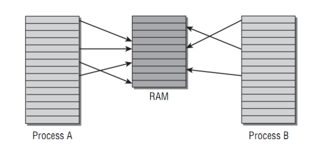
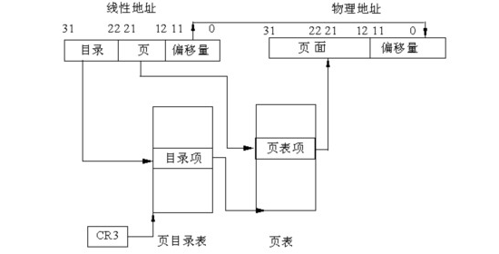

#Linux大内存页Oracle数据库优化 

PC Server发展到今天，在性能方面有着长足的进步。64位的CPU在数年前都已经进入到寻常的家用PC之中，更别说是更高端的PC Server；在Intel和AMD两大处理器巨头的努力下，x86 CPU在处理能力上不断提升；同时随着制造工艺的发展，在PC Server上能够安装的内存容量也越来越大，现在随处可见数十G内存的PC Server。正是硬件的发展，使得PC Server的处理能力越来越强大，性能越来越高。而在稳定性方面，搭配PCServer和Linux操作系统，同样能够满重要业务系统所需要的稳定性和可靠性。当然在成本方面，引用一位在行业软件厂商的网友的话来说，“如果不用PC Server改用小型机，那我们赚什么钱啊？”。不管从初期的购买，运行期的能耗和维护成本，PC Server都比相同处理能力的小型机便宜很多。正是在性能和成本这两个重要因素的影响下，运行在PC Server上的数据库越来越多。笔者所服务的一些客户，甚至把高端的PCServer虚拟化成多台机器，在每台虚拟机上跑一套Oracle数据库，这些数据库不乏承载着重要的生产系统。

毫无疑问，在PC Server上运行Oracle数据库，最适合的操作系统无疑是Linux。作为与UNIX极为类似的操作系统，在稳定性、可靠性和性能方面有着与UNIX同样优异的表现。但是Linux在内存分页处理机制上与AIX、HP-UX等操作系统相比有一个明显的缺陷，而这个缺陷在使用较大SGA的Oracle数据库上体现尤为明显，严重时对数据库性能有着显著的负面影响，甚至会导致数据库完全停止响应。而本文就将从一个案例来详述这种缺陷，并使用Linux下的大内存页来解决这一问题。

##一、案例的引入

客户的一套系统，出现了严重的性能问题。在问题出现时，系统基本不可使用，应用上所有的业务操作完全失去响应。系统的数据库是运行在RHEL 5.2 (Red Hat Enterprise Linux Server release 5 (Tikanga))下的Oracle 10.2.0.4 Oracle Database，CPU为4颗4核至强处理器（Intel(R)Xeon(R) CPU  E7430  @ 2.13GHz），也就是逻辑CPU为16，内存32GB。故障期间，数据库服务器的CPU长期保持在100%。甚至将应用的所有Weblogic Server都关闭之后，数据库服务器的CPU利用率在数分钟之内都一直是100%，然后逐渐下降，大约需要经过20分钟才会下降到正常的空闲状态，因为这个时候所有的应用都已经关闭，只有非常低的CPU利用率才是正常的状态。据这套系统的数据库维护人员反映，这种情况已经出现多次，就算是重启数据库之后，过不了一两天，这样的故障同样会出现。同时这套系统最近也没做过大的变动。

笔者在接到接到故障报告后，通过SSH连接到数据库数据库都非常慢，需要差不多1分钟才能连接上去。先简单的看一下服务器的性能状况，发展IO极低、内存剩余还比较多，至少还有1GB以上，也没有page in / page out。而最显著的现象就是CPU利用率相当地高，一直保持在100%，同时CPU利用率的SYS部分，均在95%以上。而操作系统运行队列也一直在200以上。服务器内存的使用情况如下：

```
$cat/proc/meminfo
MemTotal:        32999792 kB
MemFree:          1438672 kB
Buffers:           112304 kB
Cached:          23471680 kB
SwapCached:          1296 kB
Active:          19571024 kB
Inactive:         6085396 kB
HighTotal:              0 kB
HighFree:               0 kB
LowTotal:        32999792 kB
LowFree:          1438672 kB
SwapTotal:       38371320 kB
SwapFree:        38260796 kB
Dirty:                280 kB
Writeback:               0kB
AnonPages:        2071192 kB
Mapped:          12455324 kB
Slab:              340140 kB
PageTables:       4749076 kB
NFS_Unstable:           0 kB
Bounce:                 0 kB
CommitLimit:      54871216kB
Committed_AS:    17226744 kB
VmallocTotal: 34359738367 kB
VmallocUsed:        22016 kB
VmallocChunk: 34359716303 kB
```

从现象上看，SYS CPU高是分析问题的一个重要线索。

在以最快的速度了解了一下操作系统层面的性能情况之后，立即通过Sqlplus连接到数据库，查看数据库内部的性能信息：

> 注：以下数据关于SQL、服务器名称、数据库名称等相关信息经过处理。

```
SQL> select sid,serial#,program,machine,sql_id,eventfrom v$session where type='USER' and status='ACTIVE';

SID    SERIAL#  PROGRAM        MACHINE         SQL_ID          EVENT
------ -------- -------------- --------------- --------------- -------------     
519       4304  xxx_app1                       0gc4uvt2pqvpu   latch: cache buffers chains
459      12806  xxx_app1                       0gc4uvt2pqvpu   latch: cache buffers chains
454       5518  xxx_app1                       15hq76k17h4ta   latch: cache buffers chains
529       7708  xxx_app1                       0gc4uvt2pqvpu   latch: cache buffers chains
420      40948  xxx_app1                       0gc4uvt2pqvpu   latch: cache buffers chains
353      56222  xxx_app1                       f7fxxczffp5rx   latch: cache buffers chains
243      42611  xxx_app1                       2zqg4sbrq7zay   latch: cache buffers chains
458      63221  xxxTimer.exe    APPSERVER      9t1ujakwt6fnf   local write wait
...为节省篇幅，省略部分内容...
409       4951  xxx_app1                       7d4c6m3ytcx87   read by other session
239      51959  xxx_app1                       7d4c6m3ytcx87   read by other session
525       3815  xxxTimer.exe    APPSERVER      0ftnnr7pfw7r6   enq: RO -fast object reu
518       7845  xxx_app1                                       log file sync
473       1972  xxxTimer.exe    APPSERVER      5017jsr7kdk3b   log file sync
197      37462  xxx_app1                       cbvbzbfdxn2w7   db file sequential read
319       4939  xxxTimer.exe    APPSERVER      6vmk5uzu1p45m   db file sequentialread
434       2939  xxx_app1                       gw921z764rmkc   latch: shared pool
220      50017  xxx_app1                       2zqg4sbrq7zay   latch: library cache
301      36418  xxx_app1                       02dw161xqmrgf   latch: library cache
193      25003  oracle@xxx_db1 (J001)                          jobq slave wait
368      64846  oracle@xxx_db1 (J000)                          jobq slave wait
218      13307  sqlplus@xxx_db1 (TNS V1-V3)    5rby2rfcgs6b7   SQL*Net message to client
435       1883  xxx_app1                       fd7369jwkuvty   SQL*Net message from client
448       3001  xxxTimer.exe    APPSERVER      bsk0kpawwztnw   SQL*Net message from dblink
```

```
SQL>@waitevent

SID    EVENT                          SECONDS_IN_WAIT   STATE
---- ------------------------------   ---------------   -------------------
556   latch: cache buffers chains       35                WAITED KNOWN TIME     
464   latch:cache buffers chai ns        2                WAITING              
427   latch:cache buffers chai ns       34                WAITED SHORT TIME  
458   localwrite wait                   63                WAITING
403   writecomplete waits               40                WAITING
502   writecomplete waits               41                WAITING
525   enq:RO - fast object reuse        40                WAITING  
368   enq:RO - fast object reu se       23                WAITING   
282   db file sequential read            0                WAITING
501   dbfile sequential read             2                WAITED SHORT TIME
478   db file sequential read            0                WAITING
281   db file sequential read            6                WAITED KNOWN TIME
195   db file sequential read            4                WAITED KNOWN TIME
450   db file sequential read            2                WAITED KNOWN TIME
529   db file sequential read            1                WAITING
310   dbfile sequential read             0                WAITED KNOWN TIME
316   db filesequential read            89                WAITED SHORT TIME
370   db file sequential read            1                WAITING
380   db file sequential read            1                WAITED SHORT TIME
326   jobq slave wait                  122                WAITING
378   jobq slave wait                    2                WAITING
425   jobq slave wait                  108                WAITING
208   SQL*Net more data from db         11                WAITED SHORT TIME   link
537   Streams AQ: waiting for t       7042                WAITING  ime management or cleanup  tasks
549   Streams AQ: qmn coordinat    1585854                WAITING or idle wait
507   Streams AQ: qmn slave idl    1585854                WAITING   e wait
430   latch free                         2                WAITED KNOWN TIME
565   latch:cache buffers lru          136                WAITED SHORT TIME   chain
```

从数据库中的活动以及等待事件来看，并没有太大的异常。值得注意的是，在数据库服务器CPU利用率长期在100%，或物理内存耗尽并伴有大量的交换内存换入换出时，需要仔细地诊断数据库中的性能现象，比如某类较多的等待事件，是由CPU或内存不足导致的结果还是因为这些数据库中的特定的活动才是Root Cause引起CPU过高或内存耗尽。

从上面的数据来看，活动会话并不是特别多，不到50个，加上后台进程的数量，与操作系统中高达200的运行相比，存在不小的差异。数据库中主要有三类的非空闲等待事件，IO相关的等待如db file sequential read，database link相关的SQL*Net more data from dblink以及latch 相关的等待事件。在这三类种，通常只有latch这类等待事件才会引起CPU的利用率增加。

通过分析对比AWR报告，在故障期间和正常期间，从数据库活动来说，没有特别明显的差异。但是在系统统计上，差异较大：

```
StatisticName                                  1st            2nd           Value      
-----------------------------------   -------------- -------------- ------------------------
BUSY_TIME                                  3,475,776      1,611,753
IDLE_TIME                                  2,266,224      4,065,506
IOWAIT_TIME                                  520,453        886,345
LOAD                                             -67             -3
NICE_TIME                                          0              0
NUM_CPU_SOCKETS                                    0              0
PHYSICAL_MEMORY_BYTES                              0              0
RSRC_MGR_CPU_WAIT_TIME                             0              0
SYS_TIME                                   1,802,025        205,644
USER_TIME                                  1,645,837      1,381,719
```

上面的数据中，是来自于包含故障时间段的1小时(1st)和正常时间段1小时(2nd)的AWR的对比数据。对于故障分析来说，特别是故障时间比较短的情况下，1小时的AWR报告会不够准确地反映故障期间的性能情况。但是我们在Trouble Shooting之时，首要的是需要从各种数据中，确定方向。正如前面提到，SYS部分的CPU利用率过高是一个很重要的线索，而数据库内部的其他性能数据相差不大的情况下，可以先从CPU这一点着手。

##二、操作系统中CPU使用分析

那么，在操作系统中，SYS和USER这两个不同的利用率代表着什么？或者说二者有什么区别？

简单来说，CPU利用率中的SYS部分，指的是操作系统内核(Kernel）使用的CPU部分，也就是运行在内核态的代码所消耗的CPU，最常见的就是系统调用(SYS CALL)时消耗的CPU。而USER部分则是应用软件自己的代码使用的CPU部分，也就是运行在用户态的代码所消耗的CPU。比如Oracle在执行SQL时，从磁盘读数据到db buffer cache，需要发起read调用，这个read调用主要是由操作系统内核包括设备驱动程序的代码在运行，因此消耗的CPU计算到SYS部分；而Oracle在解析从磁盘中读到的数据时，则只是Oracle自己的代码在运行，因此消耗的CPU计算到USER部分。

那么SYS部分的CPU主要会由哪些操作或是系统调用产生呢：

1. I/O操作，比如读写文件、访问外设、通过网络传输数据等。这部分操作一般不会消耗太多的CPU，因为主要的时间消耗会在IO操作的设备上。比如从磁盘读文件时，主要的时间在磁盘内部的操作上，而消耗的CPU时间只占I/O操作响应时间的少部分。只有在过高的并发I/O时才可能会使SYS CPU有所增加。
2. 内存管理，比如应用进程向操作系统申请内存，操作系统维护系统可用内存，交换空间换页等。其实与Oracle类似，越大的内存，越频繁的内存管理操作，CPU的消耗会越高。
3. 进程调度。这部分CPU的使用，在于操作系统中运行队列的长短，越长的运行队列，表明越多的进程需要调度，那么内核的负担也就越高。
4. 其他，包括进程间通信、信号量处理、设备驱动程序内部一些活动等等。

从系统故障时的性能数据来看，内存管理和进程调度这两项可能是引起SYS CPU很高的原因。但是运行队列高达200以上，很可能是由于CPU利用率高导致的结果，而不是因为运行队列高导致了CPU利用率高。从数据库里面来看活动会话数不是特别高。那么接下来，需要关注是否是由于系统内存管理方面的问题导致了CPU利用率过高？

回顾本文开始部分收集的/proc/meminfo中系统内存方面数据，可以发现一项重要的数据：

```
PageTables:   4749076 kB
```

从数据可以看到，PageTables内存达到了4637MB。PageTables在字面意思上是指“页面表”。简单地说，就是操作系统内核用于维护进程线性虚拟地址和实际物理内存地址对应关系的表格。

现代计算机对于物理内存，通常是将其以页(Page Frame)为单位进行管理和分配，在 x86处理器架构上，页面大小为4K。运行在操作系统上的进程，可访问的地址空间称为虚地址空间，跟处理器位数有关。对于32位的x86处理器，进程的可访问地址空间为4GB。在操作系统中运行的每一个进程，都有其独立的虚地址空间或线性地址空间，而这个地址空间同样也是按页(Page)进行管理，在Linux中，页大小通常为4KB。进程在访问内存时，由操作系统和硬件配合，负责将进程的虚拟地址转换成为物理地址。两个不同的进程，其相同的虚拟线性地址，指向的物理内存，可能相同，比如共享内存；也可能不同，比如进程的私有内存。

下图是关于虚拟地址和物理内存对应关系的示意图：



假设有两个进程A、B，分别有一个内存指针指向的地址为0x12345（0x表示16进制数），比如一个进程fork或clone出另一个进程，那么这2个进程就会存在指向相同内存地址的指针的情况。进程在访问0x12345这个地址指向的内存时，操作系统将这个地址转换为物理地址，比如A进程为0x23456，B进程为0x34567，二者互不影响。那么这个物理地址是什么时候得来？对于进程私有内存（大部分情况均是如此）来说，是进程在向操作系统请求分配内存时得来。进程向操作系统请求分配内存时，操作系统将空闲的物理内存以Page为单位分配给进程，同时给进程产生一个虚拟线程地址，在虚拟地址和物理内存地址之间建立 映射关系，这个虚拟地址作为结果返回给进程。

Page Table（页表）就是用于操作系统维护进程虚拟地址和物理内存对应关系的数据结构。下图是一个比较简单情况下的Page Table示意图：



下面简单地描述在32位系统下，页大小为4K时，操作系统是如何为进程的虚拟地址和实际物理地址之间进行转换的。

1. 目录表是用于索引页表的数据结构，每个目录项占32位，即4字节，存储一个页表的位置。目录表刚好占用1页内存，即4KB，可以存储1024个目录项，也就是可以存储1024个页表的位置。
2. 页表项(Page Table Entry）大小为4字节，存储一个物理内存页起始地址。每个页表同样占用4K内存，可以存储1024个物理内存页起始地址。由于物理内存页起始地址以4KB为单位对齐，所以32位中，只需要20位来表示地址，其他12位用于其他用途，比如表示这1内存页是只读还是可写等等。
3. 1024个页表，每个页表1024个物理内存页起始地址，合计就是1M个地址，每个地址指向的物理内存页大小为4KB，合计为4GB。
4. 操作系统及硬件将虚拟地址映射为物理地址时，将虚拟地址的31-22这10位用于从目录项中索引到1024个页表中的一个；将虚拟地址的12-21这10位用于从页表中索引到1024个页表项中的一个。从这个索引到的页表项中得到物理内存页的起始地址，然后将虚拟地址的0-11这12位用作4KB内存页中的偏移量。那么物理内存页起始地址加上偏移量就是进程所需要访问的物理内存的地址。

再看看目录表和页表这2种数据结构占用的空间会有多少。目录表固定只有4KB。而页表呢？由于最多有1024个页表，每个页表占用4KB，因此页表最多占用4MB内存。

实际上32位Linux中的进程通常不会那么大的页表。进程不可能用完所有的4GB大小地址空间，甚至有1GB虚拟地址空间分给了内核。同时Linux不会为进程一次性建立那么大的页表，只有进程在分配和访问内存时，操作系统才会为进程建立相应地址的映射。

这里只描述了最简单情况下的分页映射。实际上页表目录连同页表一共有四级。同时在32位下启用PAE或64位系统，其页表结构比上面的示意图更复杂。但无论怎么样，最后一级即页表的结构是一致的。

在64位系统中，Page Table（页表）中的页表项，与32位相比，大小从32位变为64位。那么这会有多大的影响？假如一个进程，访问的物理内存有1GB，即262144个内存页，在32位系统中，页表需要262144*4/1024/1024=1MB，而在64位系统下，页表占用的空间增加1倍，即为2MB。

那再看看对于Linux系统中运行的Oracle数据库，又是怎么样一番情景。本文案例中数据库的SGA大小12GB，如果一个OracleProcess访问到了所有的SGA内存，那么其页表大小会是24MB，这是一个惊人的数字。这里忽略掉PGA，因为平均下来每个进程的PGA不超过2M，与SGA相比实在太小。从AWR报告来看，有300个左右的会话，那么这300个连接的页表会达到7200MB，只不过并不是每个进程都会访问到SGA中所有的内存。而从meminfo查看到的Page Tables大小达到4637MB，这么大的Page Table空间，正是300个会话，SGA大小达到12GB的结果。

系统中显然不会只有Page Table这唯一的内存管理数据结构，还有其他一些数据结构用于管理内存。这些过大的内存管理结构，无疑会大大增加操作系统内核的负担和对CPU的消耗。而在负载变化或其他原因导致内存需求大幅变化，比如多进程同时申请大量的内存，可能引起CPU在短时间内达到高峰，从而引起问题。

##三、使用大内存页来解决问题

虽然没有确实的证据，也没有足够长的时间来收集足够的证据来证明是过大的Page Table导致了问题，那需要面临多次半小时以上的系统不可用故障。但是从目前来看，这是最大的可疑点。因此，决定先使用大内存页来调优系统的内存使用。

大内存页是一种统称，在低版本的Linux中为Large Page，而当前主流的Linux版本中为Huge Page。下面以Huge Page为例来说明Huge Page的优点及如何使用。

使用大内存页有哪些好处：

1. 减少页表(Page Table）大小。每一个Huge Page，对应的是连续的2MB物理内存，这样12GB的物理内存只需要48KB的Page Table，与原来的24MB相比减少很多。
2. Huge Page内存只能锁定在物理内存中，不能被交换到交换区。这样避免了交换引起的性能影响。
3. 由于页表数量的减少，使得CPU中的TLB（可理解为CPU对页表的CACHE）的命中率大大提高。
4. 针对Huge Page的页表，在各进程之间可以共享，也降低了Page Table的大小。实际上这里可以反映出Linux在分页处理机制上的缺陷。而其他操作系统，比如AIX，对于共享内存段这样的内存，进程共享相同的页表，避免了Linux的这种问题。像笔者维护的一套系统，连接数平常都是5000以上，实例的SGA在60GB左右，要是按Linux的分页处理方式，系统中大部分内存都会被页表给用掉。

那么，怎么样为Oracle启用大内存页(Huge Page)？以下是实施步骤。由于案例中涉及的数据库在过一段时间后将SGA调整为了18G，这里就以18G为例：

1. 检查/proc/meminfo，确认系统支持HugePage：

    ```
    HugePages_Total:     0
    HugePages_Free:      0
    HugePages_Rsvd:      0
    Hugepagesize:    2048 kB
    ```
    
    HugePages Total表示系统中配置的大内存页页面数。HugePages Free表示没有访问过的大内存页面数，这里free容易引起误解，这在稍后有所解释。HugePages Rsvd表示已经分配但是还未使用的页面数。Hugepagesize表示大内存页面大小，这里为2MB，注意在有的内核配置中可能为4MB。

    比如HugePages总计11GB，SGA_MAX_SIZE为10GB，SGA_TARGET为8GB。那么数据库启动后，会根据SGA_MAX_SIZE分配HugePage内存，这里为10GB，真正Free的HugePage内存为11-10=1G。但是SGA_TARGET只有8GB，那么会有2GB不会被访问到，则HugePage_Free为2+1=3GB，HugePage_Rsvd内存有2GB。这里实际上可以给其他实例使用的只有1GB，也就是真正意义上的Free只有1GB。

2. 计划要设置的内存页数量。到目前为止，大内存页只能用于共享内存段等少量类型     的内存。一旦将物理内存用作大内存页，那么这些物理内存就不能用作其他用途，比如作为进程的私有内存。因此不能将过多的内存设置为大内存页。我们通常将大内存页用作Oracle数据库的SGA，那么大内存页数量：

    ```
     HugePages_Total=ceil(SGA_MAX_SIZE/Hugepagesize)+N
     ```

    比如，为数据库设置的SGA_MAX_SIZE为18GB，那么页面数可以为ceil(18*1024/2)+2=9218。

    这里加上N，是需要将HugePage内存空间设置得比SGA_MAX_SIZE稍大，通常为1-2即可。我们通过ipcs -m命令查看共享内存段的大小，可以看到共享内存段的大小实际上比SGA_MAX_SIZE约大。如果服务器上有多个Oracle实例，需要为每个实例考虑共享内存段多出的部分，即N值会越大。另外，Oracle数据库要么全部使用大内存页，要么完全不使用大内存页，因此不合适的HugePages_Total将造成内存的浪费。

    除了使用SGA_MAX_SIZE计算，也可以通过ipcs -m所获取的共享内存段大小计算出更准确的HugePages_Total。

    ```
    HugePages_Total=sum(ceil(share_segment_size/Hugepagesize))
    ```

3. 修改/etc/sysctl.conf文件，增加如下行：

    ```
    vm.nr_hugepages=9218
    ```

    然后执行sysctl –p命令，使配置生效。

    这里vm.nr_hugepages这个参数值为第2步计算出的大内存页数量。然后检查/proc/meminfo，如果HugePages_Total小于设置的数量，那么表明没有足够的连续物理内存用于这些大内存页，需要重启服务器。

4. 在/etc/security/limits.conf文件中增加如下行：

    ```
    oracle soft memlock 18878464
    oracle hard memlock 18878464
    ```

    这里设定oracle用户可以锁定内存的大小 ，以KB为单位。

    然后重新以oracle用户连接到数据库服务器，使用ulimit -a命令，可以看到：

    ```
    max lockedmemory       (kbytes, -l) 18878464
    ```

    这里将memlock配置为unlimited也可以。

5. 如果数据库使用MANUAL方式管理SGA，需要改为AUTO方式，即将SGA_TARGET_SIZE设置为大于0的值。对于11g，由于HugePage只能用于共享内存，不能用于PGA，所以不能使用AMM，即不能设置MEMORY_TARGET为大于0，只能分别设置SGA和PGA，SGA同样只能是AUTO方式管理。

6. 最后启动数据库，检查/proc/meminfo中查看HugePages_Free是否已经减少。如果已经减少，表明已经使用到HugePage Memory。

    不过查看出故障数据库服务器上的/proc/meminfo时发现，居然没有HugePage相关的信息，sysctl -a查看所有系统参数也没有找到vm.nr_hugepages这个参数。这是由于Linux内核没有编译进HugePage这个特性。我们需要使用其他的内核来启用HugePage。

    查看/boot/grub/grub.conf：

    ```
    # grub.confgenerated by anaconda
    # Note thatyou do not have to rerun grub after making changes to this file
    # NOTICE:  You have a /boot partition.  This means that
    # all kerneland initrd paths are relative to /boot/, eg.
    # root(hd0,0)
    # kernel/vmlinuz-version ro root=/dev/VolGroup00/LogVol00
    # initrd/initrd-version.img
    #boot=/dev/cciss/c0d0
    default=0
    timeout=5
    splashimage=(hd0,0)/grub/splash.xpm.gz
    hiddenmenu
    title Red HatEnterprise Linux Server (2.6.18-8.el5xen) with RDAC
            root (hd0,0)
            kernel /xen.gz-2.6.18-8.el5
            module /vmlinuz-2.6.18-8.el5xen roroot=/dev/VolGroup00/LogVol00 rhgb quiet
            module /mpp-2.6.18-8.el5xen.img
    title Red HatEnterprise Linux Server (2.6.18-8.el5xen)
            root (hd0,0)
            kernel /xen.gz-2.6.18-8.el5
            module /vmlinuz-2.6.18-8.el5xen roroot=/dev/VolGroup00/LogVol00 rhgb quiet
            module /initrd-2.6.18-8.el5xen.img
    title Red HatEnterprise Linux Server-base (2.6.18-8.el5)
            root (hd0,0)
            kernel /vmlinuz-2.6.18-8.el5 roroot=/dev/VolGroup00/LogVol00 rhgb quiet
            module/initrd-2.6.18-8.el5.img
    ```
    
    发现这个系统使用的内核带有"xen"字样，我们修改这个文件，将default=0改为default=2，或者将前面2种内核用#号屏蔽掉，然后重启数据库服务器，发现新的内核已经支持HugePage。

数据库启用大内存页之后，本文描述的性能问题甚至是在增大了SGA的情况下也没有出现。观察/proc/meminfo数据，PageTables占用的内存一直保持在120M以下，与原来相比，减少了4500MB。据观察，CPU的利用率也较使用HugePages之前有所下降，而系统运行也相当地稳定，至少没有出现因使用HugePage而产生的BUG。

测试表明，对于OLTP系统来说，在运行Oracle数据库的Linux上启用HugePage，数据库处理能力和响应时间均有不同程度的提高，最高甚至可以达到10%以上。
    
##四、小结

本文以一个案例，介绍了Linux操作系统下大内存页在性能提升方面的作用，以及如何设置相应的参数来启用大内存页。在本文最后，笔者建议在Linux操作系统中运行Oracle数据库时，启用大内存页来避免本文案例遇到的性能问题，或进一步提高系统性能。可以说，HugePage是少数不需要额外代价就能提升性能的特性。另外值得高兴的是，新版本的Linux内核提供了Transparent Huge Pages，以便运行在Linux上的应用能更广泛更方便地使用大内存页，而不仅仅是只有共享内存这类内存才能使用大内存页。对于这一特性引起的变化，让我们拭目以待。

##引用

文章来源:《Oracle DBA手记 3》Linux大内存页Oracle数据库优化 作者：熊军

