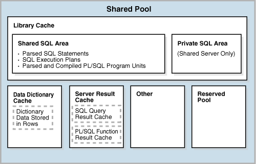

#共享池(Shared Pool)

shared pool用于缓存许多种类型的程序数据，例如，SQL/PLSQL执行计划、系统参数、数据字典(data dictionary)信息等。shared pool参与了数据库中大多数操作，例如，用户执行SQL语句时Oracle数据库就会访问它。

shared pool被分成多个子组件，最重要的几个见下图：



##库缓存(Library Cache)

library cache是shared pool中用于存储SQL/PLSQL执行计划的内存结构。其中包含shared SQL and PL/SQL areas和类似锁和库缓存句柄的控制结构。在共享服务器(shared server architecture)中还包含private SQL areas。

在执行SQL语句时，数据库尝试复用以前执行过的代码，只要该代码存在于library cache并且已共享。我们称之为软解析(soft parse)或者命中库缓存(library cache hit)。如果数据库无法在library cache找到之前执行过的代码，那么就必须为现在要执行代码创建可执行的代码，我们称之为硬解析(hard parse)或library cache miss。

###Shared SQL Areas

数据库包含两种区域用来执行SQL语句：

* Shared SQL area
  
  shared SQL area会在数据库第一次执行一条SQL语句的时候被使用，它包含该语句的解析树和执行计划(execution plan)，并且能够被所有用户访问。每条SQL语句只占用shared SQL area中的一个区域。
  
* Private SQL area
  
  每个会话都会在它PGA中拥有一个private SQL area用来执行SQL语句。每个用户提交相同的语句，都会有一个private SQL area指针指向相同的shared SQL area。即在PGA中的多个private SQL areas与同一个shared SQL area相关联。
  
数据库会自动判断用户提交的语句是否与缓存中的相同。数据库会考虑到直接由用户和应用程序提交的语句与存在于其他语句内部的子语句的区别。数据库按以下步骤执行：

1. 检查shared pool看在shared SQL area中是否已存在一条语法和语义都相同的语句：

  * 如果语句已存在，数据库会使用现有的shared SQL area来执行语句，这样就可以减少内存消耗
  * 如果语句不存在，数据库就会在shared pool中为它分配一块shared SQL area。拥有相同语法的语句，如果语义不同就会使用子游标(child cursor)。
  
  无论怎样，用户为语句分配的指向shared SQL area的那块private SQL area都会包含语句和执行计划。

2. 为会话分配一块privated SQL area
  
  private SQL area的位置依赖于会话与数据库建立连接的方式。如果会话连的是共享服务器(shared server)，那么private SQL area保存在SGA。

下图展示一个专用服务器架构(dedicated server architecture)中两个会话在他们的PGA中保留相同语句的副本。在共享服务器中，副本是存储在UGA中的（UGA是large pool中的一块内存区域，如果large pool不存在则存放在shared pool中）。


>**更多信息请参考**
>
>* [Oracle Database Performance Tuning Guide](http://docs.oracle.com/database/121/TGDBA/tune_shared_pool.htm#TGDBA562)，该文档中包含更多library cache如何管理的知识
>* [Oracle Database Development Guide](http://docs.oracle.com/database/121/ADFNS/adfns_sqlproc.htm#ADFNS99965)，该文档包含shared SQL的信息

###Program Units and the Library Cache

library cache中保存着PL/SQL程序和Java类的可执行单元，这些单元统称为program units。

数据库执行program units的方式与执行SQL语句相同。例如数据库会分配一块shared area用于存放PL/SQL程序解析和编译后的格式。数据库还会分配i一块privated area用于存储程序执行过程中用到的本地的、全局的、包作用域内的变量和buffer。如果多个用户执行相同的程序，那么每个用户都会在他/她的private SQL area保留一个独立的副本。

如前所述，数据库会单独执行PL/SQL程序中的SQL语句，尽管这些SQL语句的源码包含在PL/SQL程序中。SQL语句的执行计划在内存中的存储形式是会话级的。

###Allocation and Reuse of Memory in the Shared Pool

数据库在解析一条新的SQL语句时，会根据语句的复杂度在shared pool中分配对应的内存大小。

通常的，shared pool内存争用采用LRU机制。shared pool中的内存允许被许多会话使用，只要它还有用，数据库就会一直保留着它，那么创建这块内存的进程已经终止了。这个机制可最小化SQL语句的执行和开销。

如果数据库需要从空闲空间频繁地分配新的内存区域，那么某些shared SQL area就有可能被清除，那么它关联着一个打开状态的cursor，而这个cursor是指暂时地没有执行。被清除后，如果这个已打开的cursor重新执行了，那么数据库就会重新对它进行解析并分配新的shared SQL area。

当以下情况出现时，数据库就会执行清除shared SQL area的操作：

* 如果数据库收集表、集群表或索引的静态信息，那么默认地，它会逐渐清除那些引用这些已分析对象的语句相关的shared SQL area。当这些被清除的语句再次执行的时候，数据库就会使用新的静态信息在新的shared SQL area对他们进行解析。
* 如果语句中引用的对象被DDL语句所更改，那么数据库就会置它对应的shared SQL area于无效。当该语句下次被执行时，优化器必须重新解析它。
* 如果全局数据库并被更改，那么数据库就会清除shared pool中的所有信息。

如果要手动清除所有的shared pool，可使用以下语句：

```sql
ALTER SYSTEM FLUSH SHARED_POOL;
```

>**更多资料请参考**
>
>* [Oracle Database SQL Language Reference](http://docs.oracle.com/database/121/SQLRF/statements_2017.htm#SQLRF53120)，该文档包含 `ALERT SYSTEM FLUSH SHARED_POOL` 的信息
>* [Oracle Database Reference](http://docs.oracle.com/database/121/REFRN/refrn30246.htm#REFRN30246)，关于动态性能视图 V$SQL 和 V$SQLAREA 的更多信息。

##数据字典缓存(Data Dictionary Cache)

数据字典是一些表和视图，其中包含数据库用于定义结构和用户的信息。数据库在进行SQL语句解析的时候会频繁地访问数据字典。

由于数据字典是如此频繁地被访问，所以Oracle数据库专门指定特别的内存区域来存储数据字典：

* Data dictionary cache
  
  该缓存保留数据库对象的信息，它还被称作 row cache，因为它以行的方式而不是buffer来存储数据。
  
* Library cache

所有的服务器进程(server process)都共享数据字典缓存来访问数据字典信息。

>**更多信息请参考**
>
>* [Chapter 6, "Data Dictionary and Dynamic Performance Views"](http://docs.oracle.com/database/121/CNCPT/datadict.htm#g6891)
>* [Oracle Database Performance Tuning Guide](http://docs.oracle.com/database/121/TGDBA/tune_shared_pool.htm#TGDBA593)，提供怎样分配更多的内存给data dictionary cache

##Server Result Cache

server result cache是属于shared pool中的内存区域。它不是缓冲区(buffer)池，因为它保留的是结果集(result sets)，而不是数据块。server result cache包含两类：SQL查询结果缓存(SQL query result cache)和PL/SQL函数结果缓存(PL/SQL function result cache)，两者所使用的原理是相同的。

>**提示**
>
>客户端的结果缓存(client result cache)与服务器端的结果缓存是不一样的，客户端的结果缓存是应用程序级别的配置并且存储在客户端的，而不是存储在数据库服务器的内存中。

>**更多信息请参考**
>
>* [Oracle Database Administrator's Guide for](http://docs.oracle.com/database/121/ADMIN/memory.htm#ADMIN11228)，关于结果集缓存的大小
>* [Oracle Database PL/SQL Packages and Types Reference](http://docs.oracle.com/database/121/ARPLS/d_result_cache.htm#ARPLS202)，关于DBMS_RESULT_CACHE包的信息
>* [Oracle Database Performance Tuning Guide](http://docs.oracle.com/database/121/TGDBA/tune_result_cache.htm#TGDBA638)，关于客户端结果集缓存的信息

###SQL查询结果集缓存(SQL Query Result Cache)

该缓存是服务器端结果集缓存的一个子集，用于缓存查询和查询片段的结果集。大多数应用程序使用它可获得性能上的提升。假设一个应用程序重复地执行相同的SELECT语句，如果该语句的结果被缓存起来，那么数据库可以从缓存中立即返回结果，避免了去读取数据块和计算结果的昂贵的开销。

在执行查询时，数据库会去内存中查找，看是否查询的结果已经被缓存在结果集缓存中。如果已经存在，那么数据库直接从内存读取并返回，而不是去执行查询。如果未被缓存，那么数据库会执行查询，并将得到的查询结果写进结果集缓存中。假如有其他事务修改了数据，或者数据库对象的结果被改变了，那么数据库会自动地令相关的结果集缓存失效。

用户可以使用 RESULT_CACHE hint让数据库一定缓存结果集。使用 RESULT_CACHE_MODE 初始化参数可以设置所有的查询是否进行结果集缓存。

>**更多信息请参考**
>
>* [Oracle Database Reference](http://docs.oracle.com/database/121/REFRN/refrn10270.htm#REFRN10270)，关于初始化参数 RESULT_CACHE_MODE的信息
>* [Oracle Database SQL Language Reference](http://docs.oracle.com/database/121/SQLRF/sql_elements006.htm#SQLRF20004)，关于 RESULT_CACHE提示的信息

###PL/SQL函数结果集缓存(PL/SQL Function Result Cache)

PL/SQL函数结果集缓存是用于缓存函数结果集的服务器端结果集缓存的一个子集。如果没有缓存，每次调用函数用时1秒，调用1000次就要用1000秒。但加入有缓存，那么调用1000次只需1秒。Good candidates for result caching are frequently invoked functions that depend on relatively static data.

PL/SQL函数代码可以包含缓存它的结果集的请求。当函数被调用的时候，系统会检查缓存。如果缓存中已存在以前使用相同参数值调用该函数的结果集，那么数据库会直接返回缓存中现有的结果集给调用者，而不会重新执行函数。如果缓存中未缓存结果集，那么系统执行函数体，并在将结果返回给调用者之前，把结果先添加到结果集缓存中。

>**提示**
>
>You can specify the database objects that Oracle Database uses to compute a cached result, so that if any of them are updated, the cached result becomes invalid and must be recomputed.

缓存中会积累许多的结果集，每个函数和它的参数值组合一起关联一个结果集。如果数据库需要更多的内存，那么这些结果集就会被清除。

>**更多信息请参考**
>
>* [Oracle Database Development Guide](http://docs.oracle.com/database/121/ADFNS/adfns_packages.htm#ADFNS333)，关于PL/SQL function result cache的更多信息
>* [Oracle Database PL/SQL Language Reference](http://docs.oracle.com/database/121/LNPLS/subprograms.htm#LNPLS00817)，关于PL/SQL function result cache的更多信息

##Reserved Pool

reserved pool是shared pool中的内存空间，用于分配给需要连续内存块(chunk)的大对象。

数据库使用chunks在shared pool中分配内存。数据库允许大对象(>5KB)直接载入缓冲区，而不需要请求一个单独的连续的内存区，这样可避免数据库中的连续内存太快耗尽而只剩下碎片。

一般很少有Java、PL/SQL、SQL游标需要>5KB的shared pool，因此数据库开辟很少的空间用于reserved pool。

>**更多信息请参考**
>
> [Oracle Database Performance Tuning Guide](http://docs.oracle.com/database/121/TGDBA/tune_shared_pool.htm#TGDBA605)，关于如何配置 reserved pool

##参考资料
* [1] [Oracle Database 12cR1 Concepts](http://docs.oracle.com/database/121/CNCPT/memory.htm#CNCPT1226)