#使用DBCA创建数据库

* 数据库版本：Oracle Database 12c Release 1
* 操作系统：CentOS 6.4

>要求：oracle网络监听程序已经配置好

##以oracle用户身份登录

```
[ben@oracle12cR1 ~]$ su - oracle
密码：
[oracle@oracle12cR1 ~]$ dbca
```

##图形界面向导

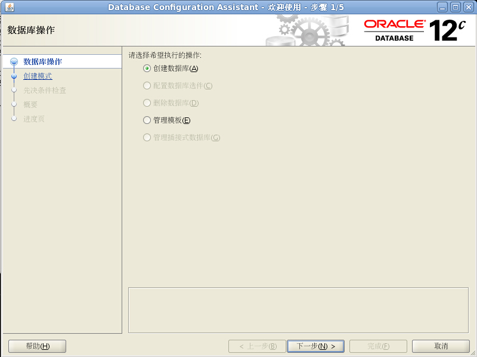

选中 `创建数据库`，点击下一步

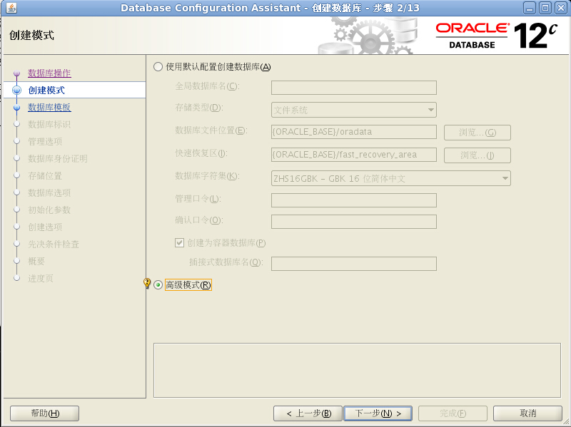

选中 `高级模式`，点击下一步

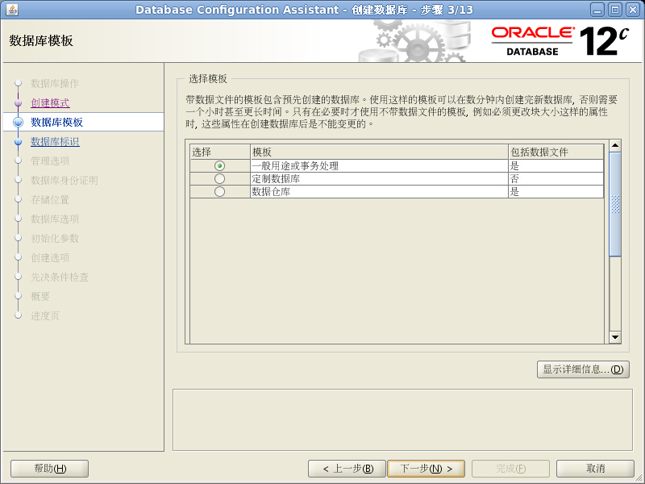

选中 `一般用途或事务处理`，点击下一步

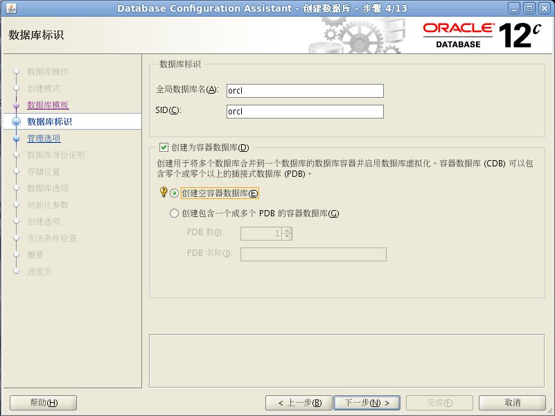

输入`全局数据库名`和`SID`，选中`创建为容器数据库`，选中`创建空容器数据库`，点击下一步

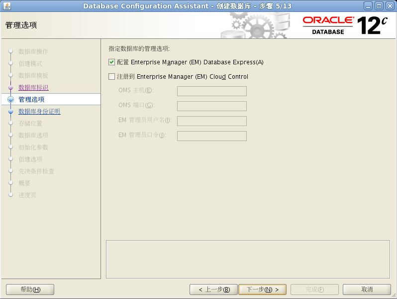

选中`配置Enterprise Manager(EM) Database Express`，点击下一步

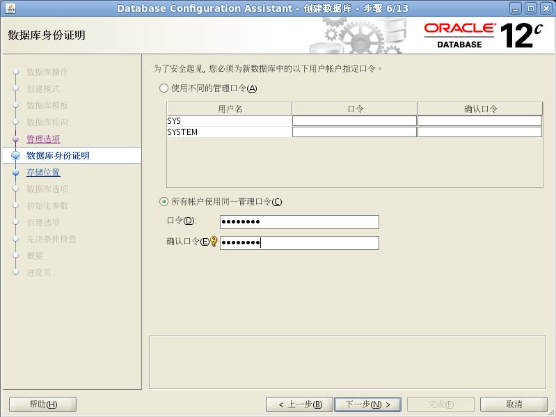

选中`所有账户使用同一管理口令`，以后再修改，输入口令：Aa123456，点击下一步

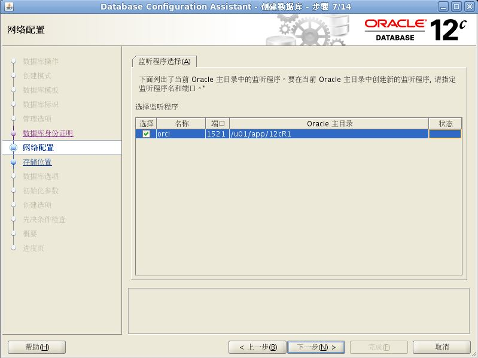

选中监听程序，需在此前使用netca创建监听程序，点击下一步

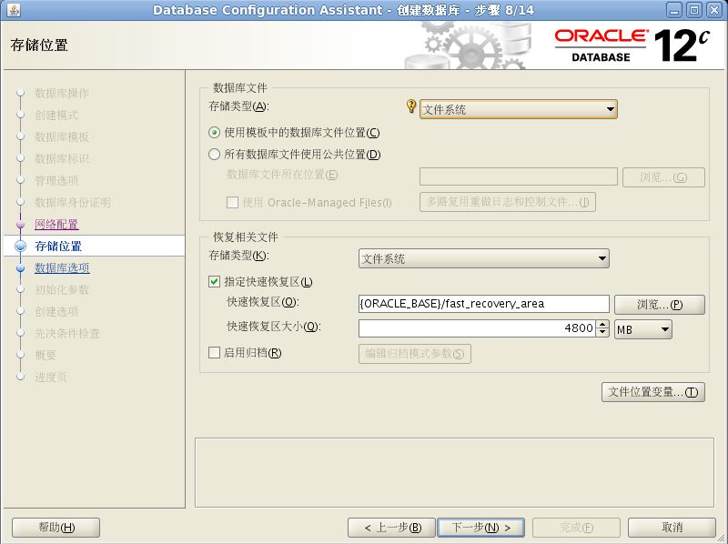

根据需要设置数据库文件和恢复相关，点击下一步

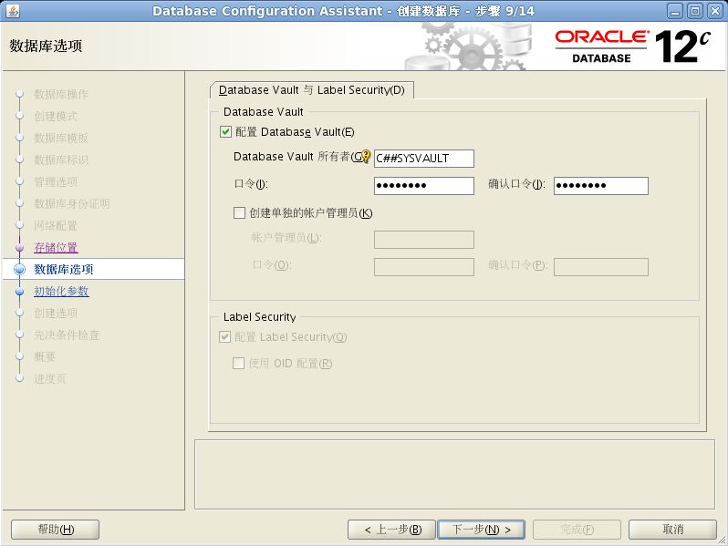

选中`配置Database Vault`，输入所有者和口令（Abc_123456），

>指定的用户将作为普通用户在容器数据库中创建。普通用户名应以 'C##' 开头。
>
>Database Vault 所有者口令的长度必须最少为 8 个字符, 最多为 30 个字符。此外, 该口令必须至少包含一个字母字符, 一个数字字符和一个非字母数字字符。非字母数字字符必须是以下字符之一: 井号 (#), 百分号 (%), 脱字号 (^), 短划线 (-), 下划线 (_), 加号 (+), 波形符 (~), 左方括号 ([), 右方括号 (]), 句点 (.) 或逗号 (,)。请指定有效的 Database Vault 所有者口令。

点击下一步

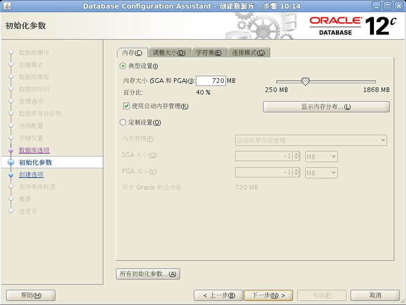

设置内存大小，选择`调整大小`选项卡

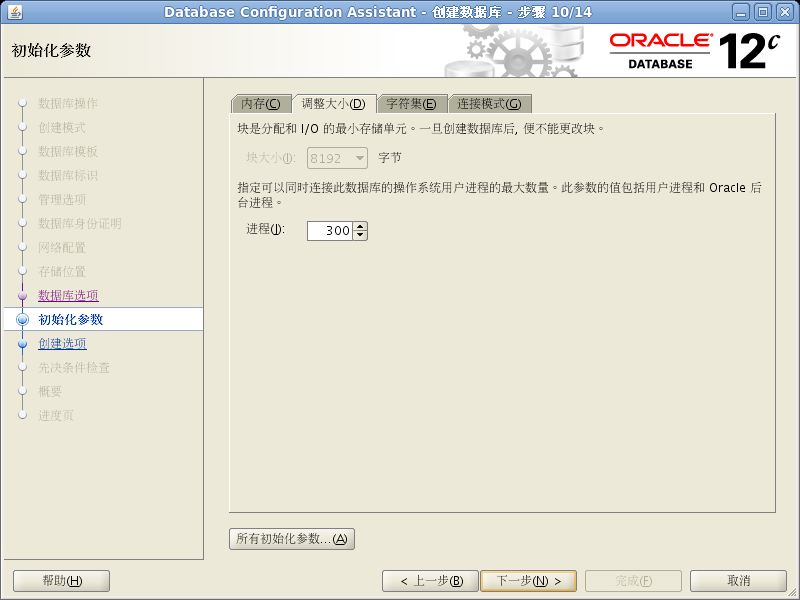

设置oracle进程数，选择`字符集`选项卡

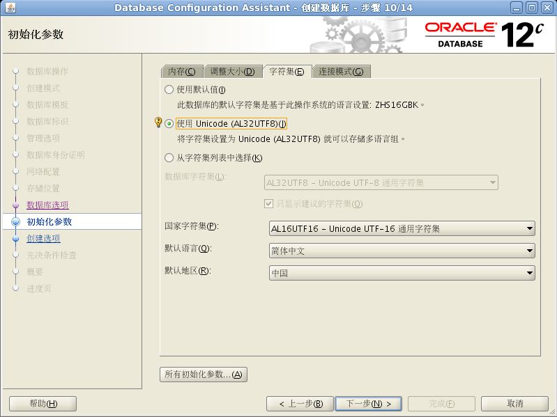

选择`使用Unicode(AL32UTF8)`作为字符集，选择`连接模式`选项卡

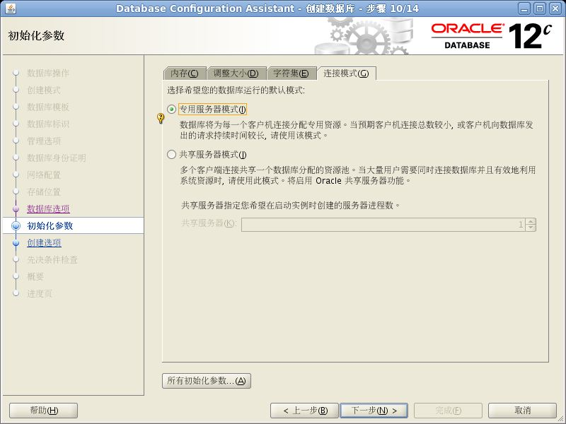

选择合适的服务器模式，点击下一步

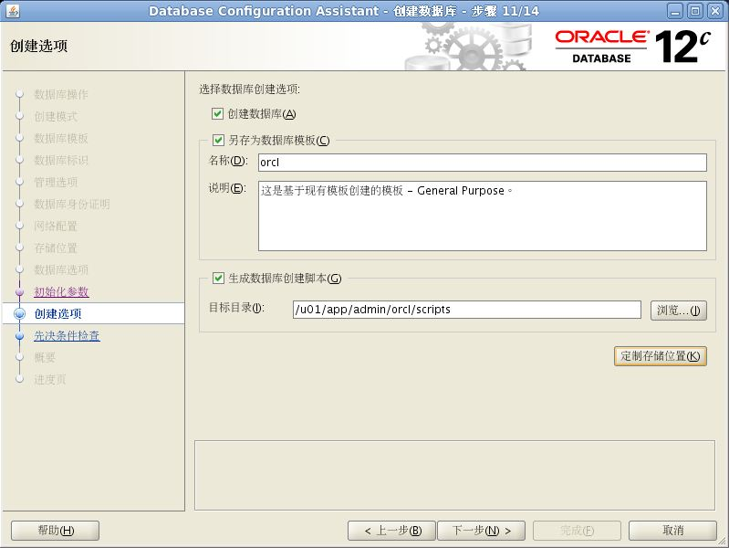

选中`创建数据库`，选中`另存为数据库模板`，选中`生成数据库创建脚本`，后两项是可选的，点击下一步

安装向导会进行检查先决条件，如果所有条件都满足，则自动跳过，进入概要

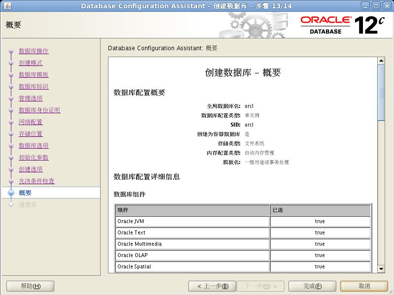

点击完成，开始创建数据库模板、数据库创建脚本和创建数据库，弹窗中点击确定

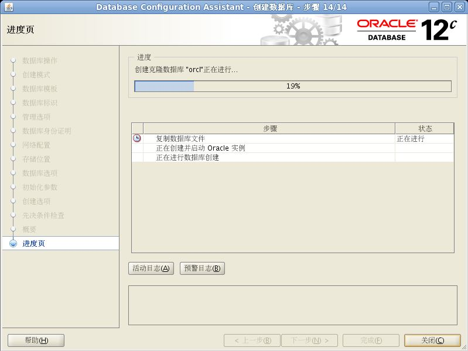

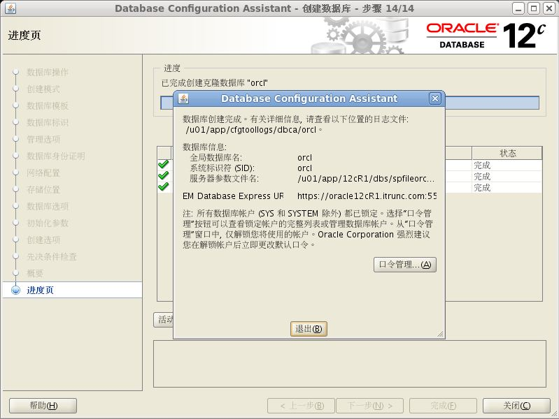

完成安装，点击弹窗的推出后，点击主窗口的关闭